# 2. Apache Maven 47m

* Introducción a Apache Maven 6:15 
* Instalación y configuración 10:04 
* Compilación y empaquetado 9:46 
* Instalación de librerías 4:18 
* Árbol de dependencias 6:18 
* Ejemplo práctico: Apache Maven 10:54 
* Contenido adicional 2

## Introducción a Apache Maven 6:15 

[Introducción a Apache Maven](pdfs/2.1_Introudcción_a_Apache_Maven.pdf)

## Instalación y configuración 10:04 

[Instalación y configuración](pdfs/2.2_Instalacion.pdf)

[Pagina oficial de Maven](https://maven.apache.org/)

### Intalar Maven en un Mac desde la consola

[Video](https://www.youtube.com/watch?v=j0OnSAP-KtU&vl=es)

[cmder](https://cmder.net/)

* Descargar Maven de la página oficial 

   Descargaremos el archivo `Binary tar.gz archive`:

   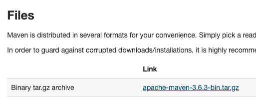
   
* Una vez descargado el archivo lo descomprimimos

   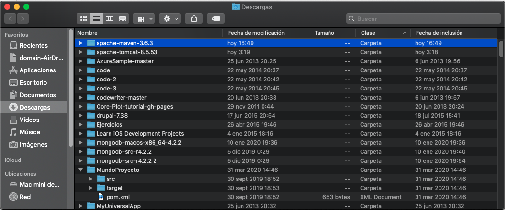
   
   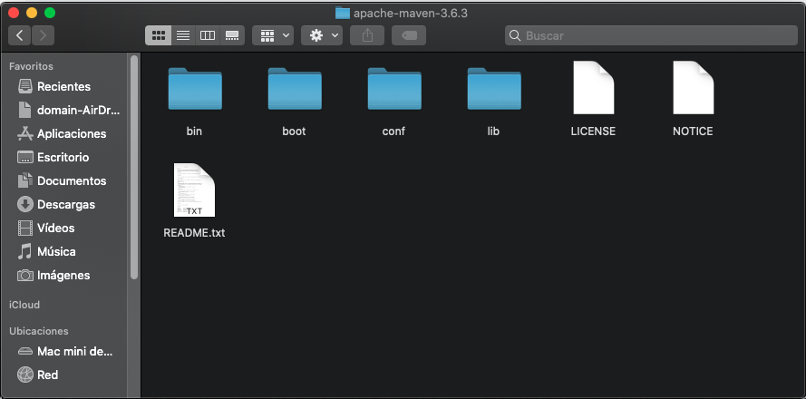
   
   Lo más habitual será trabajar con la carpeta `conf` y con el archivo `settings.xml`, que es el archivo de configuración global de Maven.
   
   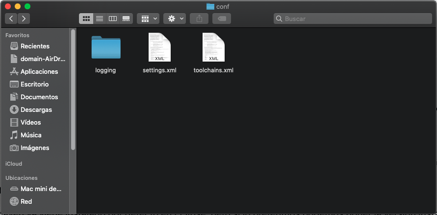
   
* Vamos a mover nuestro archivo Maven al directorio `Applications`   

   ```
   mini-de-adolfo:~ adolfodelarosa$ cd Downloads/
   mini-de-adolfo:Downloads adolfodelarosa$ mv apache-maven-3.6.3 /Applications/
   mini-de-adolfo:Downloads adolfodelarosa$ cd /Applications/
   mini-de-adolfo:Applications adolfodelarosa$ cd apache-maven-3.6.3/
   mini-de-adolfo:apache-maven-3.6.3 adolfodelarosa$ pwd
   /Applications/apache-maven-3.6.3
   
   mini-de-adolfo:apache-maven-3.6.3 adolfodelarosa$ cd /Users/adolfodelarosa/
   mini-de-adolfo:~ adolfodelarosa$ mini-de-adolfo:~ adolfodelarosa$ ls -a
   .				.vagrant.d
   ..				.viminfo
   .CFUserTextEncoding		.vscode
   .DS_Store			Adolfo2020
   .Trash				AndroidStudioProjects
   .android			Applications
   .angular-config.json		Desktop
   .bash_history			Documents
   .bash_profile			Downloads
   
   mini-de-adolfo:~ adolfodelarosa$ open -e .bash_profile   
   ```
* El ultimo comando abre el archivo `.bash_profile` en el editor por default, insertamos el siguiente código:

   ```sh
   export M2_HOME=/Applications/apache-maven-3.6.3
   export PATH=$PATH:$M2_HOME/bin
   ```
  
  Salvamos el archivo
  
* Una vez hecho lo anterior, pulsamos el siguiente comando:

   ```sh
   mini-de-adolfo:~ adolfodelarosa$ source .bash_profile
   ```
* Y ya podemos ejecutar Maven:

   ```sh   
   mini-de-adolfo:~ adolfodelarosa$ mvn -version
   Apache Maven 3.6.3 (cecedd343002696d0abb50b32b541b8a6ba2883f)
   Maven home: /Applications/apache-maven-3.6.3
   Java version: 14, vendor: Oracle Corporation, runtime: /Library/Java/JavaVirtualMachines/jdk-14.jdk/Contents/Home
   Default locale: es_ES, platform encoding: UTF-8
   OS name: "mac os x", version: "10.15", arch: "x86_64", family: "mac"
   mini-de-adolfo:~ adolfodelarosa$ 
   ```
### Intalar Maven en un Mac en Eclipse 

Maven ya viene instalado por defecto en Eclipse, pero si lo preferimos podemos poner la versión instalada desde la consola para que sea la que use Eclipse ya que ofrece la ventaja de saber exactamente donde esta contenida la instalación de Maven.

* Para hacer esto vamos a *Preferencias/Maven/Instalación* y a añadimos nuestra versión:

   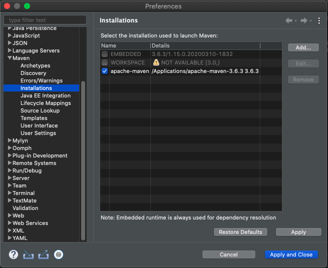

* Para comprobar que todo va bien podemos descargar el siguiente proyecto Maven y abrirlo desde Eclipse.

   https://github.com/jitpack/maven-modular

* Importamos un proyecto Maven

   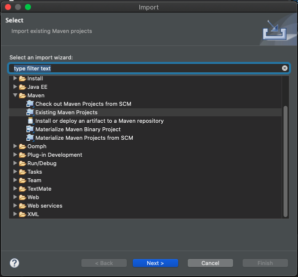

   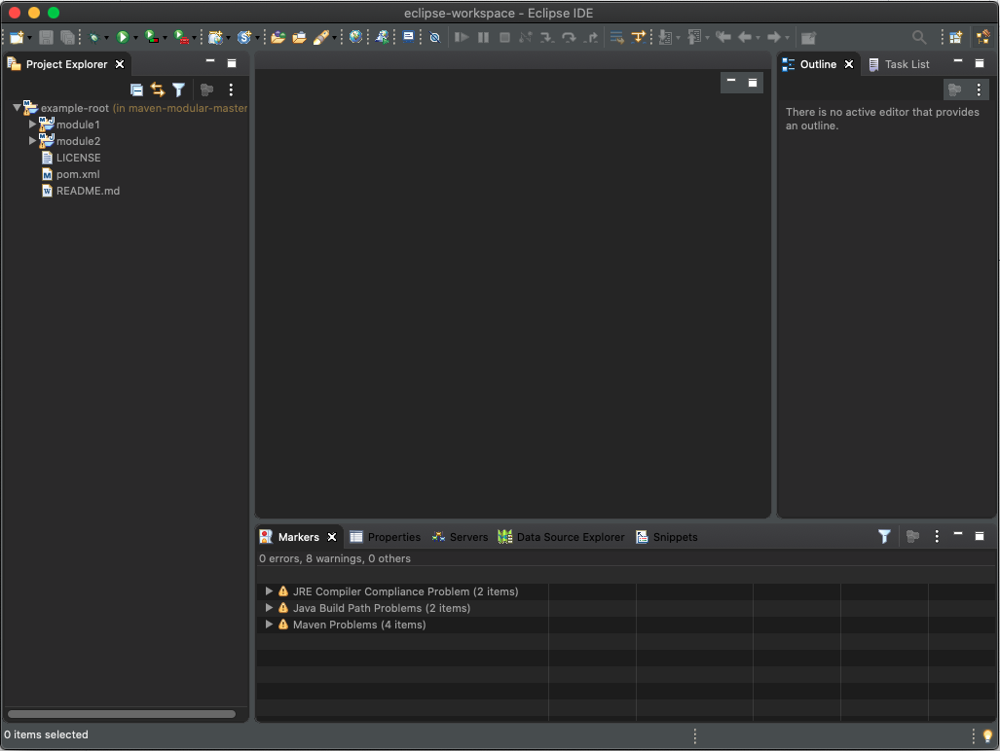

### Visualizarlo desde la consola

* Desde la consola podemos ubicarnos donde se encuentra el proyecto:

   `cd /Users/adolfodelarosa/Documents/Udemy2020/Cursos/OW/Maven/downloads/maven-modular-master`

* Podemos ver la estructura del proyecto

   ```sh
   mini-de-adolfo:maven-modular-master adolfodelarosa$ ls
   LICENSE		README.md	module1		module2		pom.xml
   
   mini-de-adolfo:maven-modular-master adolfodelarosa$ cd module1
   mini-de-adolfo:module1 adolfodelarosa$ ls
   pom.xml	src	target
   
   mini-de-adolfo:module1 adolfodelarosa$ cd ..
   mini-de-adolfo:maven-modular-master adolfodelarosa$ cd module2
   mini-de-adolfo:module2 adolfodelarosa$ ls
   pom.xml	src	target
   mini-de-adolfo:module2 adolfodelarosa$ 
   ```
   
   Es un proyecto Maven con dos modulos y su archivo `pom.xml` y a su vez cada modulo es otro proyecto Maven con su propio archivo `pom.xml`.

* Si estando en el proyecto principal pulsamos `mvn`, identifica el contenido:

   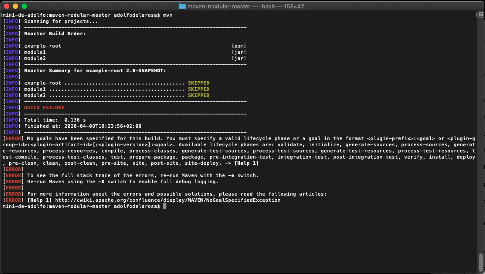

   Nos presenta errores por que no dimos ningún comando Maven, 
   
* Si pulsamos `mvn compile` podemos ver como nos compila el proyecto:

   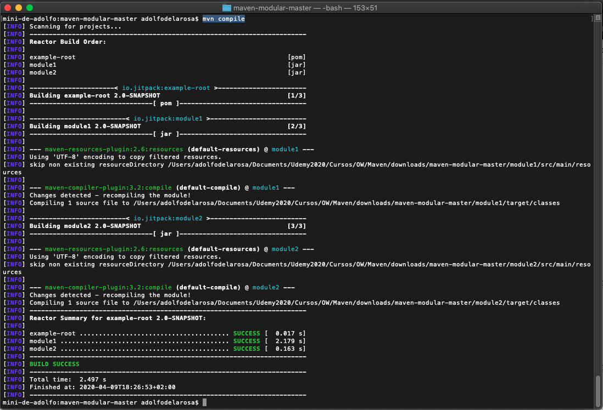

## Compilación y empaquetado 9:46

Para empezar con los comandos desde la consola nos descargamos el siguiente repositirio:

[Apache Commons IO](https://github.com/apache/commons-io)

En nuestra consola nos vamos a la carpeta donde hemos descargado el proyecto:

```sh
cd /Users/adolfodelarosa/Documents/Udemy2020/Cursos/OW/Maven/downloads/commons-io-master

mini-de-adolfo:commons-io-master adolfodelarosa$ pwd
/Users/adolfodelarosa/Documents/Udemy2020/Cursos/OW/Maven/downloads/commons-io-master
mini-de-adolfo:commons-io-master adolfodelarosa$ 
```

Podemos apreciar el contenido de este proyecto

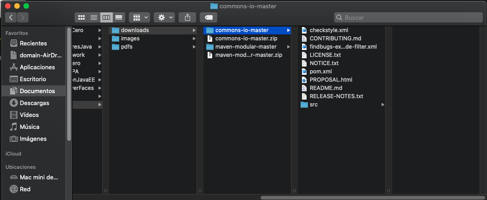

### Comando `mvn compile`

Crea el directorio `target` con los `.class` asociados a los fuentes que hay en la carpeta `src`

```sh
mini-de-adolfo:commons-io-master adolfodelarosa$ mvn compile
[INFO] Scanning for projects...
Downloading from central: https://repo.maven.apache.org/maven2/org/apache/commons/commons-parent/50/commons-parent-50.pom
Downloaded from central: https://repo.maven.apache.org/maven2/org/apache/commons/commons-parent/50/commons-parent-50.pom (76 kB at 66 kB/s)
[INFO] 
[INFO] -----------------------< commons-io:commons-io >------------------------
[INFO] Building Apache Commons IO 2.7-SNAPSHOT
[INFO] --------------------------------[ jar ]---------------------------------

...

[INFO] /Users/adolfodelarosa/Documents/Udemy2020/Cursos/OW/Maven/downloads/commons-io-master/src/main/java/org/apache/commons/io/IOExceptionList.java: Recompile with -Xlint:unchecked for details.
[INFO] ------------------------------------------------------------------------
[INFO] BUILD SUCCESS
[INFO] ------------------------------------------------------------------------
[INFO] Total time:  20.019 s
[INFO] Finished at: 2020-04-09T19:04:36+02:00
[INFO] ------------------------------------------------------------------------
mini-de-adolfo:commons-io-master adolfodelarosa$ 
```

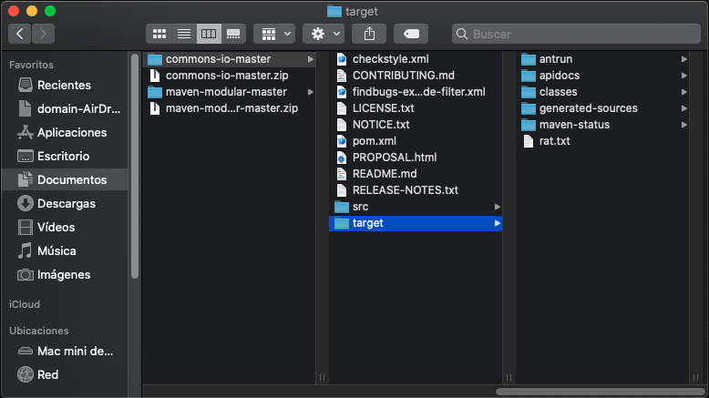

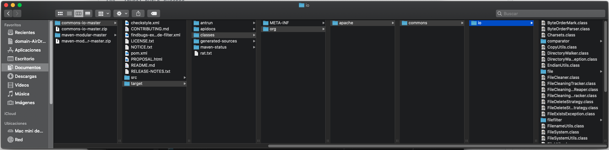

Podemos apreciar como se ha generado la carpeta `target` y dentro de ella se han creado todos los archivos `.class`.

### Comando `mvn clean`

Borra todo el contenido del directorio `target` que es donde se almacenan todos los compilados del proyecto.


### Comando `mvn clean`

Si pulsamos el comando `mvn clean`:


Vemos como la carpeta `target` se elimina junto con todo su contenido.


          
### Comando `mvn clean package`          

Este comando nos permite eliminar lo ya compilado, para volverlo a compilar pero ademas empaquetarlo.

```sh
192:commons-io-master adolfodelarosa$ mvn clean package

... 

[INFO] Skipping because packaging 'jar' is not pom.
[INFO] 
[INFO] --- maven-jar-plugin:3.2.0:test-jar (default) @ commons-io ---
[INFO] Building jar: /Users/adolfodelarosa/Documents/Udemy2020/Cursos/OW/Maven/downloads/commons-io-master/target/commons-io-2.7-SNAPSHOT-tests.jar
[INFO] 
[INFO] --- maven-source-plugin:3.2.0:jar-no-fork (create-source-jar) @ commons-io ---
[INFO] Building jar: /Users/adolfodelarosa/Documents/Udemy2020/Cursos/OW/Maven/downloads/commons-io-master/target/commons-io-2.7-SNAPSHOT-sources.jar
[INFO] 
[INFO] --- maven-source-plugin:3.2.0:test-jar-no-fork (create-source-jar) @ commons-io ---
[INFO] Building jar: /Users/adolfodelarosa/Documents/Udemy2020/Cursos/OW/Maven/downloads/commons-io-master/target/commons-io-2.7-SNAPSHOT-test-sources.jar
[INFO] ------------------------------------------------------------------------
[INFO] BUILD SUCCESS
[INFO] ------------------------------------------------------------------------
[INFO] Total time:  05:03 min
[INFO] Finished at: 2020-04-09T20:58:08+02:00
[INFO] ------------------------------------------------------------------------
192:commons-io-master adolfodelarosa$
```

Cuando finaliza se crea la carpeta `target` con todos los archivos `.class` pero ademas de esto se crean los archivos `.jar`:

```
commons-io-2.7-SNAPSHOT-sources.jar
commons-io-2.7-SNAPSHOT-test-sources.jar
commons-io-2.7-SNAPSHOT-tests.jar
commons-io-2.7-SNAPSHOT.jar
```

Nosotros podriamos distribuir el archivo `commons-io-2.7-SNAPSHOT-sources.jar` para que pueda ser incluido en otros proyectos y pueda ser utilizado todo el código desarrollado en esa libreria.

Ademas de este jar genera otro para los `sources`, otro de `test`y uno de `test-sources`.

### Respositorio local

Maven tiene un repositorio local por default donde va recolectando todas las dependencias y librerias que va necesitando y que descarga de repositorios remotos y las coloca en el repositorio local para optimizar la velocidad de compilación.

Este repositorio local por defaul esta ubicado en:

`/Users/adolfodelarosa/.m2/repository`

Para este proyecto si abrimos el archivo `pom.xml` tenemos:

```
<groupId>commons-io</groupId>
<artifactId>commons-io</artifactId>
<version>2.7-SNAPSHOT</version>
```

Tanto el `groupId` como `artifactId` tienen como valor `commons-io`, por lo que en el repositorio local debemos encontrar esta dependencia.

**Explicación de cómo se crea el respositorio local:**

* Por defecto Maven, si no le decimos nada, utilizará como ruta por defecto del repositorio local `{tu carpeta de usuario}/.m2/repository`

* En la primera ejecución de Maven si no existe dicho directorio lo creará

* Si por un casual queremos customizar esta ruta por el motivo que fuera, porque queremos diferenciar el repositorio local de un cliente a otro, por ejemplo: simplemente editaríamos la propiedad `localRepository` del fichero de configuración `%M2_HOME%/conf/settings.xml`

* Cuando comiencen a descargarse dependencias o a instalarse proyectos en local se guardaran en dicho repositorio atendiendo al `{groupId}/{artifactId}/{version}`

* Hay que tener en cuenta que normalmente el {groupId} suele estar organizado de un modo similar a los paquetes de clases en Maven, usando el caracter .como separador, y dicho separador se usará para establecer la jerarquía en el repositorio.

Por ejemplo la siguiente librería *commons-services*:

* `groupId: net.openwebinars.samples`
* `artifactId: commons-services`
* `version: 1.0`

Al instalarse en nuestro repositorio se guardaría en:

* `%USER_HOME%/.m2/repository/net/openwebinars/samples/commons-services/1.0/commons-services-1.0.jar`

   * Es decir que el primer nivel corresponde al `groupId`.
   * El segundo nivel corresponde al `artifactId`.
   * Y el tercer nivel corresponde a la `version`.

### Cambiar el repositorio local por defecto

* Editamos el archivo `%M2_HOME%/conf/settings.xml` añadiendo la línea:

   `<localRepository> ${user.home}/.m2/repository2</localRepository>`

* Verificamos el contenido de `.m2` para ver que solo existe `repository`:

```sh
192:.m2 adolfodelarosa$ pwd
/Users/adolfodelarosa/.m2

192:.m2 adolfodelarosa$ ls
repository
```

* Compilemos nuvamente nuestro proyecto con: 

   ```sh
   192:commons-io-master adolfodelarosa$ mvn clean package

   ... 
   [INFO] Skipping because packaging 'jar' is not pom.
   [INFO] 
   [INFO] --- maven-jar-plugin:3.2.0:test-jar (default) @ commons-io ---
   [INFO] Building jar: /Users/adolfodelarosa/Documents/Udemy2020/Cursos/OW/Maven/downloads/commons-io-master/target/commons-io-2.7-SNAPSHOT-tests.jar
   [INFO] 
   [INFO] --- maven-source-plugin:3.2.0:jar-no-fork (create-source-jar) @ commons-io ---
   [INFO] Building jar: /Users/adolfodelarosa/Documents/Udemy2020/Cursos/OW/Maven/downloads/commons-io-master/target/commons-io-2.7-SNAPSHOT-sources.jar
   [INFO] 
   [INFO] --- maven-source-plugin:3.2.0:test-jar-no-fork (create-source-jar) @ commons-io ---
   [INFO] Building jar: /Users/adolfodelarosa/Documents/Udemy2020/Cursos/OW/Maven/downloads/commons-io-master/target/commons-io-2.7-SNAPSHOT-test-sources.jar
   [INFO] ------------------------------------------------------------------------
   [INFO] BUILD SUCCESS
   [INFO] ------------------------------------------------------------------------
   [INFO] Total time:  05:12 min
   [INFO] Finished at: 2020-04-09T22:39:14+02:00
   [INFO] ------------------------------------------------------------------------
   mini-de-adolfo:commons-io-master adolfodelarosa$ 
   ```

* Una vez que finaliza la compilación, podemos ver que en `.m2` ya tenemos el `repository2` que incluimos en la configuración:

   ```sh
   192:.m2 adolfodelarosa$ ls
   repository	repository2

   192:.m2 adolfodelarosa$ cd repository2
   192:repository2 adolfodelarosa$ ls
   antlr				commons-chain			commons-logging			net
   aopalliance			commons-cli			commons-validator		org
   avalon-framework		commons-codec			de				oro
   backport-util-concurrent	commons-collections		dom4j				sslext
   biz				commons-digester		javax				xerces
   classworlds			commons-httpclient		junit				xml-apis
   com				commons-io			log4j				xmlunit
   commons-beanutils		commons-lang			logkit
   192:repository2 adolfodelarosa$ 

   ```

   Todo lo que vaya necesitando lo mete dentro de este repositorio.

## Instalación de librerías 4:18 

### Comando `mvn install`

Este comando compila, empaqueta y toma el `jar` creado en la carpeta `target` y lo copia en el repositorio local.

```sh
mini-de-adolfo:commons-io-master adolfodelarosa$ mvn install

...

[INFO] Installing /Users/adolfodelarosa/Documents/Udemy2020/Cursos/OW/Maven/downloads/commons-io-master/target/commons-io-2.7-SNAPSHOT-test-sources.jar to /Users/adolfodelarosa/.m2/repository2/commons-io/commons-io/2.7-SNAPSHOT/commons-io-2.7-SNAPSHOT-test-sources.jar
[INFO] ------------------------------------------------------------------------
[INFO] BUILD SUCCESS
[INFO] ------------------------------------------------------------------------
[INFO] Total time:  04:50 min
[INFO] Finished at: 2020-04-10T01:23:27+02:00
[INFO] ------------------------------------------------------------------------
```

Si revisamos el repositorio local veremos que se ha copiado nuestros archivos `.jar`  dentro de `2.7-SNAPSHOT`:

```sh
192:commons-io adolfodelarosa$ pwd
/Users/adolfodelarosa/.m2/repository2/commons-io/commons-io
192:commons-io adolfodelarosa$ ls -l
total 8
drwxr-xr-x  5 adolfodelarosa  staff  160  9 abr 22:34 2.1
drwxr-xr-x  7 adolfodelarosa  staff  224  9 abr 22:34 2.2
drwxr-xr-x  7 adolfodelarosa  staff  224  9 abr 22:34 2.4
drwxr-xr-x  7 adolfodelarosa  staff  224  9 abr 22:34 2.5
drwxr-xr-x  5 adolfodelarosa  staff  160  9 abr 22:39 2.6
drwxr-xr-x  9 adolfodelarosa  staff  288 10 abr 01:23 2.7-SNAPSHOT
-rw-r--r--  1 adolfodelarosa  staff  278 10 abr 01:23 maven-metadata-local.xml
192:commons-io adolfodelarosa$ 

192:commons-io adolfodelarosa$ cd 2.7-SNAPSHOT/
-rw-r--r--  1 adolfodelarosa  staff     318 10 abr 01:23 _remote.repositories
-rw-r--r--  1 adolfodelarosa  staff  340195 10 abr 01:23 commons-io-2.7-SNAPSHOT-sources.jar
-rw-r--r--  1 adolfodelarosa  staff  296496 10 abr 01:23 commons-io-2.7-SNAPSHOT-test-sources.jar
-rw-r--r--  1 adolfodelarosa  staff  470135 10 abr 01:23 commons-io-2.7-SNAPSHOT-tests.jar
-rw-r--r--  1 adolfodelarosa  staff  270181 10 abr 01:23 commons-io-2.7-SNAPSHOT.jar
-rw-r--r--  1 adolfodelarosa  staff   15073  9 abr 16:19 commons-io-2.7-SNAPSHOT.pom
-rw-r--r--  1 adolfodelarosa  staff   
```

También mete el `pom.xml` pero le cambia el nombre a `commons-io-2.7-SNAPSHOT.pom`. Ademas de meter ciertos metadatos como la fecha en la que se descargo la libreria.

### Comando `mvn clean install -Dmaven.test.skip=true`

Con este comando hacemos lo mismo que el comando `mvn install` pero sin incluir los test.

## Árbol de dependencias 6:18 

### Comando `mvn dependency:tree`

Con este comando se descarga el pluging `dependency` y una vez descargado ejecuta la orden `tree`. Lo que devuelve son todas las dependencias del proyecto en forma de árbol.

```sh
mini-de-adolfo:commons-io-master adolfodelarosa$ mvn dependency:tree
[INFO] Scanning for projects...
[INFO] 
[INFO] -----------------------< commons-io:commons-io >------------------------
[INFO] Building Apache Commons IO 2.7-SNAPSHOT
[INFO] --------------------------------[ jar ]---------------------------------
[INFO] 
[INFO] --- maven-dependency-plugin:3.1.1:tree (default-cli) @ commons-io ---
[INFO] commons-io:commons-io:jar:2.7-SNAPSHOT
[INFO] +- org.junit.jupiter:junit-jupiter:jar:5.6.1:test
[INFO] |  +- org.junit.jupiter:junit-jupiter-api:jar:5.6.1:test
[INFO] |  |  +- org.apiguardian:apiguardian-api:jar:1.1.0:test
[INFO] |  |  +- org.opentest4j:opentest4j:jar:1.2.0:test
[INFO] |  |  \- org.junit.platform:junit-platform-commons:jar:1.6.1:test
[INFO] |  +- org.junit.jupiter:junit-jupiter-params:jar:5.6.1:test
[INFO] |  \- org.junit.jupiter:junit-jupiter-engine:jar:5.6.1:test
[INFO] |     \- org.junit.platform:junit-platform-engine:jar:1.6.1:test
[INFO] +- org.junit-pioneer:junit-pioneer:jar:0.5.6:test
[INFO] +- org.mockito:mockito-core:jar:3.3.3:test
[INFO] |  +- net.bytebuddy:byte-buddy:jar:1.10.5:test
[INFO] |  +- net.bytebuddy:byte-buddy-agent:jar:1.10.5:test
[INFO] |  \- org.objenesis:objenesis:jar:2.6:test
[INFO] +- com.google.jimfs:jimfs:jar:1.1:test
[INFO] |  \- com.google.guava:guava:jar:18.0:test
[INFO] \- org.apache.commons:commons-lang3:jar:3.10:test
[INFO] ------------------------------------------------------------------------
[INFO] BUILD SUCCESS
[INFO] ------------------------------------------------------------------------
[INFO] Total time:  1.561 s
[INFO] Finished at: 2020-04-10T01:39:19+02:00
[INFO] ------------------------------------------------------------------------
mini-de-adolfo:commons-io-master adolfodelarosa$ 
```

Podemos apreciar el árbol de las dependencias de este proyecto. Podemos abrir el archivo `pom.xml` del proyecto y ver las dependecias que tiene incluidas de manera directa:

```sh
<dependencies>
    <dependency>
      <groupId>org.junit.jupiter</groupId>
      <artifactId>junit-jupiter</artifactId>
      <version>5.6.1</version>
      <scope>test</scope>
    </dependency>
    <dependency>
      <groupId>org.junit-pioneer</groupId>
      <artifactId>junit-pioneer</artifactId>
      <version>0.5.6</version>
      <scope>test</scope>
    </dependency>
    <dependency>
      <groupId>org.mockito</groupId>
      <artifactId>mockito-core</artifactId>
      <version>3.3.3</version>
      <scope>test</scope>
    </dependency>
    <dependency>
      <groupId>com.google.jimfs</groupId>
      <artifactId>jimfs</artifactId>
      <version>1.1</version>
      <scope>test</scope>
    </dependency>
    <dependency>
      <groupId>org.apache.commons</groupId>
      <artifactId>commons-lang3</artifactId>
      <version>3.10</version>
      <scope>test</scope>
    </dependency>
  </dependencies>
```

Vemos claramente como estan códificadas las dependdencias de primer nivel tal como las muestra el **árbol de dependencias**. 

Pero un archivo `pom.xml` se comporta como un objeto y como tal puede contener un padre el cual se definde en :

```sh
<parent>
    <groupId>org.apache.commons</groupId>
    <artifactId>commons-parent</artifactId>
    <version>50</version>
  </parent>
```

#### Dependencias en el Padre del `pom.xml`

Este es otro sitio donde puede haber dependencias de nuestro proyecto. Podemos buscarlo dentro de nuestro repositorio local de una manera muy sencilla gracias a que usa una **forma estandar de definición** 

```sh
192:repository2 adolfodelarosa$ cd org/apache/commons/commons-parent/50

192:50 adolfodelarosa$ ls -l
total 280
-rw-r--r--  1 adolfodelarosa  staff    172  9 abr 22:34 _remote.repositories
-rw-r--r--  1 adolfodelarosa  staff  75622  9 abr 22:34 commons-parent-50.pom
-rw-r--r--  1 adolfodelarosa  staff     40  9 abr 22:34 commons-parent-50.pom.sha1
192:50 adolfodelarosa$ 
```

Tenemos el archivo `commons-parent-50.pom` que podemos abrir con:

```sh
192:50 adolfodelarosa$ open -e commons-parent-50.pom
```

Y si vemos sus dependencias tenemos:

```sh
<dependencies>
      <dependency>
      <groupId>org.apache.maven.doxia</groupId>
      <artifactId>doxia-core</artifactId>
      <version>1.8</version>
      </dependency>
</dependencies>
```
En este caso esta dependencia no aparecia en el **árbol de dependecias** pero en otros casos será de utilidad ver las dependencias del padre que esta en el archivo `pom.xml`.

#### Dependencias dentro de las propias dependencias

Como podemos apreciar en el **árbol de dependecias** dentro de las dependencias principales existen otras dependecias que decienden de ellas, por ejemplo:

```sh
[INFO] +- org.mockito:mockito-core:jar:3.3.3:test
[INFO] |  +- net.bytebuddy:byte-buddy:jar:1.10.5:test
[INFO] |  +- net.bytebuddy:byte-buddy-agent:jar:1.10.5:test
[INFO] |  \- org.objenesis:objenesis:jar:2.6:test
```

Ya vimos que en el archivo `pom.xml` solo aparece la dependecia principal:

```sh
<dependency>
      <groupId>org.mockito</groupId>
      <artifactId>mockito-core</artifactId>
      <version>3.3.3</version>
      <scope>test</scope>
</dependency>
```

Para ver donde se encuentran las sub-dependecias es necesario acceder a esta dependencia:

```sh
192:repository2 adolfodelarosa$ pwd
/Users/adolfodelarosa/.m2/repository2
192:repository2 adolfodelarosa$ cd org/mockito/mockito-core/3.3.3
192:3.3.3 adolfodelarosa$ ls -l
total 1232
-rw-r--r--  1 adolfodelarosa  staff     205  9 abr 22:34 _remote.repositories
-rw-r--r--  1 adolfodelarosa  staff  592291  9 abr 22:34 mockito-core-3.3.3.jar
-rw-r--r--  1 adolfodelarosa  staff      40  9 abr 22:34 mockito-core-3.3.3.jar.sha1
-rw-r--r--  1 adolfodelarosa  staff   22948  9 abr 22:34 mockito-core-3.3.3.pom
-rw-r--r--  1 adolfodelarosa  staff      40  9 abr 22:34 mockito-core-3.3.3.pom.sha1
192:3.3.3 adolfodelarosa$ 
```

Y abrir el archivo `mockito-core-3.3.3.pom`:

```sh
<dependencies>
    <dependency>
      <groupId>net.bytebuddy</groupId>
      <artifactId>byte-buddy</artifactId>
      <version>1.10.5</version>
      <scope>compile</scope>
    </dependency>
    <dependency>
      <groupId>net.bytebuddy</groupId>
      <artifactId>byte-buddy-agent</artifactId>
      <version>1.10.5</version>
      <scope>compile</scope>
    </dependency>
    <dependency>
      <groupId>org.objenesis</groupId>
      <artifactId>objenesis</artifactId>
      <version>2.6</version>
      <scope>compile</scope>
    </dependency>
  </dependencies>
```

Aquí vemos claramente las 3 dependencias que se observan en el **árbol de dependecias** para esta dependencia principal. De esta manera podemos llegar a saber donde estan las demas dependencias para las otras dependendencias princiapales.

### Criterio para declarar librerias.

Si tu utilizas en tu proyecto librerias de otras librerias que se incluyen de forma transitiva, tienes que declarar expresamente las dependecias, para evitar futuros problemas en caso de que una libreria deje de usar esas librerias transitivas.

## Ejemplo práctico: Apache Maven 10:54 

1. Creación de un proyecto a partir de un arquetipo

2. Descarga de dependencias, compilación, empaquetado y ejecución.

3. Trabajando con Apache Maven en una red con un proxy HTTP

En este ejemplo vamos a cojer una libreria de software libre existente en un repositorio como GitHub y la vamos a convertir nuestra, la vamos a renombrar, modificaremos su GroupId, incluiremos alguna dependencia, es decir un software libre existe lo personalizaremos de acuerdo a nuestras necesidades.

Basandonos en nuestro proyecto `commons-io` haremos cambios para personalzar esta libreria.

* Abrimos el archivo `pom.xml` el cual tiene la siguiente configuración:

```sh
  <groupId>commons-io</groupId>
  <artifactId>commons-io</artifactId>
  <version>2.7-SNAPSHOT</version>
```

Y la cambiaremos a la siguiente:

```sh
  <groupId>net.openwebinars</groupId>
  <artifactId>coomunes-es</artifactId>
  <version>1.0</version>
  <name>OpenWebinars Comunes Entrada/Salida</name>
```

Una vez hecho estos cambios pulsamos el comando:

```sh
mini-de-adolfo:commons-io-master adolfodelarosa$ mvn clean install -Dmaven.test.skip=true

. . . 
[INFO] Installing /Users/adolfodelarosa/Documents/Udemy2020/Cursos/OW/Maven/downloads/commons-io-master/target/comunes-es-1.0.jar to /Users/adolfodelarosa/.m2/repository2/net/openwebinars/comunes-es/1.0/comunes-es-1.0.jar
[INFO] Installing /Users/adolfodelarosa/Documents/Udemy2020/Cursos/OW/Maven/downloads/commons-io-master/pom.xml to /Users/adolfodelarosa/.m2/repository2/net/openwebinars/comunes-es/1.0/comunes-es-1.0.pom
[INFO] Installing /Users/adolfodelarosa/Documents/Udemy2020/Cursos/OW/Maven/downloads/commons-io-master/target/comunes-es-1.0-sources.jar to /Users/adolfodelarosa/.m2/repository2/net/openwebinars/comunes-es/1.0/comunes-es-1.0-sources.jar
[INFO] Installing /Users/adolfodelarosa/Documents/Udemy2020/Cursos/OW/Maven/downloads/commons-io-master/target/comunes-es-1.0-test-sources.jar to /Users/adolfodelarosa/.m2/repository2/net/openwebinars/comunes-es/1.0/comunes-es-1.0-test-sources.jar
[INFO] ------------------------------------------------------------------------
[INFO] BUILD SUCCESS
[INFO] ------------------------------------------------------------------------
[INFO] Total time:  10.658 s
[INFO] Finished at: 2020-04-10T02:41:00+02:00
[INFO] ------------------------------------------------------------------------
mini-de-adolfo:commons-io-master adolfodelarosa$ 
```

Nos indica que nuestra libreria se ha instalado en:

`/Users/adolfodelarosa/.m2/repository2/net/openwebinars/comunes-es/1.0/comunes-es-1.0.jar`

Si revisamos el contenido de esa carpeta tenemos:

```sh
192:repository2 adolfodelarosa$ pwd
/Users/adolfodelarosa/.m2/repository2
192:repository2 adolfodelarosa$ cd net/openwebinars/comunes-es/1.0/
192:1.0 adolfodelarosa$ ls -l
total 1824
-rw-r--r--  1 adolfodelarosa  staff     246 10 abr 02:41 _remote.repositories
-rw-r--r--  1 adolfodelarosa  staff  340274 10 abr 02:41 comunes-es-1.0-sources.jar
-rw-r--r--  1 adolfodelarosa  staff  296575 10 abr 02:41 comunes-es-1.0-test-sources.jar
-rw-r--r--  1 adolfodelarosa  staff  270258 10 abr 02:40 comunes-es-1.0.jar
-rw-r--r--  1 adolfodelarosa  staff   15088 10 abr 02:40 comunes-es-1.0.pom
192:1.0 adolfodelarosa$ 
```

Con esto nos hemos hecho de nuestra librería rapidamente. Aquí claramente estamos viendo la utilidad de  `groupId`,`artifactId` y `version` los cuales crean la estructura del proyecto dentro de nuestro repositorio local.


## Contenido adicional 2

[Introducción a Apache Maven](pdfs/2.1_Introudcción_a_Apache_Maven.pdf)

[Instalación y configuración](pdfs/2.2_Instalacion.pdf)
