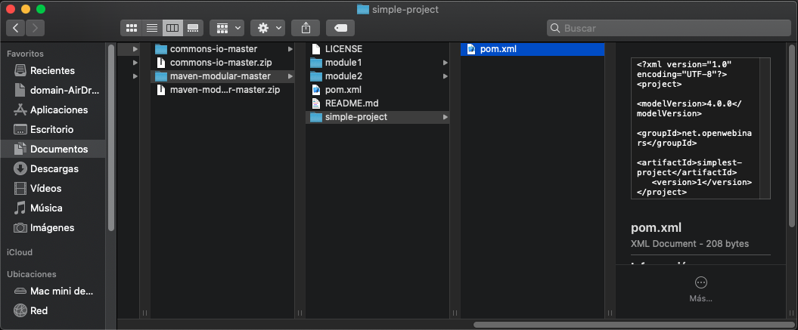
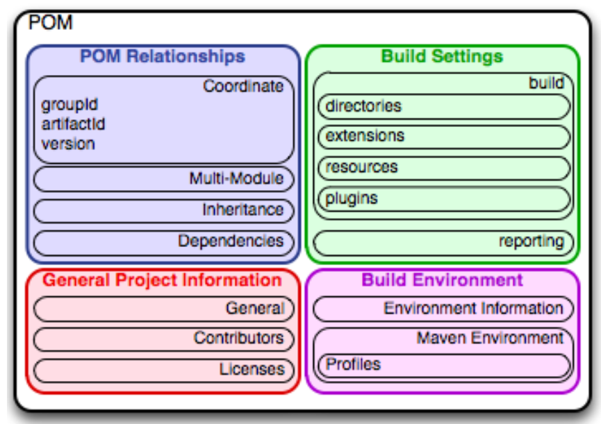

# 3. POM (Project Object Model) 80m

* Introducción a POM (Project Object Model) 3:49 
* Sintaxis del POM (Project Object Model) 9:45 
* Declaración de dependencias 14:40 
* Dependency plugins 9:52 
* Definición de repositorios 12:13 
* Definición del flujo de construcción y fases del ciclo de vida 3:27 
* Plugins Maven mas conocidos 8:16 
* Uso de perfiles de configuración 8:52 
* Ejemplo práctico: POM (Project Object Model) 9:43 
* Contenido adicional  8


## Introducción a POM (Project Object Model) 3:49 

[Introducción a POM](pdfs/3.1_Introduccion_a_POM_.pdf)

Los ficheros POM son los que aglutinan toda la configuración y declaración de ejecuciones de Maven.
Desde definición de proyectos Maven, dependencias, flujos de construcción, etc.

Existe una analogía entre los ficheros `pom.xml` de **Apache Maven** y los `Makefile` de **GNU Make** o los `build.xml` de **Apache Ant**. Cada uno de estos tres ficheros ofrecen información de configuración que es usada por cada herramienta respectiva para construir el empaquetado binario (compilados) a partir del código fuente.

Maven casi siempre es usado en proyectos Java, pero eso no quiere decir que no esté preparado para ser usado en otros lenguajes como C# o C.

Maven va mucho más allá de una mera herramienta de construcción y empaquetado de aplicaciones, permite gestionar todo el ciclo de vida de un proyecto contemplando ámbitos como CI/CD (integración contínua y entrega contínua), testing, control de calidad, etc.

## Sintaxis del POM (Project Object Model) 9:45 

[Sintaxis del POM](pdfs/3.2_Sintaxis_del_POM_.pdf)

Veamos como ejemplo el POM más sencillo que se puede declarar:

```html
<project xmlns="http://maven.apache.org/POM/4.0.0" xmlns:xsi="http://www.w3.org/2001/XMLSchema-instance" xsi:schemaLocation="http://maven.apache.org/POM/4.0.0 http://maven.apache.org/xsd/maven-4.0.0.xsd">
  <modelVersion>4.0.0</modelVersion>
  <groupId>net.openwebinars</groupId>
  <artifactId>simplest-project</artifactId>
  <version>1</version>
</project>
```

Si ejecutamos el comando `$> mvn help:effective-pom` obtendremos el POM efectivo que en realidad hemos definido teniendo en cuenta, del mismo modo que en la programación orientada a objetos, la configuración heredada del super *POM*:

```html
<?xml version="1.0"?>
<project xsi:schemaLocation="http://maven.apache.org/POM/4.0.0 http://maven.apache.org/xsd/maven-4.0.0.xsd" xmlns="http://maven.apache.org/POM/4.0.0"
    xmlns:xsi="http://www.w3.org/2001/XMLSchema-instance">
  <modelVersion>4.0.0</modelVersion>
  <groupId>net.openwebinars</groupId>
  <artifactId>simplest-project</artifactId>
  <version>1</version>
  <repositories>
    <repository>
      <snapshots>
        <enabled>false</enabled>
      </snapshots>
      <id>central</id>
      <name>Central Repository</name>
      <url>https://repo.maven.apache.org/maven2</url>
    </repository>
  </repositories>
  <pluginRepositories>
    <pluginRepository>
      <releases>
        <updatePolicy>never</updatePolicy>
      </releases>
      <snapshots>
        <enabled>false</enabled>
      </snapshots>
      <id>central</id>
      <name>Central Repository</name>
      <url>https://repo.maven.apache.org/maven2</url>
    </pluginRepository>
  </pluginRepositories>
  <build>
    <sourceDirectory>C:\dev\workspace\simplest-project\src\main\java</sourceDirectory>
    <scriptSourceDirectory>C:\dev\workspace\simplest-project\src\main\scripts</scriptSourceDirectory>
    <testSourceDirectory>C:\dev\workspace\simplest-project\src\test\java</testSourceDirectory>
    <outputDirectory>C:\dev\workspace\simplest-project\target\classes</outputDirectory>
    <testOutputDirectory>C:\dev\workspace\simplest-project\target\test-classes</testOutputDirectory>
    <resources>
      <resource>
        <directory>C:\dev\workspace\simplest-project\src\main\resources</directory>
      </resource>
    </resources>
    <testResources>
      <testResource>
        <directory>C:\dev\workspace\simplest-project\src\test\resources</directory>
      </testResource>
    </testResources>
    <directory>C:\dev\workspace\simplest-project\target</directory>
    <finalName>simplest-project-1</finalName>
    <pluginManagement>
      <plugins>
        <plugin>
          <artifactId>maven-antrun-plugin</artifactId>
          <version>1.3</version>
        </plugin>
        <plugin>
          <artifactId>maven-assembly-plugin</artifactId>
          <version>2.2-beta-5</version>
        </plugin>
        <plugin>
          <artifactId>maven-dependency-plugin</artifactId>
          <version>2.8</version>
        </plugin>
        <plugin>
          <artifactId>maven-release-plugin</artifactId>
          <version>2.3.2</version>
        </plugin>
      </plugins>
    </pluginManagement>
    <plugins>
      <plugin>
        <artifactId>maven-clean-plugin</artifactId>
        <version>2.5</version>
        <executions>
          <execution>
            <id>default-clean</id>
            <phase>clean</phase>
            <goals>
              <goal>clean</goal>
            </goals>
          </execution>
        </executions>
      </plugin>
      <plugin>
        <artifactId>maven-resources-plugin</artifactId>
        <version>2.6</version>
        <executions>
          <execution>
            <id>default-testResources</id>
            <phase>process-test-resources</phase>
            <goals>
              <goal>testResources</goal>
            </goals>
          </execution>
          <execution>
            <id>default-resources</id>
            <phase>process-resources</phase>
            <goals>
              <goal>resources</goal>
            </goals>
          </execution>
        </executions>
      </plugin>
      <plugin>
        <artifactId>maven-jar-plugin</artifactId>
        <version>2.4</version>
        <executions>
          <execution>
            <id>default-jar</id>
            <phase>package</phase>
            <goals>
              <goal>jar</goal>
            </goals>
          </execution>
        </executions>
      </plugin>
      <plugin>
        <artifactId>maven-compiler-plugin</artifactId>
        <version>3.1</version>
        <executions>
          <execution>
            <id>default-compile</id>
            <phase>compile</phase>
            <goals>
              <goal>compile</goal>
            </goals>
          </execution>
          <execution>
            <id>default-testCompile</id>
            <phase>test-compile</phase>
            <goals>
              <goal>testCompile</goal>
            </goals>
          </execution>
        </executions>
      </plugin>
      <plugin>
        <artifactId>maven-surefire-plugin</artifactId>
        <version>2.12.4</version>
        <executions>
          <execution>
            <id>default-test</id>
            <phase>test</phase>
            <goals>
              <goal>test</goal>
            </goals>
          </execution>
        </executions>
      </plugin>
      <plugin>
        <artifactId>maven-install-plugin</artifactId>
        <version>2.4</version>
        <executions>
          <execution>
            <id>default-install</id>
            <phase>install</phase>
            <goals>
              <goal>install</goal>
            </goals>
          </execution>
        </executions>
      </plugin>
      <plugin>
        <artifactId>maven-deploy-plugin</artifactId>
        <version>2.7</version>
        <executions>
          <execution>
            <id>default-deploy</id>
            <phase>deploy</phase>
            <goals>
              <goal>deploy</goal>
            </goals>
          </execution>
        </executions>
      </plugin>
      <plugin>
        <artifactId>maven-site-plugin</artifactId>
        <version>3.3</version>
        <executions>
          <execution>
            <id>default-site</id>
            <phase>site</phase>
            <goals>
              <goal>site</goal>
            </goals>
            <configuration>
              <outputDirectory>C:\dev\workspace\simplest-project\target\site</outputDirectory>
              <reportPlugins>
                <reportPlugin>
                  <groupId>org.apache.maven.plugins</groupId>
                  <artifactId>maven-project-info-reports-plugin</artifactId>
                </reportPlugin>
              </reportPlugins>
            </configuration>
          </execution>
          <execution>
            <id>default-deploy</id>
            <phase>site-deploy</phase>
            <goals>
              <goal>deploy</goal>
            </goals>
            <configuration>
              <outputDirectory>C:\dev\workspace\simplest-project\target\site</outputDirectory>
              <reportPlugins>
                <reportPlugin>
                  <groupId>org.apache.maven.plugins</groupId>
                  <artifactId>maven-project-info-reports-plugin</artifactId>
                </reportPlugin>
              </reportPlugins>
            </configuration>
          </execution>
        </executions>
        <configuration>
          <outputDirectory>C:\dev\workspace\simplest-project\target\site</outputDirectory>
          <reportPlugins>
            <reportPlugin>
              <groupId>org.apache.maven.plugins</groupId>
              <artifactId>maven-project-info-reports-plugin</artifactId>
            </reportPlugin>
          </reportPlugins>
        </configuration>
      </plugin>
    </plugins>
  </build>
  <reporting>
    <outputDirectory>C:\dev\workspace\simplest-project\target\site</outputDirectory>
  </reporting>
</project>
```

Evidentemente, y continuando utilizando la analogía de la programación orientada a objetos, esta configuración heredada puede ser sobreescrita y ampliada.

### Estructura del POM

Cuatro categorías de descripción y configuración:

1. **Información general del proyecto**: Nombre del proyecto, URL, lista de desarrolladores y contribuyentes

2. **Configuración de construcción**: Customización de la configuración manual de construcción definida por defecto

3. **Configuración de entornos** a través de la definición de perfiles de config, por entorno, etc.

4. **Dependencias** entre proyectos y librerías

## Mis Apuntes

### Ejemplo del `pom.xml` más simple

La estructura del archivo `pom.xml`más siemple es la siguiente.

```js
<?xml version="1.0" encoding="UTF-8"?>
<project>
   <modelVersion>4.0.0</modelVersion> 
   <groupId>net.openwebinars</groupId> 
   <artifactId>simplest-project</artifactId> 
   <version>1</version>
</project>
```

### Crear un proyecto a partir `pom.xml` más simple

* Dentro de nuestro proyecto **maven-modular-master** vamos a crear la carpeta *simple-project*
* Dentro de la carpeta *simple-project* creamos el archivo `pom.xml` más simple.

   
   
* Desde la consola ejecutamos el comando `mvn install` para instalar el pom en el repositorio local:

   ```sh
   mini-de-adolfo:simple-project adolfodelarosa$ pwd
   /Users/adolfodelarosa/Documents/Udemy2020/Cursos/OW/Maven/downloads/maven-modular-master/simple-project
   mini-de-adolfo:simple-project adolfodelarosa$ mvn install
   [INFO] Scanning for projects...
   [INFO] 
   [INFO] -----------------< net.openwebinars:simplest-project >------------------
   [INFO] Building simplest-project 1
   [INFO] --------------------------------[ jar ]---------------------------------
   
   . . . 
   
   [INFO] Installing /Users/adolfodelarosa/Documents/Udemy2020/Cursos/OW/Maven/downloads/maven-modular-master/simple- project/pom.xml to /Users/adolfodelarosa/.m2/repository2/net/openwebinars/simplest-project/1/simplest-project-1.pom
   [INFO] ------------------------------------------------------------------------
   [INFO] BUILD SUCCESS
   [INFO] ------------------------------------------------------------------------
   [INFO] Total time:  5.463 s
   [INFO] Finished at: 2020-04-10T19:49:39+02:00
   [INFO] ------------------------------------------------------------------------
   mini-de-adolfo:simple-project adolfodelarosa$ 
   ```
* Ejecutar comando `mvn help:effective-pom` para ver el **pom efectivo**:

   ```sh
   mini-de-adolfo:simple-project adolfodelarosa$ mvn help:effective-pom
   
   . . .
   
   [INFO] 
   [INFO] -----------------< net.openwebinars:simplest-project >------------------
   [INFO] Building simplest-project 1
   [INFO] --------------------------------[ jar ]---------------------------------
   [INFO] 
   [INFO] --- maven-help-plugin:3.2.0:effective-pom (default-cli) @ simplest-project ---
   
   . . .

   <?xml version="1.0" encoding="UTF-8"?>
   <!-- ====================================================================== -->
   <!--                                                                        -->
   <!-- Generated by Maven Help Plugin on 2020-04-10T19:57:19+02:00            -->
   <!-- See: http://maven.apache.org/plugins/maven-help-plugin/                -->
   <!--                                                                        -->
   <!-- ====================================================================== -->
   <!-- ====================================================================== -->
   <!--                                                                        -->
   <!-- Effective POM for project 'net.openwebinars:simplest-project:jar:1'    -->
   <!--                                                                        -->
   <!-- ====================================================================== -->
   <project xmlns="http://maven.apache.org/POM/4.0.0" xmlns:xsi="http://www.w3.org/2001/XMLSchema-instance" xsi:schemaLocation="http://maven.apache.org/POM/4.0.0 https://maven.apache.org/xsd/maven-4.0.0.xsd">
     <modelVersion>4.0.0</modelVersion>
     <groupId>net.openwebinars</groupId>
     <artifactId>simplest-project</artifactId>
     <version>1</version>
     <repositories>
       <repository>
         <snapshots>
           <enabled>false</enabled>
         </snapshots>
         <id>central</id>
         <name>Central Repository</name>
         <url>https://repo.maven.apache.org/maven2</url>
       </repository>
     </repositories>
     <pluginRepositories>
       <pluginRepository>
         <releases>
           <updatePolicy>never</updatePolicy>
         </releases>
         <snapshots>
           <enabled>false</enabled>
         </snapshots>
         <id>central</id>
         <name>Central Repository</name>
         <url>https://repo.maven.apache.org/maven2</url>
       </pluginRepository>
     </pluginRepositories>
     <build>
       <sourceDirectory>/Users/adolfodelarosa/Documents/Udemy2020/Cursos/OW/Maven/downloads/maven-modular-master/simple-project/src/main/java</sourceDirectory>
       <scriptSourceDirectory>/Users/adolfodelarosa/Documents/Udemy2020/Cursos/OW/Maven/downloads/maven-modular-master/simple-project/src/main/scripts</scriptSourceDirectory>
       <testSourceDirectory>/Users/adolfodelarosa/Documents/Udemy2020/Cursos/OW/Maven/downloads/maven-modular-master/simple-project/src/test/java</testSourceDirectory>
       <outputDirectory>/Users/adolfodelarosa/Documents/Udemy2020/Cursos/OW/Maven/downloads/maven-modular-master/simple-project/target/classes</outputDirectory>
       <testOutputDirectory>/Users/adolfodelarosa/Documents/Udemy2020/Cursos/OW/Maven/downloads/maven-modular-master/simple-project/target/test-classes</testOutputDirectory>
       <resources>
         <resource>
           <directory>/Users/adolfodelarosa/Documents/Udemy2020/Cursos/OW/Maven/downloads/maven-modular-master/simple-project/src/main/resources</directory>
         </resource>
       </resources>
       <testResources>
         <testResource>
           <directory>/Users/adolfodelarosa/Documents/Udemy2020/Cursos/OW/Maven/downloads/maven-modular-master/simple-project/src/test/resources</directory>
         </testResource>
       </testResources>
       <directory>/Users/adolfodelarosa/Documents/Udemy2020/Cursos/OW/Maven/downloads/maven-modular-master/simple-project/target</directory>
       <finalName>simplest-project-1</finalName>
       <pluginManagement>
         <plugins>
           <plugin>
             <artifactId>maven-antrun-plugin</artifactId>
             <version>1.3</version>
           </plugin>
           <plugin>
             <artifactId>maven-assembly-plugin</artifactId>
             <version>2.2-beta-5</version>
           </plugin>
           <plugin>
             <artifactId>maven-dependency-plugin</artifactId>
             <version>2.8</version>
           </plugin>
           <plugin>
             <artifactId>maven-release-plugin</artifactId>
             <version>2.5.3</version>
           </plugin>
         </plugins>
       </pluginManagement>
       <plugins>
         <plugin>
           <artifactId>maven-clean-plugin</artifactId>
           <version>2.5</version>
           <executions>
             <execution>
               <id>default-clean</id>
               <phase>clean</phase>
               <goals>
                 <goal>clean</goal>
               </goals>
             </execution>
           </executions>
         </plugin>
         <plugin>
           <artifactId>maven-resources-plugin</artifactId>
           <version>2.6</version>
           <executions>
             <execution>
               <id>default-testResources</id>
               <phase>process-test-resources</phase>
               <goals>
                 <goal>testResources</goal>
               </goals>
             </execution>
             <execution>
               <id>default-resources</id>
               <phase>process-resources</phase>
               <goals>
                 <goal>resources</goal>
               </goals>
             </execution>
           </executions>
         </plugin>
         <plugin>
           <artifactId>maven-jar-plugin</artifactId>
           <version>2.4</version>
           <executions>
             <execution>
               <id>default-jar</id>
               <phase>package</phase>
               <goals>
                 <goal>jar</goal>
               </goals>
             </execution>
           </executions>
         </plugin>
         <plugin>
           <artifactId>maven-compiler-plugin</artifactId>
           <version>3.1</version>
           <executions>
             <execution>
               <id>default-compile</id>
               <phase>compile</phase>
               <goals>
                 <goal>compile</goal>
               </goals>
             </execution>
             <execution>
               <id>default-testCompile</id>
               <phase>test-compile</phase>
               <goals>
                 <goal>testCompile</goal>
               </goals>
             </execution>
           </executions>
         </plugin>
         <plugin>
           <artifactId>maven-surefire-plugin</artifactId>
           <version>2.12.4</version>
           <executions>
             <execution>
               <id>default-test</id>
               <phase>test</phase>
               <goals>
                 <goal>test</goal>
               </goals>
             </execution>
           </executions>
         </plugin>
         <plugin>
           <artifactId>maven-install-plugin</artifactId>
           <version>2.4</version>
           <executions>
             <execution>
               <id>default-install</id>
               <phase>install</phase>
               <goals>
                 <goal>install</goal>
               </goals>
             </execution>
           </executions>
         </plugin>
         <plugin>
           <artifactId>maven-deploy-plugin</artifactId>
           <version>2.7</version>
           <executions>
             <execution>
               <id>default-deploy</id>
               <phase>deploy</phase>
               <goals>
                 <goal>deploy</goal>
               </goals>
             </execution>
           </executions>
         </plugin>
         <plugin>
           <artifactId>maven-site-plugin</artifactId>
           <version>3.3</version>
           <executions>
             <execution>
               <id>default-site</id>
               <phase>site</phase>
               <goals>
                 <goal>site</goal>
               </goals>
               <configuration>
                 <outputDirectory>/Users/adolfodelarosa/Documents/Udemy2020/Cursos/OW/Maven/downloads/maven-modular-master/simple-project/target/site</outputDirectory>
                 <reportPlugins>
                   <reportPlugin>
                     <groupId>org.apache.maven.plugins</groupId>
                     <artifactId>maven-project-info-reports-plugin</artifactId>
                   </reportPlugin>
                 </reportPlugins>
               </configuration>
             </execution>
             <execution>
               <id>default-deploy</id>
               <phase>site-deploy</phase>
               <goals>
                 <goal>deploy</goal>
               </goals>
               <configuration>
                 <outputDirectory>/Users/adolfodelarosa/Documents/Udemy2020/Cursos/OW/Maven/downloads/maven-modular-master/simple-project/target/site</outputDirectory>
                 <reportPlugins>
                   <reportPlugin>
                     <groupId>org.apache.maven.plugins</groupId>
                     <artifactId>maven-project-info-reports-plugin</artifactId>
                   </reportPlugin>
                 </reportPlugins>
               </configuration>
             </execution>
           </executions>
           <configuration>
             <outputDirectory>/Users/adolfodelarosa/Documents/Udemy2020/Cursos/OW/Maven/downloads/maven-modular-master/simple-project/target/site</outputDirectory>
             <reportPlugins>
               <reportPlugin>
                 <groupId>org.apache.maven.plugins</groupId>
                 <artifactId>maven-project-info-reports-plugin</artifactId>
               </reportPlugin>
             </reportPlugins>
           </configuration>
         </plugin>
       </plugins>
     </build>
     <reporting>
       <outputDirectory>/Users/adolfodelarosa/Documents/Udemy2020/Cursos/OW/Maven/downloads/maven-modular-master/simple-project/target/site</outputDirectory>
     </reporting>
   </project>


   [INFO] ------------------------------------------------------------------------
   [INFO] BUILD SUCCESS
   [INFO] ------------------------------------------------------------------------
   [INFO] Total time:  4.238 s
   [INFO] Finished at: 2020-04-10T19:57:19+02:00
   [INFO] ------------------------------------------------------------------------
   mini-de-adolfo:simple-project adolfodelarosa$ 
  ```

* También podríamos enviar la salida a un archivo de salido con:

   `mvn help:effective-pom > effective-pom.xml`

El **pom efectivo** no tiene nada que ver con la sencilles de nuestro `pom.xml` más sencillo.

Esto significa que **hay un pom padre no definido para cualquier `pom.xml`, también llamado super pom** que define cosas como el *Central Repository* (https://repo.maven.apache.org/maven2) que es el repositorio oficial donde se publiacan todas las dependecias, también se define el *pluginRepository*, *build* que corresponde a todo el ciclo de vida de una aplicación, indica donde se compilan las clases, donde los test. Toda una información operativo que no nos damos cuenta que esta.

### De que se compone un fichero pom.

Un fichero pom a grandes resgos se compone dr todo lo siguiente:



## Declaración de dependencias 14:40

[Declaración de dependencias](pdfs/3.3_Declaracion_de_dependencias_.pdf)

Analicemos la declaración de la siguiente dependencia:

```html
<dependencies>
  <dependency>
    <groupId>org.springframework.boot</groupId>
    <artifactId>spring-boot-starter-web</artifactId>
    <version>2.1.3-RELEASE</version>
  </dependency>
</dependencies>
```

Identificador:

* `groupId=org.springframework.boot`

* `artifactId=spring-boot-starter-web`

* `version=2.1.3-RELEASE`

Una vez descargada, dicha depenencia se encontrará en 
`$M2_REPO/org/springframework/boot/spring-boot-starter-web/2.1.3-RELEASE/` :

* spring-boot-starter-web-2.1.3-RELEASE.jar

* spring-boot-starter-web-2.1.3-RELEASE.pom

Si ejecutamos el comando `$> mvn help:effective-pom` obtendremos el POM efectivo que en realidad hemos definido teniendo en cuenta, del mismo modo que en la programación orientada a objetos, la configuración heredada del *super POM*:

Adicionalmente una dependencia puede tener una serie de parámetros adicionales:

1. ***scope***: (ámbito): Valores posibles:

   * **compile**: scope por defecto, son usadas en tiempo de compilaión y empaquetado

   * **provided**: dependencias usadas en tiempo de compilación pero que no son incluídas en el empaquetado final ya que se espera que sean provistas por la JDK o por el servidor de aplicaciones (caso aplicaciones web). No son dependencias transitivsa

   * **runtime**: Dependencias que son usadas en tiempo de ejecución pero que no son usadas en tiempo de compilación.
   
   * **test**: Dependencias que no son necesarias para la ejecución de la aplicación pero sí son usadas en tiempo de compilación/ejecución de tests.
   
   * **system**: Parecido a *provided* salvo que es preciso establecer el path completo del sistema de archivos local donde se encuenta la librería
   
2. ***packaging*** (empaquetado): Valores posibles:

   * **pom**

   * **jar** (empaquetado por defecto)

   * **war**
   
   * **ear**

## Dependency plugins 9:52 

[Dependency plugins](pdfs/3.4_Dependency_plugins_.pdf)

Aunque se puede consultar todas la documentación de este plugin en: 
https://maven.apache.org/plugins/maven-dependency-plugin/

Veamos las opciones más útiles y nos ayudaran a resolver problemas y a realizar ciertas operaciones:

#### Ver el árbol de dependencias de un proyecto Maven:

```sh
$> mvn dependency:dependency-tree
[INFO] ------------------------------------------------------------------------
[INFO] Building Apache Commons IO 2.7-SNAPSHOT
[INFO] ------------------------------------------------------------------------
[INFO] 
[INFO] --- maven-dependency-plugin:3.1.1:tree (default-cli) @ commons-io ---
[INFO] commons-io:commons-io:jar:2.7-SNAPSHOT
[INFO] +- junit:junit:jar:4.12:test
[INFO] |  \- org.hamcrest:hamcrest-core:jar:1.3:test
[INFO] \- org.apache.commons:commons-lang3:jar:3.8.1:test
[INFO] ------------------------------------------------------------------------
[INFO] BUILD SUCCESS
[INFO] ------------------------------------------------------------------------
[INFO] Total time: 2.443s
[INFO] Finished at: Mon Apr 29 00:52:18 CEST 2019
[INFO] Final Memory: 17M/304M
[INFO] ------------------------------------------------------------------------
```

#### Copiar las dependencias de un proyecto Maven:

```sh
$> mvn dependency:copy-dependencies
[INFO] ------------------------------------------------------------------------
[INFO] Building Apache Commons IO 2.7-SNAPSHOT
[INFO] ------------------------------------------------------------------------
[INFO] 
[INFO] --- maven-dependency-plugin:3.1.1:copy-dependencies (default-cli) @ commons-io ---
[INFO] Copying junit-4.12.jar to C:\dev\workspace\commons-io\target\dependency\junit-4.12.jar
[INFO] Copying hamcrest-core-1.3.jar to C:\dev\workspace\commons-io\target\dependency\hamcrest-core-1.3.jar
[INFO] Copying commons-lang3-3.8.1.jar to C:\dev\workspace\commons-io\target\dependency\commons-lang3-3.8.1.jar
[INFO] ------------------------------------------------------------------------
[INFO] BUILD SUCCESS
[INFO] ------------------------------------------------------------------------
```

Este comando es muy útil cuando hay que hacer migraciones de despliegues de un repositorio remoto a otro.

#### Analizar las dependencias de un proyecto Maven:

```sh
$> mvn dependency:analyze
```

Para simular el error de que alguien incluya una dependencia que se usa en realidad vamos a incluir la siguiente librería:

```html
<dependency>
    <groupId>org.hibernate</groupId>
    <artifactId>hibernate-core</artifactId>
    <version>5.3.10.Final</version>
</dependency>
```

El resultado del análisis indica que existe una librería no usada:

```sh
[INFO] ------------------------------------------------------------------------
[INFO] Building Apache Commons IO 2.7-SNAPSHOT
[INFO] ------------------------------------------------------------------------
[INFO] ....
[INFO] 
[INFO] <<< maven-dependency-plugin:3.1.1:analyze (default-cli) @ commons-io <<<
[INFO] 
[INFO] --- maven-dependency-plugin:3.1.1:analyze (default-cli) @ commons-io ---
[WARNING] Unused declared dependencies found:
[WARNING]    org.hibernate:hibernate-core:jar:5.3.10.Final:compile
[INFO] ------------------------------------------------------------------------
[INFO] BUILD SUCCESS
[INFO] ------------------------------------------------------------------------
```

## Definición de repositorios 12:13 

[Definición de repositorios](pdfs/3.5_Definicion_de_repositorios_.pdf)

### ¿Cómo se define?

Un repositorio viene identificado por un **ID**, su **URL**, si registrará versiones liberadas (`releases`), si registrará versión en desarrollo (`snapshots`), etc.

```html
<repositories>
  <repository>
    <id>central</id>
    <url>http://repo1.maven.org/maven2</url>
    <releases>
      <enabled>true</enabled>
    </releases>
    <snapshots>
      <enabled>false</enabled>
    </snapshots>
  </repository>

  <repository>
    <id>redhat</id>
    <url>https://maven.repository.redhat.com/ga</url>
    <releases>
      <enabled>true</enabled>
    </releases>
    <snapshots>
      <enabled>false</enabled>
    </snapshots>
  </repository>

  <repository>
    <id>corporate_repository</id>
    <url>https://repository.mycorporation.com/central</url>
    <releases>
      <enabled>true</enabled>
    </releases>
    <snapshots>
      <enabled>false</enabled>
    </snapshots>
  </repository>
</repositories>
```

Los repositorios remotos pueden requerir **autenticación**. En dicho caso, se deberá registrar en el `settings.xml` global o de usuario las credenciales en forma de donde el ID del *server* debe corresponderse con el ID del repositorio.

Por ejemplo, si el repositorio `corporate_repository` requiriera autenticación con las credenciales `usuario/c0ntr4s3ñ4` tendríamos que definir el siguiente **server** en el `settings.xml`:

```html
<servers>
     <server>
       <id>corporate_repository</id>
       <username>usuario</username>
       <password>c0ntr4s3ñ4</password>
     </server>
</servers>
```

### ¿Dónde se deben definir?

Posibilidades:

1. En un `settings.xml` específico para el proyecto: Es la mejor opción ya que puede ser un fichero settings historificado mediante un control de versiones y queda definido claramente en un fichero único

2. En un `pom.xml` maestro (padre de todos los módulos): No es una buena práctica. No obstante, es la menos mala por ser en un único POM. Tiene un problema grave hacerlo en esta localización: Supone un acoplamiento importante ya que los ficheros POM son instalados/desplegados/difundidos como una dependencia más y los repositorios no son de por vida, pueden dejar de existir (caso del repositorio Maven de **java.net**), pueden cambiar de URL y pasar a estar definidos por HTTPS en vez de HTTP (caso del repositorio Maven **primefaces.org**).

3. En el `pom.xml` de cada módulo: Está permitido definir repositorios en un POM cualesquiera pero si no era recomendable su definición en un POM maestro, en un POM de un módulo hijo mucho menos. Es una opción acoplada que de por sí ya implica que existe duplicidad en la definición de repositorios.

### El eterno problema de la política de actualizaciones

Cada repositorio tiene la opción de customizar su política de actualizaciones (`<updatePolicy />`) que por defecto es diaria. Existiendo las siguientes opciones disponibles:

* `always`

* `daily` (por defecto)


* `interval:XXX` (XXX minutos)

* `never` (solo si no existe en el repositorio local)

Muchas veces Maven puede resultar un poco tedioso con las constantes actualizaciones y evidentemente esto puede ser resultando usando: `<updatePolicy>never</updatePolicy>`

Pero este tipo de política tan restrictiva, si se trabaja de forma colaborativa, **impediría** que los miembros del proyecto recibieran actualizaciones de los artefactos que se despliegan.

No obstante, en estos casos existe la opción de actualizar expresamente las dependencias existentes en el repositorio Maven local:

`$> mvn clean install -U`

## Definición del flujo de construcción y fases del ciclo de vida 3:27 

[Definición del flujo de construcción y fases del ciclo de vida](pdfs/3.6_Flujos_construccion_y_ciclo_de_vida.pdf)

### `$> mvn clean`

***Borra el directorio de compilados** (`target`) . Acción realizada por el plugin: `maven-clean-plugin`

### `$> mvn clean package`

*Borra el directorio de compilados (`target`)*
*Copiado de recursos (filtrado si es necesario)*
*Compilación del código fuente en el directorio target*
***Empaquetado de compilados en el directorio target**. Acción realizada por los plugins (en función del packaging del POM): `maven-jar-plugin, maven-war-plugin, maven-ear-plugin`, etc.*

### `$> mvn clean install`

*Borra el directorio de compilados (`target`)*
*Copiado de recursos (filtrado si es necesario)
Compilación del código fuente en el directorio target
Empaquetado de compilados en el directorio target
**Instalación de empaquetados en el repositorio local**. Acción realizada por el plugin: `maven-install-plugin`*

### `$> mvn clean deploy`

*Borra el directorio de compilados (`target`)
Copiado de recursos (filtrado si es necesario)
Compilación del código fuente en el directorio target
Empaquetado de compilados en el directorio target
Instalación de empaquetados en el repositorio local
**Despliegue en un repositorio de distribucción remoto**. Acción realizada por el plugin: `maven-deploy-plugin`*

### Ciclo de vida por defecto

* validate
* compile
* test
* package
* verify
* install
* deploy

### Fases del ciclo de vida por defecto

* validate
* generate-sources
* process-sources
* generate-resources
* process-resources
* compile
* process-classes
* generate-test-sources
* process-test-sources
* generate-test-resources
* process-test-resources
* test-compile
* process-test-classes
* test
* prepare-package
* package
* pre-integration-test
* integration-test
* post-integration-test
* verify
* install
* deploy

Cada una de las fases (`phases`) anteriores pueden ser usadas para activar ejecuciones de plugins y definir de ese modo un *pipeline* enriquecido.

## Plugins Maven mas conocidos 8:16 

[Plugins Maven mas conocidos](pdfs/3.7_Plugins_Maven_mas_conocidos.pdf)

Un plugin Maven es un proyecto Maven declarado con packaging `plugin` en su POM.
Los plugins Maven son el medio de customizar la ejecución del pipeline de un módulo Maven.

Ejemplo de ejecución automatizadade la orden **`jar-no-fork`** del plugin **`maven-source-plugin`** que será ejecutada en la fase `verify`:

```html
<build>
  <plugins>
    <plugin>
      <groupId>org.apache.maven.plugins</groupId>
      <artifactId>maven-source-plugin</artifactId>
      <version>2.4</version>
      <executions>
          <execution>
            <id>attach-sources</id>
            <phase>verify</phase>
            <goals>
              <goal>jar-no-fork</goal>
            </goals>
          </execution>
      </executions>
    </plugin>
  </plugins>
</build>
```

Existen plugins muy diversos para cubrir múltiples necesidades. Veamos el ejemplo del `jasperreports-maven-plugin` usado para compilar informes definidos en `.jrxml` a formato `.jasper`:

```html
<build>
  <plugins>
    <plugin>
      <groupId>org.codehaus.mojo</groupId>
      <artifactId>jasperreports-maven-plugin</artifactId>
      <version>1.0-beta-2</version>
      <configuration>
        <sourceDirectory>src/main/reports</sourceDirectory>
        <outputDirectory>src/main/compiled-reports</outputDirectory>
      </configuration>
      <executions>
        <execution>
          <phase>compile</phase>
          <goals>
            <goal>compile-reports</goal>
          </goals>
        </execution>
      </executions>
      <dependencies>
        <dependency>
          <groupId>net.sf.jasperreports</groupId>
          <artifactId>jasperreports</artifactId>
          <version>${jasperreports.version}</version>
        </dependency>
      </dependencies>
    </plugin>
  </plugins>
</build>
```

### Plugins más conocidos

* maven-compiler-plugin
* maven-surefire-plugin
* maven-jetty-plugin
* maven-dependency-plugin
* maven-jar-plugin
* maven-war-plugin
* maven-deploy-plugin
* maven-resource-plugin
* hibernate-tools-maven-plugin
* cxf-codegen-maven-plugin
* spring-boot-maven-plugin

## Uso de perfiles de configuración 8:52 

[Uso de perfiles de configuración](pdfs/3.8_Perfiles_de_configuracion.pdf)

En determinadas circunstancias hay configuración que requiere ser establecida de forma dinámica:

* Repositorios: `<repositories />`

* Build cycle: `<build />`

* Dependencias: `<dependencies />`

* Propiedades de configuración: `<properties />`

*Ejemplo*: Veamos un ejemplo de definición de configuración de acceso base de datos considerando que en el entorno de desarrollo se usa MySQL y en el entorno de producción se usa Oracle.

```html
<profiles>
  <profile>
    <id>entorno-dev</id>
    <dependencies>
      <dependency>
        <groupId>mysql</groupId>
        <artifactId>mysql-connector-java</artifactId>
        <version>8.0.15</version>
      </dependency>
    </dependencies>
    <properties>
        <jdbc.url>jdbc:mysql://127.0.0.1:3306/db</jdbc.url>
        <jdbc.username>root</jdbc.username>
        <jdbc.password>contrasenha</jdbc.password>
    </properties>
  </profile>
   <profile>
    <id>entorno-pro</id>
    <dependencies>
      <dependency>
        <groupId>com.oracle</groupId>
        <artifactId>ojdbc</artifactId>
        <version>6</version>
      </dependency>
    </dependencies>
    <properties>
        <jdbc.url>jdbc:oracle:thin:@127.0.0.1:1521:ora</jdbc.url>
        <jdbc.username>system</jdbc.username>
        <jdbc.password>contrasenha</jdbc.password>
    </properties>
  </profile>
</profiles>
```

La activación de estos perfiles puede realizarse de múltiples formas:

* Activación expresa

   * Incluyendo el ID de **profile** dentro de un marca **activeProfile** en el `settings.xml`. Por ejemplo: Para el perfil de ID `entorno-dev`

```html
<activeProfiles>
<activeProfile>`entorno-dev</activeProfile>
</activeProfiles>
```


* Valores de cierta variable: Por ejemplo, usando la variable de entorno **db**: `$> mvn clean install -Ddb=mysql`

```html
<profile>
  <id>mysql</id>
  <activation>
    <property>
      <name>db</name>
      <value>mysql</value>
    </property>
  </activation>
  ...
</profile>
```

* Versión de JDK (activar en caso de JDK 1.6)

```html
<profile>
  <activation>
    <jdk>1.6</jdk>
  </activation>
  ...
</profile>
```

* Versión de JDK (activar en caso de JDK 1.5, 1.6, 1.7)

```html
<profile>
  <activation>
    <jdk>[1.5,1.8)</jdk>
  </activation>
  ...
</profile>
```

* Familia de sistema operativo: `mac`, `unix`, `windows`, etc.

```html
<profile>
  <activation>
    <os>
      <name>Windows XP</name>
      <family>Windows</family>
      <arch>x86</arch>
      <version>5.1.2600</version>
    </os>
  </activation>
  ...
</profile>
```

## Ejemplo práctico: POM (Project Object Model) 9:43 

## Contenido adicional  8

[Introducción a POM](pdfs/3.1_Introduccion_a_POM_.pdf)

[Sintaxis del POM](pdfs/3.2_Sintaxis_del_POM_.pdf)

[Declaración de dependencias](pdfs/3.3_Declaracion_de_dependencias_.pdf)

[Dependency plugins](pdfs/3.4_Dependency_plugins_.pdf)

[Definición de repositorios](pdfs/3.5_Definicion_de_repositorios_.pdf)

[Definición del flujo de construcción y fases del ciclo de vida](pdfs/3.6_Flujos_construccion_y_ciclo_de_vida.pdf)

[Plugins Maven mas conocidos](pdfs/3.7_Plugins_Maven_mas_conocidos.pdf)

[Uso de perfiles de configuración](pdfs/3.8_Perfiles_de_configuracion.pdf)
