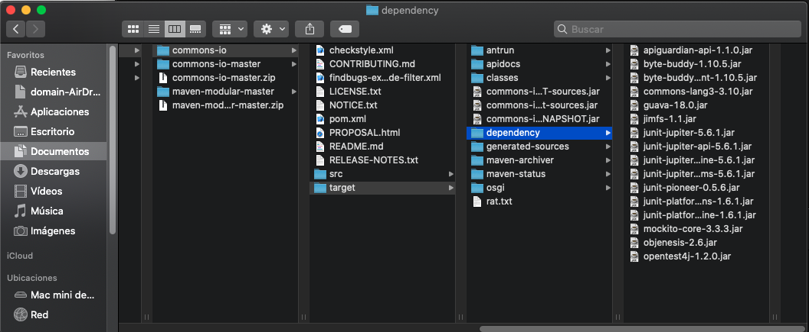
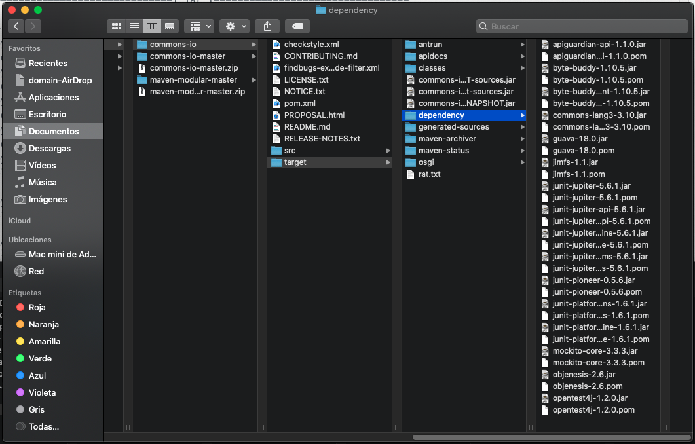
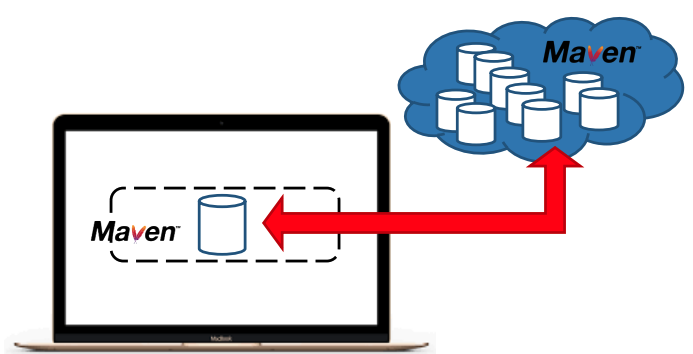
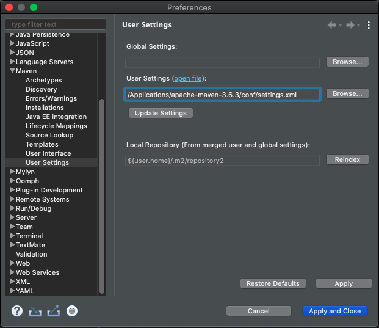
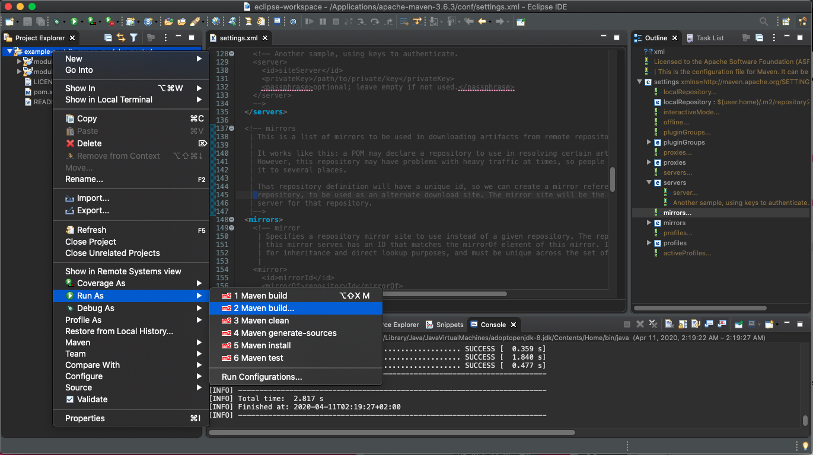
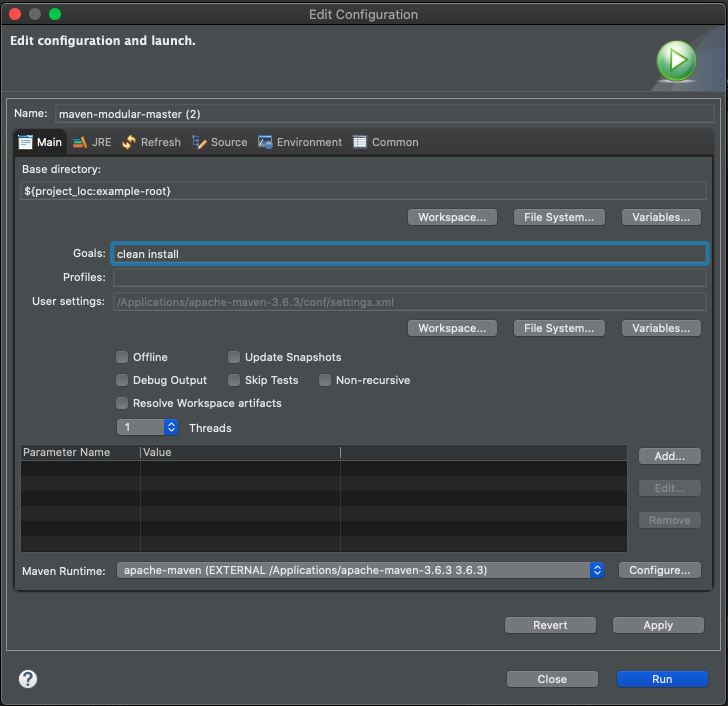
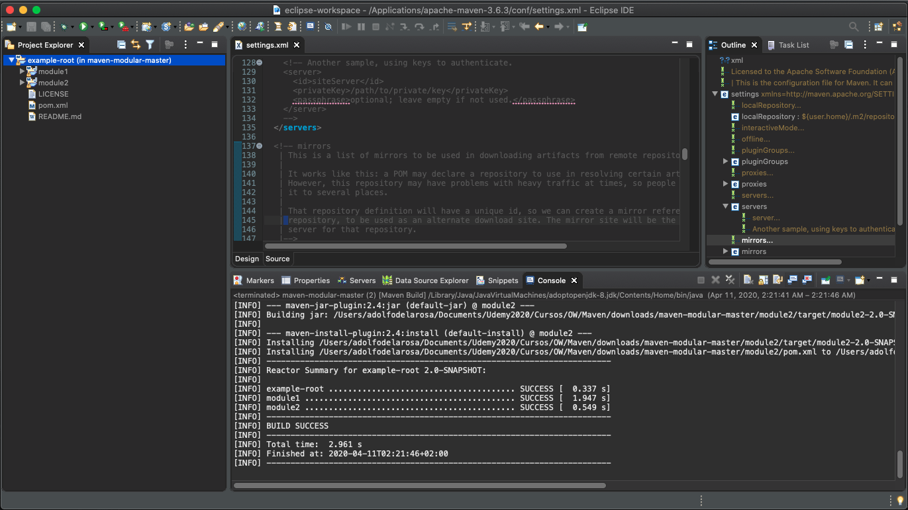
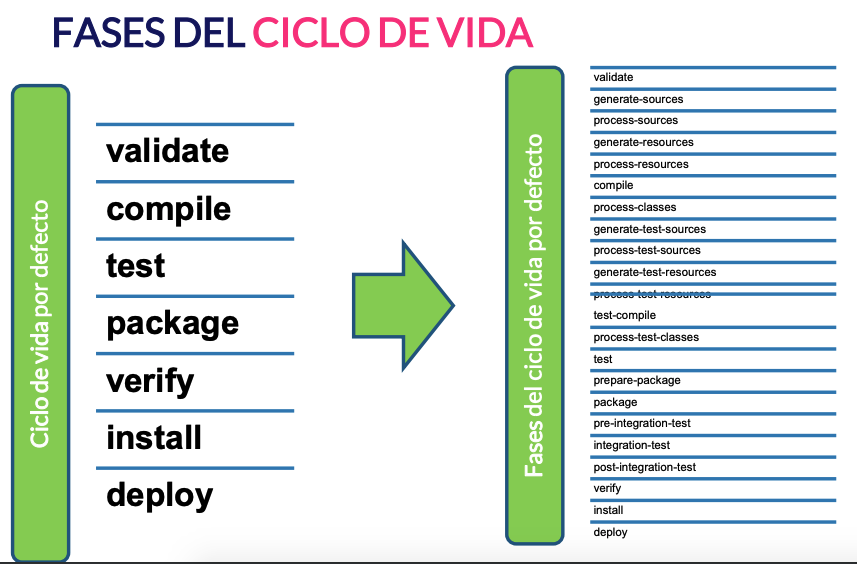
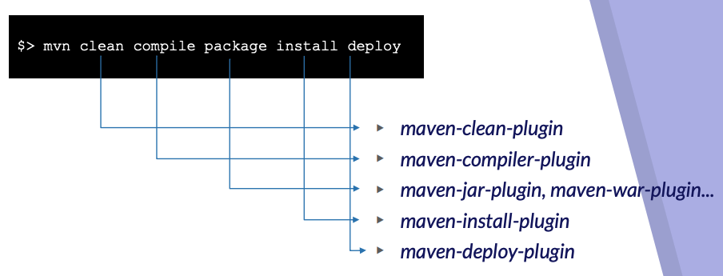

# 3. POM (Project Object Model) 80m

* Introducción a POM (Project Object Model) 3:49 
* Sintaxis del POM (Project Object Model) 9:45 
* Declaración de dependencias 14:40 
* Dependency plugins 9:52 
* Definición de repositorios 12:13 
* Definición del flujo de construcción y fases del ciclo de vida 3:27 
* Plugins Maven mas conocidos 8:16 
* Uso de perfiles de configuración 8:52 
* Ejemplo práctico: POM (Project Object Model) 9:43 
* Contenido adicional  8


## Introducción a POM (Project Object Model) 3:49 

[Introducción a POM](pdfs/3.1_Introduccion_a_POM_.pdf)

Los ficheros POM son los que aglutinan toda la configuración y declaración de ejecuciones de Maven.
Desde definición de proyectos Maven, dependencias, flujos de construcción, etc.

Existe una analogía entre los ficheros `pom.xml` de **Apache Maven** y los `Makefile` de **GNU Make** o los `build.xml` de **Apache Ant**. Cada uno de estos tres ficheros ofrecen información de configuración que es usada por cada herramienta respectiva para construir el empaquetado binario (compilados) a partir del código fuente.

Maven casi siempre es usado en proyectos Java, pero eso no quiere decir que no esté preparado para ser usado en otros lenguajes como C# o C.

Maven va mucho más allá de una mera herramienta de construcción y empaquetado de aplicaciones, permite gestionar todo el ciclo de vida de un proyecto contemplando ámbitos como CI/CD (integración contínua y entrega contínua), testing, control de calidad, etc.

## Sintaxis del POM (Project Object Model) 9:45 

[Sintaxis del POM](pdfs/3.2_Sintaxis_del_POM_.pdf)

Veamos como ejemplo el POM más sencillo que se puede declarar:

```html
<project xmlns="http://maven.apache.org/POM/4.0.0" xmlns:xsi="http://www.w3.org/2001/XMLSchema-instance" xsi:schemaLocation="http://maven.apache.org/POM/4.0.0 http://maven.apache.org/xsd/maven-4.0.0.xsd">
  <modelVersion>4.0.0</modelVersion>
  <groupId>net.openwebinars</groupId>
  <artifactId>simplest-project</artifactId>
  <version>1</version>
</project>
```

Si ejecutamos el comando `$> mvn help:effective-pom` obtendremos el POM efectivo que en realidad hemos definido teniendo en cuenta, del mismo modo que en la programación orientada a objetos, la configuración heredada del super *POM*:

```html
<?xml version="1.0"?>
<project xsi:schemaLocation="http://maven.apache.org/POM/4.0.0 http://maven.apache.org/xsd/maven-4.0.0.xsd" xmlns="http://maven.apache.org/POM/4.0.0"
    xmlns:xsi="http://www.w3.org/2001/XMLSchema-instance">
  <modelVersion>4.0.0</modelVersion>
  <groupId>net.openwebinars</groupId>
  <artifactId>simplest-project</artifactId>
  <version>1</version>
  <repositories>
    <repository>
      <snapshots>
        <enabled>false</enabled>
      </snapshots>
      <id>central</id>
      <name>Central Repository</name>
      <url>https://repo.maven.apache.org/maven2</url>
    </repository>
  </repositories>
  <pluginRepositories>
    <pluginRepository>
      <releases>
        <updatePolicy>never</updatePolicy>
      </releases>
      <snapshots>
        <enabled>false</enabled>
      </snapshots>
      <id>central</id>
      <name>Central Repository</name>
      <url>https://repo.maven.apache.org/maven2</url>
    </pluginRepository>
  </pluginRepositories>
  <build>
    <sourceDirectory>C:\dev\workspace\simplest-project\src\main\java</sourceDirectory>
    <scriptSourceDirectory>C:\dev\workspace\simplest-project\src\main\scripts</scriptSourceDirectory>
    <testSourceDirectory>C:\dev\workspace\simplest-project\src\test\java</testSourceDirectory>
    <outputDirectory>C:\dev\workspace\simplest-project\target\classes</outputDirectory>
    <testOutputDirectory>C:\dev\workspace\simplest-project\target\test-classes</testOutputDirectory>
    <resources>
      <resource>
        <directory>C:\dev\workspace\simplest-project\src\main\resources</directory>
      </resource>
    </resources>
    <testResources>
      <testResource>
        <directory>C:\dev\workspace\simplest-project\src\test\resources</directory>
      </testResource>
    </testResources>
    <directory>C:\dev\workspace\simplest-project\target</directory>
    <finalName>simplest-project-1</finalName>
    <pluginManagement>
      <plugins>
        <plugin>
          <artifactId>maven-antrun-plugin</artifactId>
          <version>1.3</version>
        </plugin>
        <plugin>
          <artifactId>maven-assembly-plugin</artifactId>
          <version>2.2-beta-5</version>
        </plugin>
        <plugin>
          <artifactId>maven-dependency-plugin</artifactId>
          <version>2.8</version>
        </plugin>
        <plugin>
          <artifactId>maven-release-plugin</artifactId>
          <version>2.3.2</version>
        </plugin>
      </plugins>
    </pluginManagement>
    <plugins>
      <plugin>
        <artifactId>maven-clean-plugin</artifactId>
        <version>2.5</version>
        <executions>
          <execution>
            <id>default-clean</id>
            <phase>clean</phase>
            <goals>
              <goal>clean</goal>
            </goals>
          </execution>
        </executions>
      </plugin>
      <plugin>
        <artifactId>maven-resources-plugin</artifactId>
        <version>2.6</version>
        <executions>
          <execution>
            <id>default-testResources</id>
            <phase>process-test-resources</phase>
            <goals>
              <goal>testResources</goal>
            </goals>
          </execution>
          <execution>
            <id>default-resources</id>
            <phase>process-resources</phase>
            <goals>
              <goal>resources</goal>
            </goals>
          </execution>
        </executions>
      </plugin>
      <plugin>
        <artifactId>maven-jar-plugin</artifactId>
        <version>2.4</version>
        <executions>
          <execution>
            <id>default-jar</id>
            <phase>package</phase>
            <goals>
              <goal>jar</goal>
            </goals>
          </execution>
        </executions>
      </plugin>
      <plugin>
        <artifactId>maven-compiler-plugin</artifactId>
        <version>3.1</version>
        <executions>
          <execution>
            <id>default-compile</id>
            <phase>compile</phase>
            <goals>
              <goal>compile</goal>
            </goals>
          </execution>
          <execution>
            <id>default-testCompile</id>
            <phase>test-compile</phase>
            <goals>
              <goal>testCompile</goal>
            </goals>
          </execution>
        </executions>
      </plugin>
      <plugin>
        <artifactId>maven-surefire-plugin</artifactId>
        <version>2.12.4</version>
        <executions>
          <execution>
            <id>default-test</id>
            <phase>test</phase>
            <goals>
              <goal>test</goal>
            </goals>
          </execution>
        </executions>
      </plugin>
      <plugin>
        <artifactId>maven-install-plugin</artifactId>
        <version>2.4</version>
        <executions>
          <execution>
            <id>default-install</id>
            <phase>install</phase>
            <goals>
              <goal>install</goal>
            </goals>
          </execution>
        </executions>
      </plugin>
      <plugin>
        <artifactId>maven-deploy-plugin</artifactId>
        <version>2.7</version>
        <executions>
          <execution>
            <id>default-deploy</id>
            <phase>deploy</phase>
            <goals>
              <goal>deploy</goal>
            </goals>
          </execution>
        </executions>
      </plugin>
      <plugin>
        <artifactId>maven-site-plugin</artifactId>
        <version>3.3</version>
        <executions>
          <execution>
            <id>default-site</id>
            <phase>site</phase>
            <goals>
              <goal>site</goal>
            </goals>
            <configuration>
              <outputDirectory>C:\dev\workspace\simplest-project\target\site</outputDirectory>
              <reportPlugins>
                <reportPlugin>
                  <groupId>org.apache.maven.plugins</groupId>
                  <artifactId>maven-project-info-reports-plugin</artifactId>
                </reportPlugin>
              </reportPlugins>
            </configuration>
          </execution>
          <execution>
            <id>default-deploy</id>
            <phase>site-deploy</phase>
            <goals>
              <goal>deploy</goal>
            </goals>
            <configuration>
              <outputDirectory>C:\dev\workspace\simplest-project\target\site</outputDirectory>
              <reportPlugins>
                <reportPlugin>
                  <groupId>org.apache.maven.plugins</groupId>
                  <artifactId>maven-project-info-reports-plugin</artifactId>
                </reportPlugin>
              </reportPlugins>
            </configuration>
          </execution>
        </executions>
        <configuration>
          <outputDirectory>C:\dev\workspace\simplest-project\target\site</outputDirectory>
          <reportPlugins>
            <reportPlugin>
              <groupId>org.apache.maven.plugins</groupId>
              <artifactId>maven-project-info-reports-plugin</artifactId>
            </reportPlugin>
          </reportPlugins>
        </configuration>
      </plugin>
    </plugins>
  </build>
  <reporting>
    <outputDirectory>C:\dev\workspace\simplest-project\target\site</outputDirectory>
  </reporting>
</project>
```

Evidentemente, y continuando utilizando la analogía de la programación orientada a objetos, esta configuración heredada puede ser sobreescrita y ampliada.

### Estructura del POM

Cuatro categorías de descripción y configuración:


1. **Información general del proyecto**: Nombre del proyecto, URL, lista de desarrolladores y contribuyentes

2. **Configuración de construcción**: Customización de la configuración manual de construcción definida por defecto

3. **Configuración de entornos** a través de la definición de perfiles de config, por entorno, etc.

4. **Dependencias** entre proyectos y librerías

### PRACTICA - Crear un proyecto a partir `pom.xml` más simple

* Dentro de nuestro proyecto **maven-modular-master** vamos a crear la carpeta *simple-project*

* Dentro de la carpeta *simple-project* creamos el archivo `pom.xml` más simple.

   
   
   ```js
   <?xml version="1.0" encoding="UTF-8"?>
   <project>
      <modelVersion>4.0.0</modelVersion> 
      <groupId>net.openwebinars</groupId> 
      <artifactId>simplest-project</artifactId> 
      <version>1</version>
   </project>
   ```
   
* Desde la consola ejecutamos el comando `mvn install` para instalar el pom en el repositorio local:

   ```sh
   mini-de-adolfo:simple-project adolfodelarosa$ pwd
   /Users/adolfodelarosa/Documents/Udemy2020/Cursos/OW/Maven/downloads/maven-modular-master/simple-project
   mini-de-adolfo:simple-project adolfodelarosa$ mvn install
   [INFO] Scanning for projects...
   [INFO] 
   [INFO] -----------------< net.openwebinars:simplest-project >------------------
   [INFO] Building simplest-project 1
   [INFO] --------------------------------[ jar ]---------------------------------
   
   . . . 
   
   [INFO] Installing /Users/adolfodelarosa/Documents/Udemy2020/Cursos/OW/Maven/downloads/maven-modular-master/simple- project/pom.xml to /Users/adolfodelarosa/.m2/repository2/net/openwebinars/simplest-project/1/simplest-project-1.pom
   [INFO] ------------------------------------------------------------------------
   [INFO] BUILD SUCCESS
   [INFO] ------------------------------------------------------------------------
   [INFO] Total time:  5.463 s
   [INFO] Finished at: 2020-04-10T19:49:39+02:00
   [INFO] ------------------------------------------------------------------------
   mini-de-adolfo:simple-project adolfodelarosa$ 
   ```
* Ejecutar comando `mvn help:effective-pom` para ver el **pom efectivo**:

   ```sh
   mini-de-adolfo:simple-project adolfodelarosa$ mvn help:effective-pom
   
   . . .
   
   TODO EL SUPER POM PUESTO ARRIBA

   [INFO] ------------------------------------------------------------------------
   [INFO] BUILD SUCCESS
   [INFO] ------------------------------------------------------------------------
   [INFO] Total time:  4.238 s
   [INFO] Finished at: 2020-04-10T19:57:19+02:00
   [INFO] ------------------------------------------------------------------------
   mini-de-adolfo:simple-project adolfodelarosa$ 
  ```

* También podríamos enviar la salida a un archivo de salido con:

   `mvn help:effective-pom > effective-pom.xml`

El **pom efectivo** no tiene nada que ver con la sencilles de nuestro `pom.xml` más sencillo.

Esto significa que **hay un pom padre no definido para cualquier `pom.xml`, también llamado super pom** que define cosas como el *Central Repository* (https://repo.maven.apache.org/maven2) que es el repositorio oficial donde se publiacan todas las dependecias, también se define el *pluginRepository*, *build* que corresponde a todo el ciclo de vida de una aplicación, indica donde se compilan las clases, donde los test. Toda una información operativo que no nos damos cuenta que esta.

## Declaración de dependencias 14:40

[Declaración de dependencias](pdfs/3.3_Declaracion_de_dependencias_.pdf)

Dentro del archivo `pom.xml` existe un apartado donde se decaran todas nuestras dependecias:

```html
<dependencies>
  <dependency>
    <groupId>org.springframework.boot</groupId>
    <artifactId>spring-boot-starter-web</artifactId>
    <version>2.1.3-RELEASE</version>
  </dependency>
</dependencies>
```

Identificador:

* `groupId=org.springframework.boot`

* `artifactId=spring-boot-starter-web`

* `version=2.1.3-RELEASE

Una vez descargada, dicha depenencia se encontrará en 
`$M2_REPO/org/springframework/boot/spring-boot-starter-web/2.1.3-RELEASE/` :

* spring-boot-starter-web-2.1.3-RELEASE.jar

* spring-boot-starter-web-2.1.3-RELEASE.pom

Si ejecutamos el comando `$> mvn help:effective-pom` obtendremos el POM efectivo que en realidad hemos definido teniendo en cuenta, del mismo modo que en la programación orientada a objetos, la configuración heredada del *super POM*:

Adicionalmente una dependencia puede tener una serie de parámetros adicionales:

1. ***scope***: (ámbito): Valores posibles:

   * **compile**: scope por defecto, son usadas en tiempo de compilaión y empaquetado

   * **provided**: dependencias usadas en tiempo de compilación pero que no son incluídas en el empaquetado final ya que se espera que sean provistas por la JDK o por el servidor de aplicaciones (caso aplicaciones web). No son dependencias transitivsa

   * **runtime**: Dependencias que son usadas en tiempo de ejecución pero que no son usadas en tiempo de compilación.
   
   * **test**: Dependencias que no son necesarias para la ejecución de la aplicación pero sí son usadas en tiempo de compilación/ejecución de tests.
   
   * **system**: Parecido a *provided* salvo que es preciso establecer el path completo del sistema de archivos local donde se encuenta la librería
   
2. ***packaging*** (empaquetado): Valores posibles:

   * **pom**

   * **jar** (empaquetado por defecto)

   * **war**
   
   * **ear**
   
### Mis Notas

**La señal de identidad de un artefacto Maven es su {groupId, artifactId, version}**

Cuando se declara una dependecia es obligatorio el **artifactId** en algunas dependencias *groupId* y *version* pueden ser opcionales. Esto puede pasar por que estamos en un proyecto jerarquico en el que tenemos un pom padre que define ya esa información y hace que se herede hacia abajo. Esto lo hariamos metiendo en el pom padre una *dependencyManagment* donde se dan de alta dependencias que usaran los pom hijos, esto se hace por ejemplo para definir la versión de una dependencia y evitar que en los hijos se usen versiones diferentes.

Las dependecias pueden usar otros parametros como **Scope** (compile, provided, runtime, test, system), **Type** (jar), **Classifier** (vacio, sources, test-sources).

Ejemplo de el uso de Classifier:

```sh
mvn clean package install:install-file -Dfile=./target/commons-io-2.7-SNAPSHOT.jar -Dclassifier=openwebinars -Dmaven.test.skip=true
```

Tubería de comandos, limpia el directorio target, empaqueta el jar, ejecuta el plugin install para tomar el archivo indicado en el parámetro `-Dfile` indicando el parametro classifier con valor openwebinars, saltandose los test.

Lo anterior sube en el repositorio local el archivo `commons-io-2.7-SNAPSHOT-openwebinars.jar`

### Documentación pluging Install

http://maven.apache.org/plugins/maven-install-plugin/install-file-mojo.html

### Practica

* Partiendo del proyecto `commons-io-master` creamos otro proyecto llamado `commons-io`. Un proyecto igual pero con otro nombre. Esta es otra forma de hacerse de un proyecto sin cambiar los valores en el `pom.xml`.

* Desde la consola ejecutamos el comando:

```sh
mvn clean package install:install-file -Dfile=./target/commons-io-2.7-SNAPSHOT.jar -Dclassifier=openwebinars -Dmaven.test.skip=true
```

```sh
mini-de-adolfo:commons-io adolfodelarosa$ pwd
/Users/adolfodelarosa/Documents/Udemy2020/Cursos/OW/Maven/downloads/commons-io
mini-de-adolfo:commons-io adolfodelarosa$ mvn clean package install:install-file -Dfile=./target/commons-io-2.7-SNAPSHOT.jar -Dclassifier=openwebinars -Dmaven.test.skip=true
[INFO] Scanning for projects...
[INFO] 
[INFO] -----------------------< commons-io:commons-io >------------------------
[INFO] Building Apache Commons IO 2.7-SNAPSHOT
[INFO] --------------------------------[ jar ]---------------------------------

[INFO] --- maven-install-plugin:2.5.2:install-file (default-cli) @ commons-io ---
[INFO] Installing /Users/adolfodelarosa/Documents/Udemy2020/Cursos/OW/Maven/downloads/commons-io/target/commons-io-2.7-SNAPSHOT.jar to /Users/adolfodelarosa/.m2/repository2/commons-io/commons-io/2.7-SNAPSHOT/commons-io-2.7-SNAPSHOT-openwebinars.jar
[INFO] ------------------------------------------------------------------------
[INFO] BUILD SUCCESS
[INFO] ------------------------------------------------------------------------
[INFO] Total time:  12.114 s
[INFO] Finished at: 2020-04-10T21:29:02+02:00
[INFO] ------------------------------------------------------------------------
mini-de-adolfo:commons-io adolfodelarosa$ 
. . .
```

Con esto a creado en nuestro repositorio el archivo:

`/Users/adolfodelarosa/.m2/repository2/commons-io/commons-io/2.7-SNAPSHOT/commons-io-2.7-SNAPSHOT-openwebinars.jar`

```sh
192:2.7-SNAPSHOT adolfodelarosa$ pwd
/Users/adolfodelarosa/.m2/repository2/commons-io/commons-io/2.7-SNAPSHOT
192:2.7-SNAPSHOT adolfodelarosa$ ls -l
total 3280
-rw-r--r--  1 adolfodelarosa  staff     361 10 abr 21:29 _remote.repositories
-rw-r--r--  1 adolfodelarosa  staff  270181 10 abr 21:29 commons-io-2.7-SNAPSHOT-openwebinars.jar
-rw-r--r--  1 adolfodelarosa  staff  340195 10 abr 01:23 commons-io-2.7-SNAPSHOT-sources.jar
-rw-r--r--  1 adolfodelarosa  staff  296496 10 abr 01:23 commons-io-2.7-SNAPSHOT-test-sources.jar
-rw-r--r--  1 adolfodelarosa  staff  470135 10 abr 01:23 commons-io-2.7-SNAPSHOT-tests.jar
-rw-r--r--  1 adolfodelarosa  staff  270181 10 abr 01:23 commons-io-2.7-SNAPSHOT.jar
-rw-r--r--  1 adolfodelarosa  staff   15073  9 abr 16:19 commons-io-2.7-SNAPSHOT.pom
-rw-r--r--  1 adolfodelarosa  staff    1520 10 abr 21:29 maven-metadata-local.xml
192:2.7-SNAPSHOT adolfodelarosa$ 
```

**Este ejemplo tiene importacia en las situaciones que determinados clientes o equipos de desarrollo, cuando tienen que modificar una libreria de software libre y no tienen la capacidad de transladar el cambio hacia el equipo de desarrollo lo que hacen es customizarlo y suelen jugar con la premisa de que si su jar esta subido en el repositorio de distribución remoto con una subcorporacion, toda la gente cuando vaya a descargar la libreria, descargara la que esta subida al repositorio y es correcto, PERO NO ES UNA BUENA PRACTICA, por que esta suponiendo que tu lo sabes pero si luego otra persona afronta el proyecto y se encuentre versiones customizadas con los mismos groupId, artifactId y version, NO SABRIA QUE LA VERSION ESTA CUSTOMIZADA por lo que deberiamos usar classifier durante la subida para tener la certeza absoluta que la dependencia nuestra es commons-io-2.7-SNAPSHOT-openwebinars.jar que es difernte a commons-io-2.7-SNAPSHOT.jar  **

## Dependency plugins 9:52 

[Dependency plugins](pdfs/3.4_Dependency_plugins_.pdf)

[Documentación oficial del plugin Dependency](https://maven.apache.org/plugins/maven-dependency-plugin/)

Veamos las opciones más útiles y nos ayudaran a resolver problemas y a realizar ciertas operaciones:

#### Ver el árbol de dependencias de un proyecto Maven:

```sh
$> mvn dependency:dependency-tree
[INFO] ------------------------------------------------------------------------
[INFO] Building Apache Commons IO 2.7-SNAPSHOT
[INFO] ------------------------------------------------------------------------
[INFO] 
[INFO] --- maven-dependency-plugin:3.1.1:tree (default-cli) @ commons-io ---
[INFO] commons-io:commons-io:jar:2.7-SNAPSHOT
[INFO] +- junit:junit:jar:4.12:test
[INFO] |  \- org.hamcrest:hamcrest-core:jar:1.3:test
[INFO] \- org.apache.commons:commons-lang3:jar:3.8.1:test
[INFO] ------------------------------------------------------------------------
[INFO] BUILD SUCCESS
[INFO] ------------------------------------------------------------------------
[INFO] Total time: 2.443s
[INFO] Finished at: Mon Apr 29 00:52:18 CEST 2019
[INFO] Final Memory: 17M/304M
[INFO] ------------------------------------------------------------------------
```

#### Copiar las dependencias de un proyecto Maven:

Hay veces que sera necesesario copiar en una carpeta todas las dependencias de un proyecto, para llevarlas a otro sitio. Un ejemplo sería si quisieramos hacer un despliegue en la maquina de nuestro Cliente para que el mismo compile el propio proyecto de forma independiente. 

```sh
$> mvn dependency:copy-dependencies
[INFO] ------------------------------------------------------------------------
[INFO] Building Apache Commons IO 2.7-SNAPSHOT
[INFO] ------------------------------------------------------------------------
[INFO] 
[INFO] --- maven-dependency-plugin:3.1.1:copy-dependencies (default-cli) @ commons-io ---
[INFO] Copying junit-4.12.jar to C:\dev\workspace\commons-io\target\dependency\junit-4.12.jar
[INFO] Copying hamcrest-core-1.3.jar to C:\dev\workspace\commons-io\target\dependency\hamcrest-core-1.3.jar
[INFO] Copying commons-lang3-3.8.1.jar to C:\dev\workspace\commons-io\target\dependency\commons-lang3-3.8.1.jar
[INFO] ------------------------------------------------------------------------
[INFO] BUILD SUCCESS
[INFO] ------------------------------------------------------------------------
```

Este comando es muy útil cuando hay que hacer migraciones de despliegues de un repositorio remoto a otro.

#### Analizar las dependencias de un proyecto Maven:

Permite definir en un listado de tu proyecto que dependencias se estan usando, cuales se pueden copiar, etc. para por ejemplo ver que dependencias sobran y poderlas eliminar.

```sh
$> mvn dependency:analyze
```

Para simular el error de que alguien incluya una dependencia que se usa en realidad vamos a incluir la siguiente librería:

```html
<dependency>
    <groupId>org.hibernate</groupId>
    <artifactId>hibernate-core</artifactId>
    <version>5.3.10.Final</version>
</dependency>
```

El resultado del análisis indica que existe una librería no usada:

```sh
[INFO] ------------------------------------------------------------------------
[INFO] Building Apache Commons IO 2.7-SNAPSHOT
[INFO] ------------------------------------------------------------------------
[INFO] ....
[INFO] 
[INFO] <<< maven-dependency-plugin:3.1.1:analyze (default-cli) @ commons-io <<<
[INFO] 
[INFO] --- maven-dependency-plugin:3.1.1:analyze (default-cli) @ commons-io ---
[WARNING] Unused declared dependencies found:
[WARNING]    org.hibernate:hibernate-core:jar:5.3.10.Final:compile
[INFO] ------------------------------------------------------------------------
[INFO] BUILD SUCCESS
[INFO] ------------------------------------------------------------------------
```

### PRACTICA

#### Ejecutar el comando `mvn dependency:copy-dependencies` en el proyecto `commons-io`

```sh
mini-de-adolfo:commons-io adolfodelarosa$ pwd
/Users/adolfodelarosa/Documents/Udemy2020/Cursos/OW/Maven/downloads/commons-io

mini-de-adolfo:commons-io adolfodelarosa$ mvn dependency:copy-dependencies
[INFO] Scanning for projects...
[INFO] 
[INFO] -----------------------< commons-io:commons-io >------------------------
[INFO] Building Apache Commons IO 2.7-SNAPSHOT
[INFO] --------------------------------[ jar ]---------------------------------
[INFO] 
[INFO] --- maven-dependency-plugin:3.1.1:copy-dependencies (default-cli) @ commons-io ---
[INFO] Copying junit-jupiter-5.6.1.jar to /Users/adolfodelarosa/Documents/Udemy2020/Cursos/OW/Maven/downloads/commons-io/target/dependency/junit-jupiter-5.6.1.jar
[INFO] Copying junit-jupiter-api-5.6.1.jar to /Users/adolfodelarosa/Documents/Udemy2020/Cursos/OW/Maven/downloads/commons-io/target/dependency/junit-jupiter-api-5.6.1.jar
[INFO] Copying apiguardian-api-1.1.0.jar to /Users/adolfodelarosa/Documents/Udemy2020/Cursos/OW/Maven/downloads/commons-io/target/dependency/apiguardian-api-1.1.0.jar
[INFO] Copying opentest4j-1.2.0.jar to /Users/adolfodelarosa/Documents/Udemy2020/Cursos/OW/Maven/downloads/commons-io/target/dependency/opentest4j-1.2.0.jar
[INFO] Copying junit-platform-commons-1.6.1.jar to /Users/adolfodelarosa/Documents/Udemy2020/Cursos/OW/Maven/downloads/commons-io/target/dependency/junit-platform-commons-1.6.1.jar
[INFO] Copying junit-jupiter-params-5.6.1.jar to /Users/adolfodelarosa/Documents/Udemy2020/Cursos/OW/Maven/downloads/commons-io/target/dependency/junit-jupiter-params-5.6.1.jar
[INFO] Copying junit-jupiter-engine-5.6.1.jar to /Users/adolfodelarosa/Documents/Udemy2020/Cursos/OW/Maven/downloads/commons-io/target/dependency/junit-jupiter-engine-5.6.1.jar
[INFO] Copying junit-platform-engine-1.6.1.jar to /Users/adolfodelarosa/Documents/Udemy2020/Cursos/OW/Maven/downloads/commons-io/target/dependency/junit-platform-engine-1.6.1.jar
[INFO] Copying junit-pioneer-0.5.6.jar to /Users/adolfodelarosa/Documents/Udemy2020/Cursos/OW/Maven/downloads/commons-io/target/dependency/junit-pioneer-0.5.6.jar
[INFO] Copying mockito-core-3.3.3.jar to /Users/adolfodelarosa/Documents/Udemy2020/Cursos/OW/Maven/downloads/commons-io/target/dependency/mockito-core-3.3.3.jar
[INFO] Copying byte-buddy-1.10.5.jar to /Users/adolfodelarosa/Documents/Udemy2020/Cursos/OW/Maven/downloads/commons-io/target/dependency/byte-buddy-1.10.5.jar
[INFO] Copying byte-buddy-agent-1.10.5.jar to /Users/adolfodelarosa/Documents/Udemy2020/Cursos/OW/Maven/downloads/commons-io/target/dependency/byte-buddy-agent-1.10.5.jar
[INFO] Copying objenesis-2.6.jar to /Users/adolfodelarosa/Documents/Udemy2020/Cursos/OW/Maven/downloads/commons-io/target/dependency/objenesis-2.6.jar
[INFO] Copying jimfs-1.1.jar to /Users/adolfodelarosa/Documents/Udemy2020/Cursos/OW/Maven/downloads/commons-io/target/dependency/jimfs-1.1.jar
[INFO] Copying guava-18.0.jar to /Users/adolfodelarosa/Documents/Udemy2020/Cursos/OW/Maven/downloads/commons-io/target/dependency/guava-18.0.jar
[INFO] Copying commons-lang3-3.10.jar to /Users/adolfodelarosa/Documents/Udemy2020/Cursos/OW/Maven/downloads/commons-io/target/dependency/commons-lang3-3.10.jar
[INFO] ------------------------------------------------------------------------
[INFO] BUILD SUCCESS
[INFO] ------------------------------------------------------------------------
[INFO] Total time:  2.037 s
[INFO] Finished at: 2020-04-11T00:52:13+02:00
[INFO] ------------------------------------------------------------------------
mini-de-adolfo:commons-io adolfodelarosa$ 
```

**Este comando copia todas las dependencias en la carpeta `target/dependency`**:



El comando tiene varias opciones que podemos ver el la documentación por ejemplo para copiar las dependencias y tambiém el pom podemos ejecutar el comando:

#### `mvn dependency:copy-dependencies -Dmdep.copyPom=true`

```sh
mini-de-adolfo:commons-io adolfodelarosa$ mvn dependency:copy-dependencies -Dmdep.copyPom=true
[INFO] Scanning for projects...
[INFO] 
[INFO] -----------------------< commons-io:commons-io >------------------------
[INFO] Building Apache Commons IO 2.7-SNAPSHOT
[INFO] --------------------------------[ jar ]---------------------------------
[INFO] 
[INFO] --- maven-dependency-plugin:3.1.1:copy-dependencies (default-cli) @ commons-io ---
[INFO] Copying junit-jupiter-5.6.1.jar to /Users/adolfodelarosa/Documents/Udemy2020/Cursos/OW/Maven/downloads/commons-io/target/dependency/junit-jupiter-5.6.1.jar
[INFO] Copying junit-jupiter-api-5.6.1.jar to /Users/adolfodelarosa/Documents/Udemy2020/Cursos/OW/Maven/downloads/commons-io/target/dependency/junit-jupiter-api-5.6.1.jar
[INFO] Copying apiguardian-api-1.1.0.jar to /Users/adolfodelarosa/Documents/Udemy2020/Cursos/OW/Maven/downloads/commons-io/target/dependency/apiguardian-api-1.1.0.jar
[INFO] Copying opentest4j-1.2.0.jar to /Users/adolfodelarosa/Documents/Udemy2020/Cursos/OW/Maven/downloads/commons-io/target/dependency/opentest4j-1.2.0.jar
[INFO] Copying junit-platform-commons-1.6.1.jar to /Users/adolfodelarosa/Documents/Udemy2020/Cursos/OW/Maven/downloads/commons-io/target/dependency/junit-platform-commons-1.6.1.jar
[INFO] Copying junit-jupiter-params-5.6.1.jar to /Users/adolfodelarosa/Documents/Udemy2020/Cursos/OW/Maven/downloads/commons-io/target/dependency/junit-jupiter-params-5.6.1.jar
[INFO] Copying junit-jupiter-engine-5.6.1.jar to /Users/adolfodelarosa/Documents/Udemy2020/Cursos/OW/Maven/downloads/commons-io/target/dependency/junit-jupiter-engine-5.6.1.jar
[INFO] Copying junit-platform-engine-1.6.1.jar to /Users/adolfodelarosa/Documents/Udemy2020/Cursos/OW/Maven/downloads/commons-io/target/dependency/junit-platform-engine-1.6.1.jar
[INFO] Copying junit-pioneer-0.5.6.jar to /Users/adolfodelarosa/Documents/Udemy2020/Cursos/OW/Maven/downloads/commons-io/target/dependency/junit-pioneer-0.5.6.jar
[INFO] Copying mockito-core-3.3.3.jar to /Users/adolfodelarosa/Documents/Udemy2020/Cursos/OW/Maven/downloads/commons-io/target/dependency/mockito-core-3.3.3.jar
[INFO] Copying byte-buddy-1.10.5.jar to /Users/adolfodelarosa/Documents/Udemy2020/Cursos/OW/Maven/downloads/commons-io/target/dependency/byte-buddy-1.10.5.jar
[INFO] Copying byte-buddy-agent-1.10.5.jar to /Users/adolfodelarosa/Documents/Udemy2020/Cursos/OW/Maven/downloads/commons-io/target/dependency/byte-buddy-agent-1.10.5.jar
[INFO] Copying objenesis-2.6.jar to /Users/adolfodelarosa/Documents/Udemy2020/Cursos/OW/Maven/downloads/commons-io/target/dependency/objenesis-2.6.jar
[INFO] Copying jimfs-1.1.jar to /Users/adolfodelarosa/Documents/Udemy2020/Cursos/OW/Maven/downloads/commons-io/target/dependency/jimfs-1.1.jar
[INFO] Copying guava-18.0.jar to /Users/adolfodelarosa/Documents/Udemy2020/Cursos/OW/Maven/downloads/commons-io/target/dependency/guava-18.0.jar
[INFO] Copying commons-lang3-3.10.jar to /Users/adolfodelarosa/Documents/Udemy2020/Cursos/OW/Maven/downloads/commons-io/target/dependency/commons-lang3-3.10.jar
[INFO] Copying junit-jupiter-5.6.1.pom to /Users/adolfodelarosa/Documents/Udemy2020/Cursos/OW/Maven/downloads/commons-io/target/dependency/junit-jupiter-5.6.1.pom
[INFO] Copying junit-jupiter-api-5.6.1.pom to /Users/adolfodelarosa/Documents/Udemy2020/Cursos/OW/Maven/downloads/commons-io/target/dependency/junit-jupiter-api-5.6.1.pom
[INFO] Copying apiguardian-api-1.1.0.pom to /Users/adolfodelarosa/Documents/Udemy2020/Cursos/OW/Maven/downloads/commons-io/target/dependency/apiguardian-api-1.1.0.pom
[INFO] Copying opentest4j-1.2.0.pom to /Users/adolfodelarosa/Documents/Udemy2020/Cursos/OW/Maven/downloads/commons-io/target/dependency/opentest4j-1.2.0.pom
[INFO] Copying junit-platform-commons-1.6.1.pom to /Users/adolfodelarosa/Documents/Udemy2020/Cursos/OW/Maven/downloads/commons-io/target/dependency/junit-platform-commons-1.6.1.pom
[INFO] Copying junit-jupiter-params-5.6.1.pom to /Users/adolfodelarosa/Documents/Udemy2020/Cursos/OW/Maven/downloads/commons-io/target/dependency/junit-jupiter-params-5.6.1.pom
[INFO] Copying junit-jupiter-engine-5.6.1.pom to /Users/adolfodelarosa/Documents/Udemy2020/Cursos/OW/Maven/downloads/commons-io/target/dependency/junit-jupiter-engine-5.6.1.pom
[INFO] Copying junit-platform-engine-1.6.1.pom to /Users/adolfodelarosa/Documents/Udemy2020/Cursos/OW/Maven/downloads/commons-io/target/dependency/junit-platform-engine-1.6.1.pom
[INFO] Copying junit-pioneer-0.5.6.pom to /Users/adolfodelarosa/Documents/Udemy2020/Cursos/OW/Maven/downloads/commons-io/target/dependency/junit-pioneer-0.5.6.pom
[INFO] Copying mockito-core-3.3.3.pom to /Users/adolfodelarosa/Documents/Udemy2020/Cursos/OW/Maven/downloads/commons-io/target/dependency/mockito-core-3.3.3.pom
[INFO] Copying byte-buddy-1.10.5.pom to /Users/adolfodelarosa/Documents/Udemy2020/Cursos/OW/Maven/downloads/commons-io/target/dependency/byte-buddy-1.10.5.pom
[INFO] Copying byte-buddy-agent-1.10.5.pom to /Users/adolfodelarosa/Documents/Udemy2020/Cursos/OW/Maven/downloads/commons-io/target/dependency/byte-buddy-agent-1.10.5.pom
[INFO] Copying objenesis-2.6.pom to /Users/adolfodelarosa/Documents/Udemy2020/Cursos/OW/Maven/downloads/commons-io/target/dependency/objenesis-2.6.pom
[INFO] Copying jimfs-1.1.pom to /Users/adolfodelarosa/Documents/Udemy2020/Cursos/OW/Maven/downloads/commons-io/target/dependency/jimfs-1.1.pom
[INFO] Copying guava-18.0.pom to /Users/adolfodelarosa/Documents/Udemy2020/Cursos/OW/Maven/downloads/commons-io/target/dependency/guava-18.0.pom
[INFO] Copying commons-lang3-3.10.pom to /Users/adolfodelarosa/Documents/Udemy2020/Cursos/OW/Maven/downloads/commons-io/target/dependency/commons-lang3-3.10.pom
[INFO] ------------------------------------------------------------------------
[INFO] BUILD SUCCESS
[INFO] ------------------------------------------------------------------------
[INFO] Total time:  1.741 s
[INFO] Finished at: 2020-04-11T01:02:51+02:00
[INFO] ------------------------------------------------------------------------
mini-de-adolfo:commons-io adolfodelarosa$ 
```

Vemos como ademas de los archivos `.jar` también se han copiado los `.pom`:



#### Ejecutar el comando `mvn dependency:analyze` en el proyecto `commons-io`

```sh
mini-de-adolfo:commons-io adolfodelarosa$ mvn dependency:analyze
[INFO] Scanning for projects...
[INFO] 
[INFO] -----------------------< commons-io:commons-io >------------------------
[INFO] Building Apache Commons IO 2.7-SNAPSHOT
[INFO] --------------------------------[ jar ]---------------------------------

. . .

[INFO] --- maven-dependency-plugin:3.1.1:analyze (default-cli) @ commons-io ---
[WARNING] Used undeclared dependencies found:
[WARNING]    org.junit.jupiter:junit-jupiter-api:jar:5.6.1:test
[WARNING]    org.junit.jupiter:junit-jupiter-params:jar:5.6.1:test
[WARNING] Unused declared dependencies found:
[WARNING]    org.junit.jupiter:junit-jupiter:jar:5.6.1:test
[INFO] ------------------------------------------------------------------------
[INFO] BUILD SUCCESS
[INFO] ------------------------------------------------------------------------
[INFO] Total time:  14.748 s
[INFO] Finished at: 2020-04-11T01:10:01+02:00
[INFO] ------------------------------------------------------------------------
mini-de-adolfo:commons-io adolfodelarosa$ 
```

Como resultado del analisis nos indica ciertos *WARNING* que ha encontrado **Dependencias usadas no declaradas** y **Dependencias declaradas no utilizadas**.

En el caso del proyecto `commons-io-master` habiamos insertado una dependencia que no utilizabamos vamos a analizar dicho proyecto.

```sh
mini-de-adolfo:commons-io-master adolfodelarosa$ pwd
/Users/adolfodelarosa/Documents/Udemy2020/Cursos/OW/Maven/downloads/commons-io-master
mini-de-adolfo:commons-io-master adolfodelarosa$ mvn dependency:analyze
[INFO] Scanning for projects...
[INFO] 
[INFO] --------------------< net.openwebinars:comunes-es >---------------------
[INFO] Building OpenWebinars Comunes Entrada/Salida 1.0
[INFO] --------------------------------[ jar ]---------------------------------

. . .

[INFO] --- maven-dependency-plugin:3.1.1:analyze (default-cli) @ comunes-es ---
[WARNING] Used undeclared dependencies found:
[WARNING]    org.junit.jupiter:junit-jupiter-api:jar:5.6.1:test
[WARNING]    org.junit.jupiter:junit-jupiter-params:jar:5.6.1:test
[WARNING] Unused declared dependencies found:
[WARNING]    org.junit.jupiter:junit-jupiter:jar:5.6.1:test
[WARNING]    org.apache.commons:commons-collections4:jar:4.4:compile
[INFO] ------------------------------------------------------------------------
[INFO] BUILD SUCCESS
[INFO] ------------------------------------------------------------------------
[INFO] Total time:  14.661 s
[INFO] Finished at: 2020-04-11T01:18:34+02:00
[INFO] ------------------------------------------------------------------------
mini-de-adolfo:commons-io-master adolfodelarosa$ 
```

Vemos que la dependencia `commons-collections4` que habiamos insertado y que logicamente no se usaba la detecta en su analisis.

**Con este analis podemos purgar dependencias que no se usen en los proyectos para evitar aplicaciones más pesadas de lo que deberían ser.**

## Definición de repositorios 12:13 

[Definición de repositorios](pdfs/3.5_Definicion_de_repositorios_.pdf)

### ¿Cómo se define?

Un repositorio viene identificado por un **ID**, su **URL**, si registrará versiones liberadas (`releases`), si registrará versión en desarrollo (`snapshots`), etc.

```html
<repositories>
  <repository>
    <id>central</id>
    <url>http://repo1.maven.org/maven2</url>
    <releases>
      <enabled>true</enabled>
    </releases>
    <snapshots>
      <enabled>false</enabled>
    </snapshots>
  </repository>

  <repository>
    <id>redhat</id>
    <url>https://maven.repository.redhat.com/ga</url>
    <releases>
      <enabled>true</enabled>
    </releases>
    <snapshots>
      <enabled>false</enabled>
    </snapshots>
  </repository>

  <repository>
    <id>corporate_repository</id>
    <url>https://repository.mycorporation.com/central</url>
    <releases>
      <enabled>true</enabled>
    </releases>
    <snapshots>
      <enabled>false</enabled>
    </snapshots>
  </repository>
</repositories>
```

Los repositorios remotos pueden requerir **autenticación**. En dicho caso, se deberá registrar en el `settings.xml` global o de usuario las credenciales en forma de donde el ID del *server* debe corresponderse con el ID del repositorio.

Por ejemplo, si el repositorio `corporate_repository` requiriera autenticación con las credenciales `usuario/c0ntr4s3ñ4` tendríamos que definir el siguiente **server** en el `settings.xml`:

```html
<servers>
     <server>
       <id>corporate_repository</id>
       <username>usuario</username>
       <password>c0ntr4s3ñ4</password>
     </server>
</servers>
```

### ¿Dónde se deben definir?

Posibilidades:

1. En un `settings.xml` específico para el proyecto: Es la mejor opción ya que puede ser un fichero settings historificado mediante un control de versiones y queda definido claramente en un fichero único

2. En un `pom.xml` maestro (padre de todos los módulos): No es una buena práctica. No obstante, es la menos mala por ser en un único POM. Tiene un problema grave hacerlo en esta localización: Supone un acoplamiento importante ya que los ficheros POM son instalados/desplegados/difundidos como una dependencia más y los repositorios no son de por vida, pueden dejar de existir (caso del repositorio Maven de **java.net**), pueden cambiar de URL y pasar a estar definidos por HTTPS en vez de HTTP (caso del repositorio Maven **primefaces.org**).

3. En el `pom.xml` de cada módulo: Está permitido definir repositorios en un POM cualesquiera pero si no era recomendable su definición en un POM maestro, en un POM de un módulo hijo mucho menos. Es una opción acoplada que de por sí ya implica que existe duplicidad en la definición de repositorios.

### El eterno problema de la política de actualizaciones

Cada repositorio tiene la opción de customizar su política de actualizaciones (`<updatePolicy />`) que por defecto es diaria. Existiendo las siguientes opciones disponibles:

* `always`

* `daily` (por defecto)

* `interval:XXX` (XXX minutos)

* `never` (solo si no existe en el repositorio local)

Muchas veces Maven puede resultar un poco tedioso con las constantes actualizaciones y evidentemente esto puede ser resultando usando: `<updatePolicy>never</updatePolicy>`

Pero este tipo de política tan restrictiva, si se trabaja de forma colaborativa, **impediría** que los miembros del proyecto recibieran actualizaciones de los artefactos que se despliegan.

No obstante, en estos casos existe la opción de actualizar expresamente las dependencias existentes en el repositorio Maven local:

`$> mvn clean install -U`

### Mis Notas

Hemos visto que en Maven tenemos un **repositorio local**, pero también podemos trabajar con un **repositorio Distribuido**. Ademas hemos visto que existe un **repositorio Central** ubicado en `https://repo.maven.apache.org/maven2` esto lo sabemos al ejecutar `mvn help:effective-pom`.

Los **Repositorio Distribuidos** que podamos usar pueden ser publicos, de softawere libre, o inclusive privados dentro de nuestra propia corporación lo que permite que las corporaciones cuando tienen una cantidad de empleados numerosos lo que implicaría que si usaramos repositorios publicos la cantidad de peticiones externas crecería por lo que lo centralizan en un repositorio intermedio para evitar el trafico constante a internet, por lo que los desarrollos trabajan más rápido y se centraliza ese conocimiento intermedio. Esto permite que las librerias ddesarrolladas por el propio equipo de desarrollo se publican en estos repositorios intermedios sin necesidad de colocarlas en internet.



En Eclipse podemos asociar el setting.xml que tenemos instalado en nuestra instalación de `apache-maven-3.6.3\conf\setting.xml`.



Recordemos que en el archivo `setting.xml` podremos:

* Declaramos el repositorio local.

* Declaramos los mirrors o espejos que son un punto de entrada por donde se deben hacer todas las conexiones. Estos sirve para que si se define un repositorio usando el atributo url del mirror, Maven lo que hace cada vez que se tiene que descargar algo lo canalizara a traves de esta url, aun que existan multiples repositorios siempre pasara por este url. Esto lo hacen las corporaciones cuando es su repositorio corporativo definen un virtual repository que lo que permite es centralizar todas las conexiones a todos los repositorios distribuidos o corporativos que tenga.

* En caso de tener un server tenga autenticación y establezcamos las credenciales todo eso se definira en el apartado **server**.

* Podemos activar perfiles.

Para compilar desde eclipse usamos


          

          


## Definición del flujo de construcción y fases del ciclo de vida 3:27 

[Definición del flujo de construcción y fases del ciclo de vida](pdfs/3.6_Flujos_construccion_y_ciclo_de_vida.pdf)

### `$> mvn clean`

* Borra el directorio de compilados (`target`). 
   
   Acción realizada por el plugin: `maven-clean-plugin`

### `$> mvn clean package`

* Borra el directorio de compilados (`target`)
* Copiado de recursos (filtrado si es necesario)
* Compilación del código fuente en el directorio target
* Empaquetado de compilados en el directorio target. 

   Acción realizada por los plugins (en función del packaging del POM): 
   
   * `maven-jar-plugin
   * `maven-war-plugin`
   * `maven-ear-plugin`
   * etc.

### `$> mvn clean install`

* Borra el directorio de compilados (`target`)
* Copiado de recursos (filtrado si es necesario)
* Compilación del código fuente en el directorio target
* Empaquetado de compilados en el directorio target
* Instalación de empaquetados en el repositorio local. 

   Acción realizada por el plugin: `maven-install-plugin`*

### `$> mvn clean deploy`

* Borra el directorio de compilados (`target`)
* Copiado de recursos (filtrado si es necesario)
* Compilación del código fuente en el directorio target
* Empaquetado de compilados en el directorio target
* Instalación de empaquetados en el repositorio local
* Despliegue en un repositorio de distribucción remoto. 

   Acción realizada por el plugin: `maven-deploy-plugin`*



### Ciclo de vida por defecto

* validate
* compile
* test
* package
* verify
* install
* deploy

### Fases del ciclo de vida por defecto

* validate
* generate-sources
* process-sources
* generate-resources
* process-resources
* compile
* process-classes
* generate-test-sources
* process-test-sources
* generate-test-resources
* process-test-resources
* test-compile
* process-test-classes
* test
* prepare-package
* package
* pre-integration-test
* integration-test
* post-integration-test
* verify
* install
* deploy

Cada una de las fases (`phases`) anteriores pueden ser usadas para activar ejecuciones de plugins y definir de ese modo un *pipeline* enriquecido.

Nos sirve para:

* Automatizar pruebas
* Levantar contenedores
* etc.

## Plugins Maven mas conocidos 8:16 

[Plugins Maven mas conocidos](pdfs/3.7_Plugins_Maven_mas_conocidos.pdf)

Un plugin Maven es un proyecto Maven (libreria) declarado con packaging `plugin` en su POM.
Los plugins Maven son el medio de customizar la ejecución del pipeline de un módulo Maven.

Ejemplo de ejecución automatizada de la orden **`jar-no-fork`** del plugin **`maven-source-plugin`** que será ejecutada en la fase `verify`:

```html
<build>
  <plugins>
    <plugin>
      <groupId>org.apache.maven.plugins</groupId>
      <artifactId>maven-source-plugin</artifactId>
      <version>2.4</version>
      <executions>
          <execution>
            <id>attach-sources</id>
            <phase>verify</phase>
            <goals>
              <goal>jar-no-fork</goal>
            </goals>
          </execution>
      </executions>
    </plugin>
  </plugins>
</build>
```

Existen plugins muy diversos para cubrir múltiples necesidades. Veamos el ejemplo del `jasperreports-maven-plugin` usado para compilar informes definidos en `.jrxml` a formato `.jasper`:

```html
<build>
  <plugins>
    <plugin>
      <groupId>org.codehaus.mojo</groupId>
      <artifactId>jasperreports-maven-plugin</artifactId>
      <version>1.0-beta-2</version>
      <configuration>
        <sourceDirectory>src/main/reports</sourceDirectory>
        <outputDirectory>src/main/compiled-reports</outputDirectory>
      </configuration>
      <executions>
        <execution>
          <phase>compile</phase>
          <goals>
            <goal>compile-reports</goal>
          </goals>
        </execution>
      </executions>
      <dependencies>
        <dependency>
          <groupId>net.sf.jasperreports</groupId>
          <artifactId>jasperreports</artifactId>
          <version>${jasperreports.version}</version>
        </dependency>
      </dependencies>
    </plugin>
  </plugins>
</build>
```

En este plugin tiene una dependencia que es necesario para poder ejecutarlo. Son dependencias que se van a ejecutar en el tiempo de ejecución de ese pluging, pero no son dependencias que vayan a llegar al aplicativo. 

### Plugins más conocidos

Oficiales:

* maven-compiler-plugin: Pluging para compilar
* maven-surefire-plugin: Pluging para el test, ejecuta los test definidos en java con junit y genera un informe
* maven-jetty-plugin: Pluging para levantar servidor Jetty para realizar los test
* maven-dependency-plugin: Pluging para ver árbol de dependecias, copia de dependencias
* maven-jar-plugin: Pluging para la orden package
* maven-war-plugin: Pluging para empaquetar aplicaciones web
* maven-deploy-plugin: Pluging para el despliegue en servidores distribuidos
* maven-resource-plugin: Pluging para el filtrado de recursos



De aplicaciones:

* hibernate-tools-maven-plugin: Siguiendo la filosofias MDA a partir de un modelo fisico de BD automatices la generación de las entidades del ORM leyendo de las tablas todo la información de los metadatos que hay para construir la capa de entidades definidas en el JPA. 
* cxf-codegen-maven-plugin: A partir de un "UEDSD" de un servicio web construir la capa Java que se corresponde con ese contrato de servicios web.
* spring-boot-maven-plugin: Ofrece muchas opciones para Spring Boot

## Uso de perfiles de configuración 8:52 

[Uso de perfiles de configuración](pdfs/3.8_Perfiles_de_configuracion.pdf)

En determinadas circunstancias hay configuración que requiere ser establecida de forma dinámica:

* Repositorios: `<repositories />`

* Build cycle: `<build />`

* Dependencias: `<dependencies />`

* Propiedades de configuración: `<properties />`

*Ejemplo*: Veamos un ejemplo de definición de configuración de acceso base de datos considerando que en el entorno de desarrollo se usa MySQL y en el entorno de producción se usa Oracle.

```html
<profiles>
  <profile>
    <id>entorno-dev</id>
    <dependencies>
      <dependency>
        <groupId>mysql</groupId>
        <artifactId>mysql-connector-java</artifactId>
        <version>8.0.15</version>
      </dependency>
    </dependencies>
    <properties>
        <jdbc.url>jdbc:mysql://127.0.0.1:3306/db</jdbc.url>
        <jdbc.username>root</jdbc.username>
        <jdbc.password>contrasenha</jdbc.password>
    </properties>
  </profile>
   <profile>
    <id>entorno-pro</id>
    <dependencies>
      <dependency>
        <groupId>com.oracle</groupId>
        <artifactId>ojdbc</artifactId>
        <version>6</version>
      </dependency>
    </dependencies>
    <properties>
        <jdbc.url>jdbc:oracle:thin:@127.0.0.1:1521:ora</jdbc.url>
        <jdbc.username>system</jdbc.username>
        <jdbc.password>contrasenha</jdbc.password>
    </properties>
  </profile>
</profiles>
```

La activación de estos perfiles puede realizarse de múltiples formas:

* Activación expresa

   * Incluyendo el ID de **profile** dentro de un marca **activeProfile** en el `settings.xml`. Por ejemplo: Para el perfil de ID `entorno-dev`

```html
<activeProfiles>
<activeProfile>`entorno-dev</activeProfile>
</activeProfiles>
```


* Valores de cierta variable: Por ejemplo, usando la variable de entorno **db**: `$> mvn clean install -Ddb=mysql`

```html
<profile>
  <id>mysql</id>
  <activation>
    <property>
      <name>db</name>
      <value>mysql</value>
    </property>
  </activation>
  ...
</profile>
```

* Versión de JDK (activar en caso de JDK 1.6)

```html
<profile>
  <activation>
    <jdk>1.6</jdk>
  </activation>
  ...
</profile>
```

* Versión de JDK (activar en caso de JDK 1.5, 1.6, 1.7)

```html
<profile>
  <activation>
    <jdk>[1.5,1.8)</jdk>
  </activation>
  ...
</profile>
```

* Familia de sistema operativo: `mac`, `unix`, `windows`, etc.

```html
<profile>
  <activation>
    <os>
      <name>Windows XP</name>
      <family>Windows</family>
      <arch>x86</arch>
      <version>5.1.2600</version>
    </os>
  </activation>
  ...
</profile>
```

### Mis Notas

Esta es una de las partes de configuración de Maven que más problemas ocaciona. Pero es muy util ya que al definir perfiles de configuración permite tener distintas configuraciones para varios entornos, tener diferentes librerias en función de la JDK que se utilice o incluso tener diferencias en base al SO que se utilice.

#### Practica 1

Necesitamos que únicamente en el entorno de producción se optimice el código que se vaya a compilar.

```sh
<profiles>
  <profile>
    <id>produccion</id>
    <build>
      <plugins>
        <plugin>
          <groupId>org.apache.maven.plugins</groupId>
          <artifactId>maven-compiler-plugin</artifactId>
          <configuration>
            <debug>false</debug>
            <optimize>true</optimize>
          </configuration>
        </plugin>
      </plugins>
    </build>
  </profile>
</profiles>
```

Hemos:

* Definido un perfil identificado como *produccion*

* Se define un pluging de ejecución que se utilizara con ese perfil activo con la opción `optimize=true`

* Para ejecutarlo usariamos `$> mvn clean install –Pproduccion`

#### Practica 2

Necesitamos definir dependencias diferentes en función de la base de datos establecida.

**Esto es algo muy habitual cuando se diseñan aplicaciones que soportan distintos entorrnos de ejcución, distintas BD, distintos servidores y muchas veces es preferible crear varios perfiles que definir una configuración para cada entorno**.

Por ejemplo ademas del entorno *Local* tenemos los entornos *Desarrollo*, *Pruebas* y *Producción* y ademas usamos una conexion a la BD a través de un pool de conexiones para MySQL y Oracle. 

Tendriamos que hacer diferencias con respecto al driver JDBC que utilicemos, una opción es tener las dos dependencias en nuestra aplicacion para no estar haciendo cambios a nivel de nuestra aplicación pero si lo que queremos es optimizar librerias el uso de perfiles biene muy bien.

##### Perfil para MySQL:

```sh
<profiles>
  <profile>
    <id>mysql</id>
    <activation>
      <property>
        <name>db</name>
        <value>mysql</value>
      </property>
    </activation>
    <dependencies>
      <dependency>
  <groupId>mysql</groupId>
<artifactId>mysql-connector-java</artifactId>
<version>8.0.15</version>
</dependency>
</dependencies>
</profiles>
```

Lo ejecutamos con:

`$> mvn clean install –Ddb=mysql`

El `-D` indica que es una variable 

##### Perfil para MySQL:

```sh
<profiles>
  <profile>
    <id>oracle</id>
    <activation>
      <property>
        <name>db</name>
        <value>oracle</value>
      </property>
    </activation>
    <dependencies>
      <dependency>
        <groupId>com.oracle</groupId>
        <artifactId>ojdbc</artifactId>
        <version>6</version>
      </dependency>
    </dependencies>
</profiles>
```

Lo ejecutamos con:

`$> mvn clean install –Ddb=oracle`

Podriamos extrapolar esto a aplicaciones que usan diferentes servidores como por ejemplo Tomcat, JBoss, GlassFish o por ejemplo perfiles para diferentes Sistemas Operativos.

[Más informacion sobre perfiles](http://maven.apache.org/guides/introduction/introduction-to-profiles.html)

Otra forma de activar perfiles es de forma expresa a travez de `activeProfiles` en el `settings.xml`.

## Ejemplo práctico: POM (Project Object Model) 9:43 

## Contenido adicional  8

[Introducción a POM](pdfs/3.1_Introduccion_a_POM_.pdf)

[Sintaxis del POM](pdfs/3.2_Sintaxis_del_POM_.pdf)

[Declaración de dependencias](pdfs/3.3_Declaracion_de_dependencias_.pdf)

[Dependency plugins](pdfs/3.4_Dependency_plugins_.pdf)

[Definición de repositorios](pdfs/3.5_Definicion_de_repositorios_.pdf)

[Definición del flujo de construcción y fases del ciclo de vida](pdfs/3.6_Flujos_construccion_y_ciclo_de_vida.pdf)

[Plugins Maven mas conocidos](pdfs/3.7_Plugins_Maven_mas_conocidos.pdf)

[Uso de perfiles de configuración](pdfs/3.8_Perfiles_de_configuracion.pdf)
