# 4. Integración con el IDE Eclipse 66m

* Integración con el IDE Eclipse y Apache Maven como base de ID 2:30 
* Instalación y configuración de Apache Maven sobre Eclipse 9:16 
* Creación e importación de proyectos Maven 12:30 
* Opciones de configuración disponibles 16:40 
* Optimización de tareas y resolución de conflictos 11:16 
* Ejemplo práctico: Integración de Apache con Eclipse 13:49 
* Contenido adicional 5

## Integración con el IDE Eclipse y Apache Maven como base de ID 2:30 

[Integración con el IDE Eclipse y Apache Maven como base de ID](pdfs/4.1_Integración_con_el_IDE_Eclipse_y_Apache_Maven.pdf)

Apache Maven ofrece soporte para muchas herramientas, IDEs, sistemas de integración continua, etc.

En un proyecto con Eclipse existen ficheros de configuracón de Eclipse que no deben subirse al repositorio de código por ejemplo los archivos `.classPath .proyect`, la carpeta `.settings`. La configuración se define en el archivo `pom.xml` y cada miembro del equipo de desarrollo puede trabajar con su configuración propia. 

## Instalación y configuración de Apache Maven sobre Eclipse 9:16 

[Instalación y configuración de Apache Maven sobre Eclipse](pdfs/4.2_Instalacion_y_configuracion.pdf)

* Establecer una instalación de Maven

* Settings globales y settings por usuario

A diferencia de el uso de Maven en la línea de comandos donde existe un solo setting en Eclipse podemos definir diferentes configuraciones.

* En Eclipse vamos a importar el proyecto existente Maven `commons-io`.

* Por defecto el pluging de Maven ya viene instalado en Eclipse.

   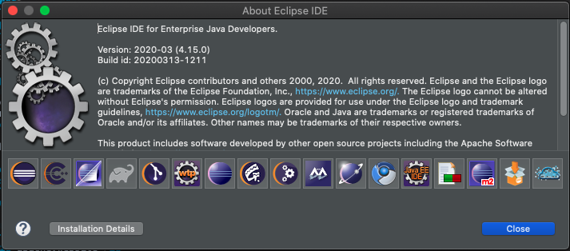
  
* Toda la configuración de Maven se centraliza dentro de las preferencias-Maven

   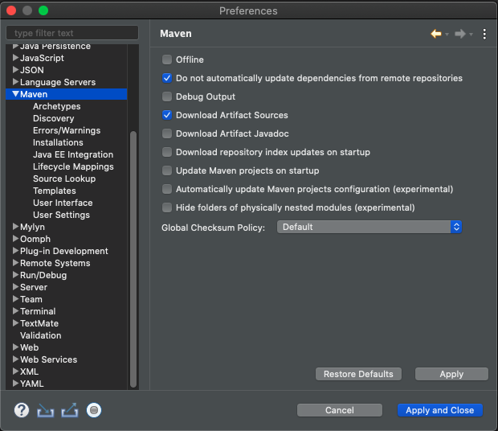
   
   Podemos en las primeras opciones que se muestran tiene marcadas dos opciones entre ellas descargar los fuentes del Artifact
   
* En la opción `Installations` podemos asignar nuestra instalación local de Maven en lugar de la que viene con Eclipse.

   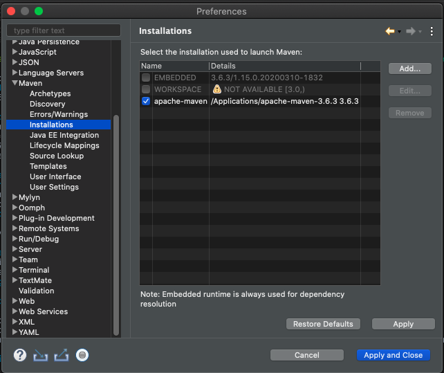
   
   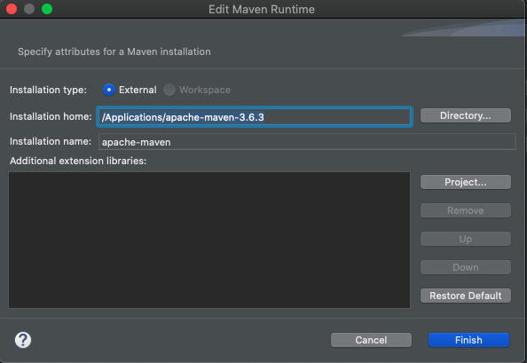
   
   En el nombre de instalación hemos quitado el número de versión para que en caso de tener runtime configuration persistida en nuestro posedor de fuentes todos los usuarios tengamos la misma versión, para evitar que diferentes miembros del equipo tengan diferentes versiones y es importante no ofrecer ese acoplamiento en los ficheros de configuraciones de las ejecuciones.
   
* En la opción `Archetypes` para definir repositorios de arquetipos. Un arquetipo maven es una estructura predefinida que se puede establecer, un tipo de empaquetado nuevo, que se sube al repositorio Maven llamado `Archetypes` y permite que cuando se va a dar de alta un proyecto nuevo se genere una estructura de proyecto predeterminada. Hay diferentes `Archetypes` por ejemplo para crear Servicos Web, para proyectos que corran sobre contenedores, etc.

* La opción `User Settings` es sin duda de las más usadas sirve para establecer una configuración Global (Global Settings), una configuración de usuario (User Settings) y tambiém indicar cual es el repositorio local apartir del User Settings. Desde aquí podemos abrir el archivo `settings.xml`

   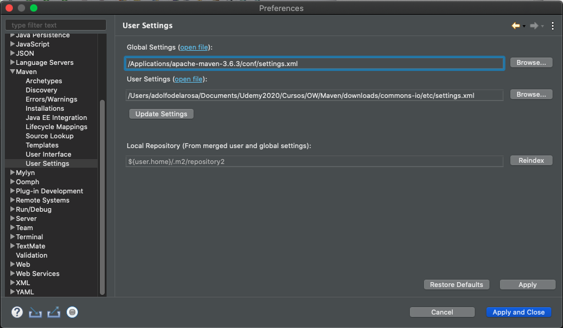
   
   Podemos establecer el `Global Settings` como el propio de la intalación de Maven y como `User Settings` podriamos tener dentro de nuestro proyecto una carpeta `etc` con su propio `settings.xml` especifico para nuestro proyecto. Esto permite que podamos tener configuración global historificada en el repositorio de código todos los desarrolladores y que por otro lado cada usuario pueda tener su propia configuración ya que puede necesitar poner sus credencial particulares para acceder a un servidor o BD. 
   
### Creación de un Nuevo Proyecto Maven

Para crear un nuevo proyecto tenemos la opción *File > New > Project Maven*

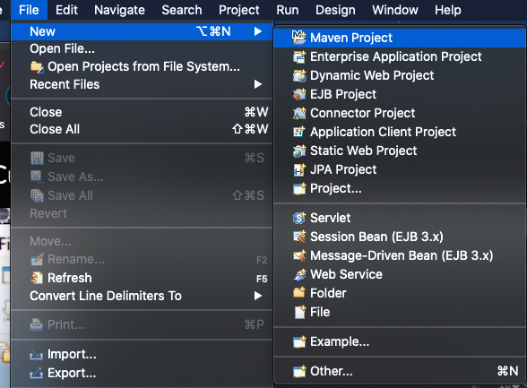

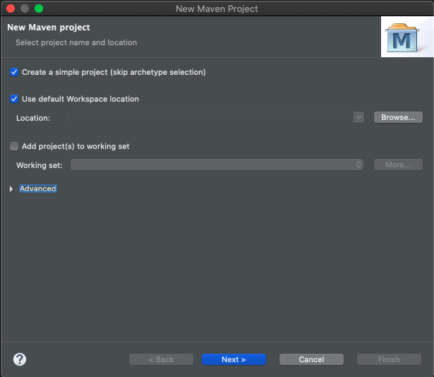

Con esto nos crea la estructura de nuestro nuevo proyecto:

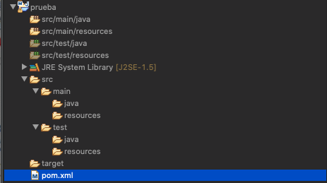

Podemos compilarlo con:

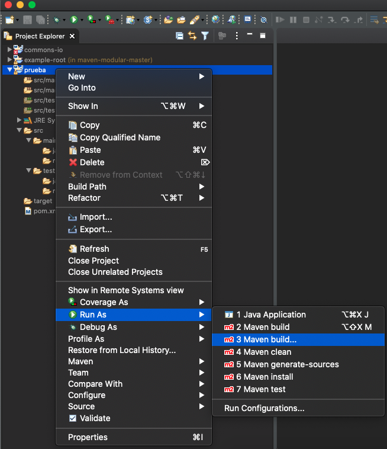

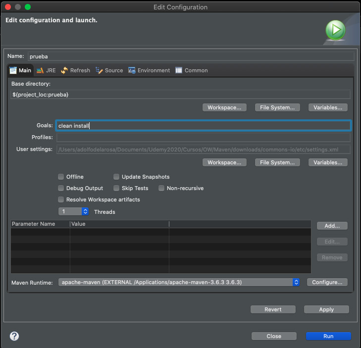

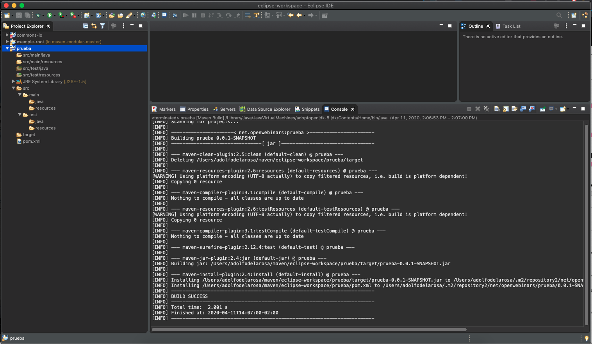

Como podemos ver hemos tenido un `BUILD SUCCESS`

## Creación e importación de proyectos Maven 12:30 

[Creación e importación de proyectos Maven](pdfs/4.3_Creacion_e_importacion_.pdf)

* Crear un proyecto desde cero a partir de un arquetipo

* Importar un proyecto existente

## Opciones de configuración disponibles 16:40 

[Opciones de configuración disponibles](pdfs/4.4_Opciones_de_configuración.pdf)

* Analizar la jerarquía de dependencias del proyecto

* Activar/desactivar la descarga de fuentes y javadoc

* Activar/deshabilitar la resolución de referencias de proyectos en el workspace

* Actualizar configuración de proyecto Maven

* Forzar la actualización/descarga de librerías de SNAPSHOTS y RELEASES

## Optimización de tareas y resolución de conflictos 11:16 

[Optimización de tareas y resolución de conflictos](pdfs/4.5_Optimización_de_tareas.pdf)

* Copiado de librerías de aplicaciones web en Servers durante el despliegue

   * Solución al problema de despliegue de dependencias: **`Plugin FileSync`**

* Trabajando con dos ramas diferentes del mismo proyecto

* Liberando versiones…

## Ejemplo práctico: Integración de Apache con Eclipse 13:49 

## Contenido adicional 5

[Integración con el IDE Eclipse y Apache Maven como base de ID](pdfs/4.1_Integración_con_el_IDE_Eclipse_y_Apache_Maven.pdf)

[Instalación y configuración de Apache Maven sobre Eclipse](pdfs/4.2_Instalacion_y_configuracion.pdf)

[Creación e importación de proyectos Maven](pdfs/4.3_Creacion_e_importacion_.pdf)

[Opciones de configuración disponibles](pdfs/4.4_Opciones_de_configuración.pdf)

[Optimización de tareas y resolución de conflictos](pdfs/4.5_Optimización_de_tareas.pdf)
