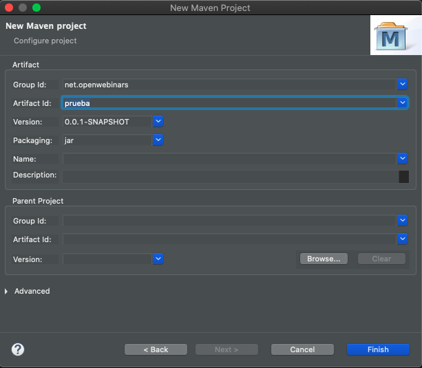
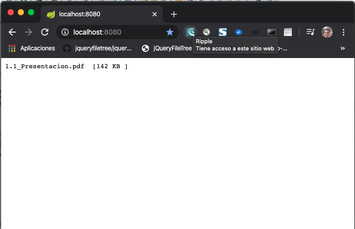

# 4. Integración con el IDE Eclipse 66m

* Integración con el IDE Eclipse y Apache Maven como base de ID 2:30 
* Instalación y configuración de Apache Maven sobre Eclipse 9:16 
* Creación e importación de proyectos Maven 12:30 
* Opciones de configuración disponibles 16:40 
* Optimización de tareas y resolución de conflictos 11:16 
* Ejemplo práctico: Integración de Apache con Eclipse 13:49 
* Contenido adicional 5

## Integración con el IDE Eclipse y Apache Maven como base de ID 2:30 

[Integración con el IDE Eclipse y Apache Maven como base de ID](pdfs/4.1_Integración_con_el_IDE_Eclipse_y_Apache_Maven.pdf)

Apache Maven ofrece soporte para muchas herramientas, IDEs, sistemas de integración continua, etc.

En un proyecto con Eclipse existen ficheros de configuracón de Eclipse que no deben subirse al repositorio de código por ejemplo los archivos `.classPath .proyect`, la carpeta `.settings`. La configuración se define en el archivo `pom.xml` y cada miembro del equipo de desarrollo puede trabajar con su configuración propia. 

## Instalación y configuración de Apache Maven sobre Eclipse 9:16 

[Instalación y configuración de Apache Maven sobre Eclipse](pdfs/4.2_Instalacion_y_configuracion.pdf)

* Establecer una instalación de Maven

* Settings globales y settings por usuario

A diferencia de el uso de Maven en la línea de comandos donde existe un solo setting en Eclipse podemos definir diferentes configuraciones.


* En Eclipse vamos a importar el proyecto existente Maven `commons-io`.

* Por defecto el pluging de Maven ya viene instalado en Eclipse.

   
  
* Toda la configuración de Maven se centraliza dentro de las preferencias-Maven

   
   
   Podemos en las primeras opciones que se muestran tiene marcadas dos opciones entre ellas descargar los fuentes del Artifact
   
* En la opción `Installations` podemos asignar nuestra instalación local de Maven en lugar de la que viene con Eclipse.

   
   
   
   
   En el nombre de instalación hemos quitado el número de versión para que en caso de tener runtime configuration persistida en nuestro posedor de fuentes todos los usuarios tengamos la misma versión, para evitar que diferentes miembros del equipo tengan diferentes versiones y es importante no ofrecer ese acoplamiento en los ficheros de configuraciones de las ejecuciones.
   
* En la opción `Archetypes` para definir repositorios de arquetipos. Un arquetipo maven es una estructura predefinida que se puede establecer, un tipo de empaquetado nuevo, que se sube al repositorio Maven llamado `Archetypes` y permite que cuando se va a dar de alta un proyecto nuevo se genere una estructura de proyecto predeterminada. Hay diferentes `Archetypes` por ejemplo para crear Servicos Web, para proyectos que corran sobre contenedores, etc.

* La opción `User Settings` es sin duda de las más usadas sirve para establecer una configuración Global (Global Settings), una configuración de usuario (User Settings) y tambiém indicar cual es el repositorio local apartir del User Settings. Desde aquí podemos abrir el archivo `settings.xml`

   
   
   Podemos establecer el `Global Settings` como el propio de la intalación de Maven y como `User Settings` podriamos tener dentro de nuestro proyecto una carpeta `etc` con su propio `settings.xml` especifico para nuestro proyecto. Esto permite que podamos tener configuración global historificada en el repositorio de código todos los desarrolladores y que por otro lado cada usuario pueda tener su propia configuración ya que puede necesitar poner sus credencial particulares para acceder a un servidor o BD. 
   
### Creación de un Nuevo Proyecto Maven

Para crear un nuevo proyecto tenemos la opción *File > New > Project Maven*




Con esto nos crea la estructura de nuestro nuevo proyecto:


Podemos compilarlo con:


Como podemos ver hemos tenido un `BUILD SUCCESS`

## Creación e importación de proyectos Maven 12:30 

[Creación e importación de proyectos Maven](pdfs/4.3_Creacion_e_importacion_.pdf)

* Crear un proyecto desde cero a partir de un **arquetipo**

* **Importar** un proyecto existente

### Instalación de Spring-Boot

* En el Eclipse Marketplace en File buscamos `spring`

   
   
   Instalamos **Spring Tools 4 (aka Spring Tool Suite 4) 4.6.0.RELEASE**
   
   
   
   Presionamos confirmar
   
   
   
   Presionamos finish.
   
   Se reiniciara Eclipse y ya nos aparecera el Boot Dashboard de Spring Boots.

### Crear un proyecto desde cero a partir de un arquetipo

Vamos a ilustrar los pasos para la creación del proyecto:


Pulsamos directamente en *Next* sin cambiar nada.


Existen infinidad de arquetipos que podemos usar aqui primero filtramos por *spring* y seleccionamos `spring-boot-blank-archetype`.


Al final nos crea la estructura de nuestro proyecto spring. Pero observamos que en la clase `HelloCpntroller.java` tenemos un error y es por que el equipo de Spring se ha olvidado de colocar el Constructor.

```java
private Result(int left, int right, long answer) {
	super();
	this.left = left;
	this.right = right;
	this.answer = answer;
}
```

Una vez insertado el error se elimina.

* Podemos ejecutar el archivo `App.java`

   
   
   A pesar de no haberlo compilado.

* Nos indica que todo a ido bien y que se ha levantado `Tomcat started on port(s): 8080 (http)`

* Si accedemos a `http://localhost:8080/` veremos la ejecución de nuestro proyecto.

   
   
   **La utilidad que ofrecen los arquetipos de Maven para crear un proyecto operativo y funcional en este caso de Spring Boots, definiendo la estructura, archivos de configuración, archivos de Test listos para ser ejecutados**
   
* En caso de que no ubiera ejecutado lo que deberiamos es compilar el proyecto con Maven Install:

   

   ```sh
   [INFO] ------------------------------------------------------------------------
   [INFO] BUILD SUCCESS
   [INFO] ------------------------------------------------------------------------
   ```
* Algun posible Error cuando creamos es un Arquetipo es que usa un JRE en lugar de un JDK, para solucionarlo entrariamos a las propiedades del proyecto en `Java Build Path` para modificarlo.

* Otro posible Error que podemos encontrar al creamos es un Arquetipo es que falten dependencias, si es el caso se incluyen dentro del archivo `pom.xml` y se compila de nuevo el proyecto.

* Otra cosa que puedo hacer es generar la instalación saltandose los test.

   

   **Observe que estas configuraciones se pueden salvar poniendo un Name y pulsando Apply, antes de dar Run**

### Importar un proyecto existente

Para importar un Proyecto Maven seleccionamos la opción *File > Import*


Buscamos en nuetra maquina el proyecto Maven que deseamos importar.


Y listo nos importa dicho proyecto.

## Opciones de configuración disponibles 16:40 

[Opciones de configuración disponibles](pdfs/4.4_Opciones_de_configuración.pdf)

* Analizar la jerarquía de dependencias del proyecto

* Activar/desactivar la descarga de fuentes y javadoc

* Activar/deshabilitar la resolución de referencias de proyectos en el workspace

* Actualizar configuración de proyecto Maven

* Forzar la actualización/descarga de librerías de SNAPSHOTS y RELEASES

### Analizar la jerarquía de dependencias del proyecto

* Abrimos el archivo `pom.xml` de nuestro proyecto **spring-boot-blank** 

   

* Tenemos la pestaña `Dependencies` que si la pulsamos tenemos:

   
  
   Nos muestra todas las dependencias directas del proyecto.
   
* Tenemos la pestaña `Dependency Hierarchy` que si la pulsamos tenemos: 

   

   Nos muestra toda la estructura de árbol de dependencias que tenemos y equivale al comando `$> mvn dependency:dependency-tree`. Del lado derecho se muestra un listado de todas las librerias.
   
   * Tenemos un `Filter` para buscar grupos de librerias:
   
      
   
      Esta pestaña es muy util para detectar conflictos entre librerias. 
      
   * Tenemos la opción `Exclude Maven Artifact...` pulsando el botón derecho sobre alguna libreria que desemos excluir.
   
      
      
      
      
      
      
      Esto lo que hace es meter la etiqueta `<exclusion>` en mi dependencia:
      
      ```sh
      <dependency>
            <groupId>com.jayway.restassured</groupId>
            <artifactId>rest-assured</artifactId>
            <version>${rest.assured.version}</version>
            <scope>test</scope>
            <exclusions>
            	<exclusion>
            		<groupId>commons-codec</groupId>
            		<artifactId>commons-codec</artifactId>
            	</exclusion>
            </exclusions>
      </dependency>
      ```

      **NOTA**: Existe un bug que cuando la dependencia esta en varios sitios la exclusion la mete en todos los sitios no solo en el que marcamos.
      
      Si en el `pon.xml` eliminamos las exclusiones la volvemos a tener operativa.
      
      

### Incluir un proyecto Maven como dependencia dentro de otro proyecto Maven

Vamos a incluir el proyecto `commons-io` dentro del de `spring-boot-blanck`

* Ir al proyecto `pom.xml` de `commons-io` y copiar sus identificadores.

   ```sh
   <groupId>commons-io</groupId>
   <artifactId>commons-io</artifactId>
   <version>2.7-SNAPSHOT</version>
   ```

* Incluir lo copiado en el `pom.xml` de `spring-boot-blanck` como dependencia

   ```sh
   <dependency>
   	<groupId>commons-io</groupId>
  	<artifactId>commons-io</artifactId>
  	<version>2.7-SNAPSHOT</version>
   </dependency>
   ```
	
   Y vemos como ya aparece como dependencia de nuestro proyecto
   
   
 
   Esto lo que implica que cuando hagamos cambios en el proyecto `commons-io` y gracias a Maven será capaz de comunicarselo al proyecto `spring-boot-blanck` automaticamente sin necesidad de hacer nada. **PERO ESTE PROCESO A VECES FALLA** esto puede verse en los servidores de aplicaciones (web) donde no coje los cambios. Si esto llega a ocurrir como mecanismo de emergencia podemos usar el siguiente punto.
   
### Activar/deshabilitar la resolución de referencias de proyectos en el workspace   

Para Activar/deshabilitar la resolución de referencias de proyectos en el workspace pulsamos:


En este caso desactiva las referencias lo que implica que si hay cambios en `commons-io` no se veran reflejados automaticamente en `spring-boot-blanck`, será necesario hacer un `clean install` del proyecto `commons-io` para reflejar los cambios.

### Vamos a Excluir una libreria que se encuentre en más de un sitio.

* Abrimos el `pom.xml` del proyecto `commons-io`. Donde incluiremos la siguiente dependencia 

   ```sh
   <dependency>
      <groupId>commons-codec</groupId>
      <artifactId>commons-codec</artifactId>
      <version>1.6</version>
   </dependency>
   ```
   
   Que corresponde a una dependencia hereda de alguna de las dependencias directas en el mismo proyecto `commons-io`. La hemos puesto como dependencia principal para duplicar su uso.
   
   En teoría la libreria deberia estar disponible tanto en `commons-io` como en `spring-boot-blanck`, pero como hemos deshabilitar la resolución de referencias es necesario realizar un `clean install` + `skip test` en `commons-io`.
  
   Si abrimos el `pom.xml` de `spring-boot-blanck` ya vemos dentro de la dependencia del proyecto la dependencia transitiva incluida, en caso de no verla sería necesario actualizar la configuración del proyecto.
 
   
   
   Con esto tenemos `commons-codec` en dos sitios, lo que vamos hacer es una exclusión de dicha libreria que acabamos de añadir, con el boton derecho y dando la opción `Exclude Maven Artifieed...`, lo que hace es que las ecluye de ambos sitios no solo del que le habiamos indicado.  

### Actualizar configuración de proyecto Maven

Cuando se modifica la configuración de un proyecto Maven es posible que no coja los cambios y sea necesario actualizar el proyecto con la opción:


**Lo que hace es algo parececido a lo que se hace cuando se importa el proyecto en base a lo que hay instalado**

### Activar/desactivar la descarga de fuentes y javadoc

Simplemente se activan o desactivan los checks en la configuración de Maven


### Forzar la actualización/descarga de librerías de SNAPSHOTS y RELEASES

Pude existir una casuistica en la que las actualizaciones de los repositorios se realicen una sola vez al dia en un horario determinado, pero si queremos descargar la dependencia en uun momento dado podemos forzarlo con la opción de Actualizar el Proyecto pero marcando el check `Force Update of Snapshots/Releases`


**Esto también es muy util cuando en la descarga hubo problemas de red y necesitamos forzar nuevamente la descarga de las dependencias**

## Optimización de tareas y resolución de conflictos 11:16 

[Optimización de tareas y resolución de conflictos](pdfs/4.5_Optimización_de_tareas.pdf)

* Copiado de librerías de aplicaciones web en Servers durante el despliegue

   * Solución al problema de despliegue de dependencias: **`Plugin FileSync`**

* Trabajando con dos ramas diferentes del mismo proyecto

* Liberando versiones…

### Copiado de librerías de aplicaciones web en Servers durante el despliegue

Ya vimos en la lección pasada una posible opción **deshabilitar la resolución de referencias de proyectos en el workspace** pero implica hacer varios pasos para que funcione lo que lo hace algo engorroso otra opción es usar el **`Plugin FileSync`**.

#### Instalación del `Plugin FileSync`


Una vez instalado se reinciara Eclipse.

* Nos metemos a las propiedades del proyecto `spring-boot-blanck` en `Resorces / File synchonization` y marcamos el check `Enable FileSync builder for project`

   

   Ademas añadimos una carpeta fuente con el mismo nombre del proyecto y la marcamos:
   
   
   
   También hay que añadir una carpeta destino en `Default target folder` Por ejemplo `..\tmp0\wtpwebapps\spring-boot-blank` que est aruta donde se despliegan las aplicaciones web de otro proyecto.
   
   Entonces lo que haria `Plugin FileSync` es que cada vez que se ejecuta build y hay cambios en la carpeta origen los copia en la carpeta destino de forma transparente. si queremos forzarlo tenemos que dar click derecho en el proyecto y dar `Force File Synchronization`  

   Lo que hace este pluging es que cada que hay modificasiones en esta carpeta creada y se ejecute el build de Eclipse 
   
### Trabajando con dos ramas diferentes del mismo proyecto

Supongamos que tenemos la siguiente estructura de dos ramas en nuestro proyecto:

```
trunk
    backend [backend-trunk]
        0.2-SNAPSHOT
branches / Release
    backend [backend-release]
        0.2-SNAPSHOT 
    frontend
        0.2-SNAPSHOT 
```

Tendríamos un cuello de botella, un punto central donde se va a mezclar todo que es el repositorio local de Maven.
si solo quisieramos desplegar el frontend también cogeria los cambios que existen en la rama trunk. Por lo que siempre tenemos que estar diferenciando las versiones de las distintas ramas, lo que sería una buena practica  ademas de ser necesario.

Por lo que nuestras ramas quedarían así:

La Release(Versión liberada) siempre ira por detras de la SNAPSHOT(Versión en desarrollo).

```
trunk
    backend [backend-trunk]
        0.2-SNAPSHOT
branches / Release
    backend [backend-release]
        0.1
    frontend
        0.1
```

Para una posterior liberación tendríamos:

```
trunk
    backend [backend-trunk]
        0.3-SNAPSHOT
branches / Release
    backend [backend-release]
        0.2
    frontend
        0.2
```

**Este es un problema muy comun, en ocaciones que no tienen la suficiente experiencia pueden tener colisiones en librerias y no saben que les pasa y es que tienen el mismo nombre en las versiones de las diferentes ramas**

### Liberando versiones…

Es lo que se ha visto en el punto anterior que cuando se liberan versiones no se liberan versiones SNAPSHOT, cuando se libera es una version ya testeada, que debe pasar por los servidores de prueba y llegar a producción. 

Hay clientes que se pueden molestar si lo que se libera son versiones SNAPSHOT por lo que se esta haciendo ver es que lo que se ha subido no esta probado, por lo que cuando se libere a producción no deben llevar versiones SNAPSHOT.

## Ejemplo práctico: Integración de Apache con Eclipse 13:49 

Vamos a aprovechar el proyecto creado con el arquetipo `spring-boot-blanck` y que le hemos metido como dependencia el proyecto `commons-io`.

**commons-io** es una libreria de software libre que tiene funcionalidades comun de lectura de I/O, lectura de ficheros, etc. 

Vamos a modificar nuestro proyecto para que en lugar de que imprima `Hello Wordl`, imprima el nombre de un archivo PDF y el tamaño que ocupa en KBytes, usando `commons-io`.

* Vamos a modificar el archivo `HelloController.java`

```java
import lombok.Data;

import java.io.File;

import org.apache.commons.io.FileUtils;
import org.springframework.beans.factory.annotation.Autowired;
import org.springframework.jdbc.core.namedparam.MapSqlParameterSource;
import org.springframework.jdbc.core.namedparam.NamedParameterJdbcTemplate;
import org.springframework.web.bind.annotation.RequestMapping;
import org.springframework.web.bind.annotation.RequestParam;
import org.springframework.web.bind.annotation.RestController;

@RestController
public class HelloController {
	
	
	private static final String FILEPATH_PPT="/Users/adolfodelarosa/Documents/Udemy2020/Cursos/OW/Maven/pdfs/1.1_Presentacion.pdf";
	
    @Autowired
    NamedParameterJdbcTemplate jdbcTemplate;

    @RequestMapping("/")
    String hello() {
    	
    	File presentacion = FileUtils.getFile(FILEPATH_PPT);
    	
    	return presentacion == null ?  "Hello World!" : presentacion.getName() + "  [" + presentacion.length()/1024 + " KB ]";
    	
        //return "Hello World!";
    }

    @Data
    static class Result {
        private final int left;
        private final int right;
        private final long answer;
		
        private Result(int left, int right, long answer) {
			super();
			this.left = left;
			this.right = right;
			this.answer = answer;
		}
        
        
    }

    // SQL sample
    @RequestMapping("calc")
    Result calc(@RequestParam int left, @RequestParam int right) {
        MapSqlParameterSource source = new MapSqlParameterSource()
                .addValue("left", left)
                .addValue("right", right);
        return jdbcTemplate.queryForObject("SELECT :left + :right AS answer", source,
                (rs, rowNum) -> new Result(left, right, rs.getLong("answer")));
    }
}

```

Hemos creado una ruta con el archivo que queremos usar como referencia y posteriormente usando `FileUtils` que es importada desde `import org.apache.commons.io.FileUtils;`, nuestro proyecto  `commons-io` e incluso si le damos Ctrl + Click en esa importación nos lleva a `commons-io`. Posteriormente obtenemos el archivo y mostramos su nombre y tamaño. Todo esto lo podemos hacer gracias a `commons-io` que lo hemos metido como dependencia dentro de `spring-boot-blank`.

Si ejecutamos nuestra aplicacion esta es la nueva salida:



#### Vamos a desactivar la resolución del workspace

 

* Con Click derecho en proyecto / Maven / Disable workspace Resolution

   Al hacer esto los cambios que hagamos en el `commons-io` no se reflejaran automaticamente en `spring-boot-blank` hasta que instalemos el `commons-io`.
   
   **Lo primero que podemos observar es que si damos Ctrl + click en `import org.apache.commons.io.FileUtils;` ya no nos lleva al archivo `.java` dentro del `commons-io`, sino que nos lleva al `.class`**

* Vamos a cambiar el método `getFile(final String... names)` para que siempre regrese un fichero fijo en lugar del que recibe como parámetro. Lo que necesitamos es hacer un cambio en `commons-io` y ver como no se refleja automaticamente en `spring-boot-blank` por haber desactivado la resolución del workspace.

   ```java
   public static File getFile(final String... names) {
        Objects.requireNonNull(names, "names");
        File file = null;
        for (String name : names) {
            if (file == null) {
                file = new File(name);
            } else {
            	name = "/Users/adolfodelarosa/Documents/Udemy2020/Cursos/OW/Maven/pdfs/7.2_Recopilacion_consejos_y_trucos_.pdf";
                file = new File(file, name);
            }
        }
        return file;
   }
   ```

  Si ejecutamos el proyecto `spring-boot-blank` no veremos cambio alguno.
  
  

### Opción `Run configurations..`

#### Exportar las Opciones

Dentro de la barra de iconos tenemos `Run Tomcat` que si pulsamos su flechita muestra varias opciones entre ellas `Run configurations..`


En esta ventana tenemos un apartado `Maven Build` que muestra todas las ejecuciones que estamos haciendo de Maven incluso se pueden salvar para no estarlas definiendo nuevamente y posteriormente podemos compartirlas con otro miembros del equipo de desarrollo. Esto se hace en la pestaña `commons` marcando la opción `Shared file` e indicando donde va a crear el archivo en este caso en `/commons-io` y presionamos el botón `Apply`.


Esto lo que hace es generarnos el archivo `commons-io.lauch` el cual es un archivo xml.


Tenemos la key `M2_RUNTIME` que se llama igual que la instalación de nuestro Maven `apache-maven` que definimos en *Preferences > Maven > Installations**, **En su momento se dijo que en el nombre que se pusiera aquí no pusieramos la versión presisamente para que este archivo pueda ser compatible con otros compañeros del equipo de desarrollo**

Este archivo se sube en el repositorio de código y son usados por cualquier miembro del equipo. Cualquier compañero abre el proyecto y ya tiene las ordenes para poder ejecutarlas.

#### Refresh

Cuando queremos compilar un proyecto WAR hay una oden que hacemos muy manual que es despues de compilarr el proyecto es ir a la carpeta `target` y refrescarla, esta tarea la podemos automatizar si vamos a `Run configurations..` pestaña `Refresh` y marcamos la opción `Refresh resources upon completion` y ademas marcamos `specific resources` para poder marcar lo que queramos que se refresque en este caso el directorio `target`


Esto a Eclipse le viene muy bien - es un comportamiento tedioso de Eclipse el hecho de que continuamente tengas que refrescar los ficheros del Workspace a pesar de hacerlo con Eclipse, pero el que realmente esta ejecutando el cambio es un proceso de Maven que esta hecho al margen de Eclipse, por eso esta opción de Refresh viene muy bien en muchos casos.


### Diferentes problemas

#### El puerto 8080 se queda abierto

Debemos matar el proceso que se queda abierto.

* Primero lo buscamos con `netstat -ano | findstr 8080`
* Y cuando lo encontremos lo matamos con `taskkill /PID 616840` * el PID que tenga


## Contenido adicional 5

[Integración con el IDE Eclipse y Apache Maven como base de ID](pdfs/4.1_Integración_con_el_IDE_Eclipse_y_Apache_Maven.pdf)

[Instalación y configuración de Apache Maven sobre Eclipse](pdfs/4.2_Instalacion_y_configuracion.pdf)

[Creación e importación de proyectos Maven](pdfs/4.3_Creacion_e_importacion_.pdf)

[Opciones de configuración disponibles](pdfs/4.4_Opciones_de_configuración.pdf)

[Optimización de tareas y resolución de conflictos](pdfs/4.5_Optimización_de_tareas.pdf)
