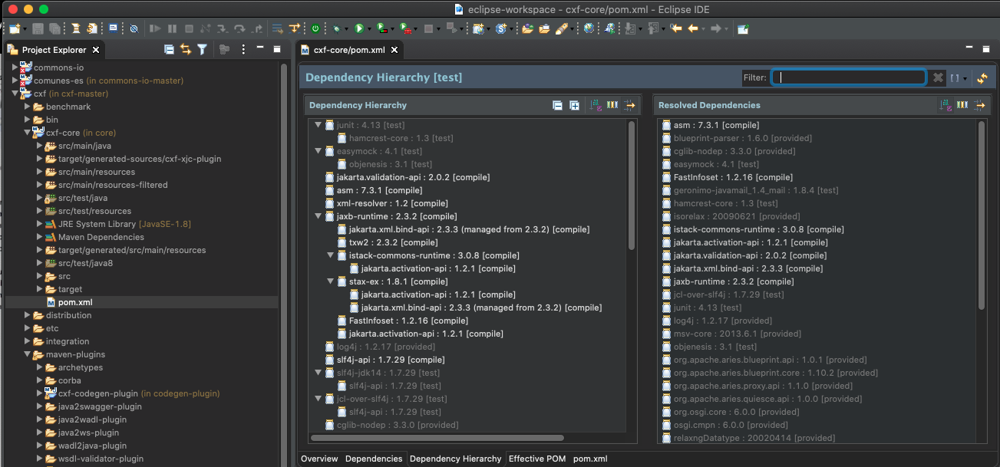

# 5. Definición de proyectos jerárquicos 36m

* Proyectos Maven jerárquicos 10:25 
* Concepto de dependencias transitivas 2:43 
* Buenas prácticas, ventajas y desventajas 8:13 
* Ejemplo práctico: Creación de un proyecto multi-módulo 15:19 
* Contenido adicional 3

## Proyectos Maven jerárquicos 10:25 

[Proyectos Maven jerárquicos](pdfs/5.1_Proyectos_Maven_Jerárquicos_.pdf)

Existen proyectos en los cuales el nivel de jerarquias es realmente complejo.

### Proyecto Apache CXF https://cxf.apache.org (Servicios Web)

Para poder ver el código del proyecto Apache CXF lo podemos hacer en el repositorio:

`https://github.com/apache/cxf`

El proyecto es bastante complejo con un alto número de modulos con su correspondiente `pom.xml`. La librería principal es **core** la cual no contiene modulos es un simple jar. Y existen ramas intermedias como `integration`, `distribution`, etc.

Este proyecto podriamos descargarlo e importarlo desde Eclipse pero lo ideal sería trabajarlo por partes ya que todo completo tiene una cantidad muy alta de modulos que lo harian muy pesado trabajarlo completo.

El siguiente diagrama muestra un resumen de las librerias principales que tiene el proyecto:


Este proyecto es muy extento por que tiene librerias para Servicios REST, SOA, etc. pero un claro ejemplo de un proyecto jerarquico muy complejo.

### plugins `codegen-plugin`

Destaca uno de los plugins `codegen-plugin` que permite ejecutar la orden `wild the to java`, en proyectos SOA que definen contratos `wildyets`,  si te facilitan el `wildyet` de un cliente al que te tienes que integrar, utilizamos el plugins `codegen-plugin` para generar el código Java asociado al esquema del contrato y lo puedes utilizar para montarte el cliente del servicio web. 

En `codegen-plugin` es tiene una oden que permite convertir el contrato de servicio Web en código Java, podriamos automatizar el pipeline de maven en la ejecución de build metiendo una sintaxis de ejecución de ese plugin para que se ejecute en ciertas fases. Por ejemplo si estamos en un proyecto que monta el servicio Web y hace falta el fuente del esquema asociado a ese contrato, podriamos ejecutarlo antes de que se vaya a compilar el proyecto y que coja los fuentes generados y que lo utilice para generarlo, de esta manera no fallara la compilación, una practica muy habitual y muy limpia ya que código pesado automatizable no lo transladamos a nuestra carpeta de fuentes, sino solo lo usamos para compilar y automatizamos la descarga de ese fuente a partir de un `wildent` publicado en la URL. 

#### Importar proyecto Apache CXF en Eclipse

Vamos a importar el proyecto a Eclipse pero solo indicandole que nos importe solo los modulos **core** y **codegen-plugin**.

Presionamos *File > Import > Maven > Existing Maven Projects* y despues indicamos la ruta donde descargamos y desempaquetamos el proyecto. Por defercto marca marca todos los proyectos para importarlos, pero solo vamos a marcar tres.


Nos importa el proyecto


Podemos ver claramente como a incluido los plugins `cxf-core` y `cxf-codegen-plugin`.

En el proyecto de Eclipse tenemos dos opciones de vistas `Flat` (defailt) y `Hierarchical` que es la que estamos usando y es mejor usarla para proyectos jerarquicos como este caso.

Si vemos con más detalle `cxf-core` observamos que tenemos `target/generated-sources/cxf-xjc-plugin` que es un ejemplo claro de código que se genera de forma automática con un pluging.


Vamos a abrir el `pom.xml` para ver solo la parte del pluging `csf-xjc-plug`:

```sh
            <plugin>
                <groupId>org.apache.cxf</groupId>
                <artifactId>cxf-xjc-plugin</artifactId>
                <version>${cxf.xjc-utils.version}</version>
                <executions>
                    <execution>
                        <id>generate-sources</id>
                        <phase>generate-sources</phase>
                        <goals>
                            <goal>xsdtojava</goal>
                        </goals>
                        <configuration>
                            <fork>${cxf.xjcplugin.forkmode}</fork>
                            <additionalJvmArgs>${cxf.xjc.jvmArgs}</additionalJvmArgs>
                            <extensions>
                                <extension>org.apache.cxf.xjcplugins:cxf-xjc-javadoc:${cxf.xjc-utils.version}</extension>
                                <extension>org.apache.cxf.xjcplugins:cxf-xjc-dv:${cxf.xjc-utils.version}</extension>
                            </extensions>
                            <sourceRoot>${basedir}/target/generated-sources/cxf-xjc-plugin</sourceRoot>
                            <xsdOptions>
                                <xsdOption>
                                    <xsd>${basedir}/src/main/resources/schemas/wsdl/http.xsd</xsd>
                                    <bindingFile>${basedir}/src/main/resources/schemas/wsdl/http.xjb</bindingFile>
                                    <catalog>${basedir}/src/main/build-resources/catalog.cat</catalog>
                                    <extensionArgs>
                                        <extensionArg>-npa</extensionArg>
                                        <extensionArg>-Xjavadoc</extensionArg>
                                    </extensionArgs>
                                </xsdOption>
                                <xsdOption>
                                    <xsd>${basedir}/src/main/resources/schemas/wsdl/ws-addr.xsd</xsd>
                                    <packagename>org.apache.cxf.ws.addressing</packagename>
                                    <extensionArgs>
                                        <extensionArg>-Xjavadoc</extensionArg>
                                        <extensionArg>-npa</extensionArg>
                                        <extensionArg>-Xdv</extensionArg>
                                    </extensionArgs>
                                </xsdOption>
                                <xsdOption>
                                    <xsd>${basedir}/src/main/resources/schemas/wsdl/addressing.xsd</xsd>
                                    <bindingFile>${basedir}/src/main/resources/schemas/wsdl/addressing.xjb</bindingFile>
                                    <extensionArgs>
                                        <extensionArg>-npa</extensionArg>
                                        <extensionArg>-Xjavadoc</extensionArg>
                                        <extensionArg>-Xdv</extensionArg>
                                    </extensionArgs>
                                </xsdOption>
                                <xsdOption>
                                    <xsd>${basedir}/src/main/resources/schemas/configuration/security.xsd</xsd>
                                    <bindingFile>${basedir}/src/main/resources/schemas/configuration/security.xjb</bindingFile>
                                    <catalog>${basedir}/src/main/build-resources/catalog.cat</catalog>
                                    <extensionArgs>
                                        <extensionArg>-npa</extensionArg>
                                        <extensionArg>-Xdv</extensionArg>
                                        <extensionArg>-Xjavadoc</extensionArg>
                                    </extensionArgs>
                                </xsdOption>
                                <xsdOption>
                                    <xsd>${basedir}/src/main/resources/schemas/wsdl/ws-addr-wsdl.xsd</xsd>
                                    <bindingFile>${basedir}/src/main/resources/schemas/wsdl/ws-addr-wsdl.xjb</bindingFile>
                                    <extension>true</extension>
                                    <extensionArgs>
                                        <extensionArg>-npa</extensionArg>
                                        <extensionArg>-Xjavadoc</extensionArg>
                                        <extensionArg>-Xdv</extensionArg>
                                    </extensionArgs>
                                </xsdOption>
                                <xsdOption>
                                    <xsd>${basedir}/src/main/resources/schemas/wsdl/addressing200403.xsd</xsd>
                                    <bindingFile>${basedir}/src/main/resources/schemas/wsdl/addressing200403.xjb</bindingFile>
                                    <extensionArgs>
                                        <extensionArg>-Xjavadoc</extensionArg>
                                        <extensionArg>-npa</extensionArg>
                                        <extensionArg>-Xdv</extensionArg>
                                    </extensionArgs>
                                </xsdOption>
                            </xsdOptions>
                        </configuration>
                    </execution>
                </executions>
            </plugin>

```

En el pluging vemos `<goal>xsdtojava</goal>` es un `xsdtojava` que quiere de cir que a partir de un fichero de esquema `xsd` que forma parte de un `wildyet` se generara el código Java, lo que le decimos que en la fase `<phase>generate-sources</phase>` ejecutamos este pluging. 


Esta es la segunda fase por lo que se ejecuta antes de la compilación para dejarlo preparado. Se ejecuta el comando `xsdtojava` y con eso se genera una estructura de código. que en Eclipse se ve en la carpeta `target/generated-sources/cxf-xjc-plugin`.

Este es un ejemplo de definición de ejecución, ejecutando el `goal` con multiples opciones `xsdOption`. es un ejemplo de generación de código automatizado en un proyecto hecho con Maven.

## Concepto de dependencias transitivas 2:43 

[Concepto de dependencias transitivas](pdfs/5.2_Concepto_de_dependencias_transitivas.pdf)

Ya habiamos visto que podemos ver las Dependencias de un proyecto en Eclipse:



La dependencia `cfx-core` es una dependencia hoja que no depende de nadie más:


En cambio `cfx-codegen-plugin` si que tiene una jerarquia de dependencias 


Como se orquestaria trabajar en un proyecto como este donde se tiene que estar continuamente modificando, lo más seguro es que no se trabaje con toda la estructura a la vez. 


## Buenas prácticas, ventajas y desventajas 8:13 

[Buenas prácticas, ventajas y desventajas](pdfs/5.3_Buenas_prácticas_ventajas_y_desventajas.pdf)

* La jerarquía de módulos tiene que estar bien definida (Definida por un Arquitecto).

   Por ejemplo un proyecto multimodulo donde se tiene un modulo Backend y otro Frontend, donde claramente el Frontend depende del Backend. Podriamos tener adicionalmente un módulo de API compartido por el Backend comoo por en Frontend. Por lo que tanto el Frontend como el Backend contienen al API y ya no existe una dependencia entre el Frontend y el Backend. Este es un ejemplo claro de dependencias qu podemos hacer. Pero para proyectos como Apache cxf la estructura no se ve a simple vista como en nuestro ejemplo planteado.

* Se deben evitar ciclos de dependencias.

   No debe hacerse nunca una definición de jerarquía donde A dependa de B y B dependa de A, por que ocaciona problemas a la larga.  
   
* En el POM maestro se deben definir ciertas características:

   * las versiones de dependencias a través de propiedades
   * La declararación de plugins y dependencias:
      * `<pluginManagement />`
      * `<dependencyManagement />`
   * La declaración de repositorio remoto de despliegue:
      * `<distributionManagement />`
      
```
<build>
 <pluginManagement>
   <plugins>
     <plugin>
       <groupId>org.apache.maven.plugins</groupId>
       <artifactId>maven-jar-plugin</artifactId>
       <version>2.6</version>
     </plugin>
   </plugins>
 </pluginManagement>
 <plugins>
   <plugin>
     <groupId>org.apache.maven.plugins</groupId>
    <artifactId>maven-jar-plugin</artifactId>
    <configuration>
      <archive>
        <manifestFile>
          ${project.build.outputDirectory}/META-INF/MANIFEST.MF
        </manifestFile>
      </archive>
    </configuration>
 </plugin> 
```
 
```sh
<distributionManagement>
 <repository>
   <id>my_artifactory</id>
   <name>Release Repository</name>
   <url>http://my_artifactory/artifactory/central</url>
 </repository>
 <snapshotRepository>
   <id>my_artifactory</id>
   <name>Snapshot Repository</name>
   <url>http://my_artifactory/artifactory/central</url>
   </snapshotRepository>
</distributionManagement> 
```

### VENTAJAS VS DESVENTAJAS

#### VENTAJAS

* Los proyectos jerárquicos ofrecen una visión directa de la estructura de un proyecto complejo   
* **Well-defined**

Si estan bien definidos ofrecen una visión directa a cualquier desarrollador, Testers, Quasts, etc. que serán capaces de interpretarlo o incluso si es para software libre, será muy bien visto que este bien definido. Las personas que lo hacen tienen mucha experiencia.

#### DESVENTAJAS

* Aumenta la complejidad en los entornos de desarrollo
   
   Trabajar con muchoyectos muy grandes si no merece la pena no aporta nada. Un proyecto en si es toda la totalidad del objetivo que se pretende, todo el código para cumplir un cometido. Pero siempre esta la premisa de divide y venceras.

   Por ejmplo un proyecto de gestión de sensores, relacionado con IOT, y otros más. Es muy probable identificar diferentes componentes y que cada componente tenga se repositorio y su estructura y que el nivel de acoplamiento entre un componente y otro sea simplemente el API que les permite interoperar entre ellos. Esto no quiere decir que todos los componentes tengan que estar el mismo repositorio o en la misma estructura jerarquica Maven. Es un ejemplo claro de separación de responsabilidades y al final definir un proyecto que contenga solo lo que hace falta. Y si existe el API podría ser una parte independiente del proyecto Maven y comun a los diferentes componentes para su comunicación. Se uniran a traves del Repositorio Maven que es donde estan instaladas las librerias.

* Se pueden producir problemas durante la publicación automática en servirdores de aplicaciones 

   Otra de las desventajas cuando trabajamos con proyectos jerarquicos a la hora de publicar los cambios en los servidores de aplicaciones aumentan las posibilidades de error y Eclipse es un compilador que tiene mucho nivel de cache y en determinados momentos esas caches no pueden enterarse de que ha existido un cambio en otro proyecto. Con lo cual tenemos que empezar a jugar con desactivar la opción de resolucion de los proyectos que estan en el workspace o bien jugar con el plugin filesync que permite tener actualizados los recursos a pesar de que Eclipse no se pueda dar cuenta. 

## Ejemplo práctico: Creación de un proyecto multi-módulo 15:19 

Nuestro proyecto `spring-boot-blank` en este proyecto multi-módulo funcionara como el modulo Frontend. `commons-io` representara nuestro Backend para aacceder al fichero y devolver su nombre y tamaño.

Por lo tanto vamos a seguir los siguientes pasos:

* Crear un proyecto Maven sencillo llamado `file-size-viewer`.

   

   ```js
   <project xmlns="http://maven.apache.org/POM/4.0.0" xmlns:xsi="http://www.w3.org/2001/XMLSchema-instance" xsi:schemaLocation="http://maven.apache.org/POM/4.0.0 https://maven.apache.org/xsd/maven-4.0.0.xsd">
     <modelVersion>4.0.0</modelVersion>
     <groupId>net.opemwebinars</groupId>
     <artifactId>file-size-viewer</artifactId>
     <version>0.0.1-SNAPSHOT</version>
     <packaging>pom</packaging>
   </project>
   ```

* A este proyecto le vamos a crear un Maven módulo:

   

   

   

   En el `pom.xml` principal se añade el tag `module`:

   ```js
   <project xmlns="http://maven.apache.org/POM/4.0.0" xmlns:xsi="http://www.w3.org/2001/XMLSchema-instance" xsi:schemaLocation="http://maven.apache.org/POM/4.0.0 https://maven.apache.org/xsd/maven-4.0.0.xsd">
     <modelVersion>4.0.0</modelVersion>
     <groupId>net.opemwebinars</groupId>
     <artifactId>file-size-viewer</artifactId>
     <version>0.0.1-SNAPSHOT</version>
     <packaging>pom</packaging>
     <modules>
  	<module>backend</module>
     </modules>
   </project>
   ```

   Y se a creado la estructura del proyecto:

   

* Creamos el modulo `frontend`:

   
   
* Vamos a cojer el `pom.xml` de `commons-io` y lo vamos a mezclar con el `pom.xml` `backend`. 

   Marcamos los dos `pom.xml` y hacemos un `Compare With - Each Other`
   
   
   
   
   
* Mejor vamos a meter la dependencia de `commons-io` dentro del `backend`:

   ```js
   <project xmlns="http://maven.apache.org/POM/4.0.0"
	xmlns:xsi="http://www.w3.org/2001/XMLSchema-instance"
	xsi:schemaLocation="http://maven.apache.org/POM/4.0.0 https://maven.apache.org/xsd/maven-4.0.0.xsd">
	<modelVersion>4.0.0</modelVersion>
	<parent>
		<groupId>net.opemwebinars</groupId>
		<artifactId>file-size-viewer</artifactId>
		<version>0.0.1-SNAPSHOT</version>
	</parent>
	<artifactId>backend</artifactId>
	<dependencies>
		<dependency>
			<groupId>commons-io</groupId>
			<artifactId>commons-io</artifactId>
			<version>2.7-SNAPSHOT</version>
		</dependency>
	</dependencies>
   </project>
   ```
* En el proyecto `frontend` lo que haremos es transladar la información del proyecto `spring-boot-blank` al proyecto `frontend`. Para lo cual usaremos la herramienta **Beyond Compare** 

   Seleccionamos *Session > New Session > Folder Compare*.
   Se insertan las dos rutas que se quieren comparar.
   
   
   
   Ahora vamos a excluir ciertos archivos y carpetas esto lo hacemos usando la opción `Filters`

   
   
   Damos OK y damos un *Edit > Expand All*:
   
   

   Ahora damos un *Edit > Select All Files*:
   
   
   
   Y posteriormente damos en *Actions > Compare Contents...*
   
   
   
   Como existe mucho codigo que solo esta en la parte de `spring-boot-blank` no se nota nada. Vamos a copiar lo que esta en este proyecto hacia `frontent` esto se hace marcando la carpeta que se quiere copiar y presionar el icono de copiar.
   
   
   
   Repetimos lo mismo para todas las carpetas que queremos copiar.
   
   
   
   Ahora vamos a comparar los dos archivos `pom.xml` presionando doble click en el nombre de uno de ellos.
   
   
  
   Lo que vamos a hacer es mantener la información del artefacto `frontend` es decir: 
   
   ```sh
   <groupId>net.opemwebinars</groupId>
   <artifactId>file-size-viewer</artifactId>
   <version>0.0.1-SNAPSHOT</version>
   ```
   Y lo que vamos a hacer es sobrescribir el `pom.xml` de `spring-boot-blank` al del `frontend`.
   
   
   
   Y lo que vamos a hacer es a remplazar el artefacto que habiamos copiado previamente por el que se copio en `frontend`
    
   
   
   Lo salvamos y listo.
   
* Asegurarse que Eclipse a cogido los cambios, por cualquier cosa damos un `refresh` en el proyecto `frontend` y ya coge todos los cambios que hicimos en el Beyond Compare. 

   

   Como podemos observar nos esta marcando un error de compilación en `HelloController` ya que nos dice que las expresiones lamba son soportadas en Java 1.8, esto es por la versión de JDK.
   
   La cambiamos en `Java Build Path`:
   
   
  
   Y también la cambiamos en `Java Compiler`:
   
   
   
   

   

## Contenido adicional 3

[Proyectos Maven jerárquicos](pdfs/5.1_Proyectos_Maven_Jerárquicos_.pdf)

[Concepto de dependencias transitivas](pdfs/5.2_Concepto_de_dependencias_transitivas.pdf)

[Buenas prácticas, ventajas y desventajas](pdfs/5.3_Buenas_prácticas_ventajas_y_desventajas.pdf)
