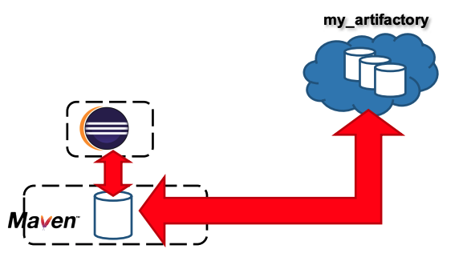
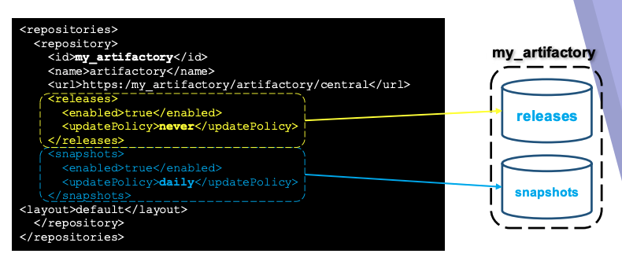
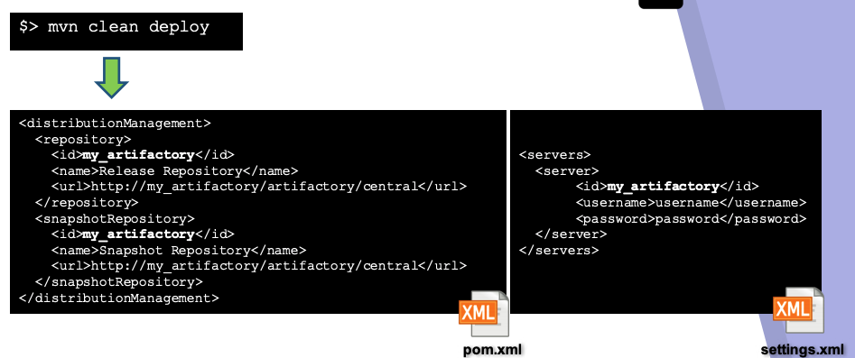

# 6. Apache Maven como herramienta de trabajo colaborativa 38m

* Apache Maven como herramienta de trabajo colaborativa 8:03 
* Despliegue de librerías y actualizaciones automáticas 9:39 
* Definición de ficheros settings.xml 5:54 
* Ejemplo práctico: Despliegue de librerías en Artifactory 15:04 
* Contenido adicional 3

## Apache Maven como herramienta de trabajo colaborativa 8:03 

[Apache Maven como herramienta de trabajo colaborativa](pdfs/6.1_Apache_Maven_como_herramienta_de_trabajo_colaborativa_.pdf)

Capacidades de Maven como herramienta de trabajo colaborativa. 

Maven ademas de ser una herramienta para compilar, para montar un pipeline en el ciclo de vida del proyecto, pero puede ir más alla por ejemplo equipos de proyectos distintos esten trabajando de forma colaborativa. 

Con Eclipse podemos tener nuestro repositorio remoto y a su vez tener la posibilidad de conectarnos a otros repositorios en Internet ya sea nuestros o publicos. 

Podriamos tener la siguiente visión, supongamos que en nuestra empresa hay líneas de desarrollo horizontales donde se establece un framework de desarrollo comun, donde hay equipos que le dan soporte a librerias comunes usadas por distintos proyectos, bajo este enfoque lo que se haria tradicionalmente es que para cada proyecto tendriamos que bajar el código fuente de las librerias comunes, compilarlo y trabajar a partir de este enfoque. 

Gracias a Maven y al uso de repositorios distribuidos pueden existir gente que se encargue de trabajar de forma activa de proyectos horizontales o comunes de forma que cuando consideras que tienes una libreria que suceptible de ser usada por todos los equipos para cierta versión usariamos el comando **deploy** para subirla al repositoorio corporativo y a partir de alli en función de como tengan configurado los usuarios la poliza y actualización de sus repositorios pueden ir recogiendo librerias ya sea de forma diaria o tener deshabilitada esta operación.

Habitualmente cuando una libreria se libera, se convierte en una Release, esa versión no es suceptible de ser actualizable, lo normal es que si se libera una versión es por que sea testeado y consideras que esa versión (2.5) esta cerrada. Si hubiera que hacerse una modificación esa subiria en forma de parche (2.5.1) o incluso en una versión posterior (2.6). Este sería el enfoque de librería de tipo Release.

Para aquellas que son de tipo Snapshot librerias que se actualizan hora a hora, si un desarrollador quiere estas versiones debe estar conciente de que las versiones no estan testeadas del todo, es util en ambientes de desarrollo donde se quiere tener la ultima versión con el último parche en cada momento.

Supongamos que el repositorio corporativo se llama **my_artifactory** un producto de **JFrog** que es el repositorio más usado en la industria otros pueden ser **Nexus**.

Los repositorios que se definen como repositorios remotos, se pueden definir como si son capaces de albergar versiones de tipo Release o de tipo Snapshot. En este caso para el repositorio llamado **central** se han declarado ambas opciones. Generalmente detras de un repositorio de Snapshot debe existir un motor de integración continua (Ej. Jenkis) que sea capaz de que constantemente este haciendo Deploy en el repositorio en base a la ultima copia que hay en el repositorio de código. Por ejemplo tenemos un motor de integración continua y lo tenemos configurado de tal manera que cada vez que se hace una subida de código hay una nueva revisión, se bajaría el código, lo compilaria, lo empaquetaría y haría un Deploy al repositorio `my_artifactory` de modo que siempre esta la última copia de la versión compilable de la librería en el repositorio para todos los usuarios que quieran tenerla, este es el caso de las Snapshots. Para aquellos usuarios que han configurado que siempre se bajen las últimas versiones del repositorio.

En el caso del repositorio **central** seguramente es un repositorio virtual que esta dentro de `artifactory` y que aglutine ciertos repositorios locales de ese servidor que se utilizan de forma centralizada donde entran todps los tipos de librerias. 

Otra opción es utilizar repositorios separados unos para Releases y otro para Snapshot. 

## Despliegue de librerías y actualizaciones automáticas 9:39 

[Despliegue de librerías y actualizaciones automáticas](pdfs/6.2_Despliegue_de_librerías.pdf)

Vamos a ver como hacer despliegues de librerias en un ambiente distribuido. Aquí ya entran varis factores por que no es igual generar una libreria en el repositorio local a ofrecer un servicio en una red corporativa o en Internet, donde cualquier persona puede hacer un Put para agregarlo en nuestro repositorio. Aquí ya existen factores relativos con seguridad etc. con lo que ltendra que autenticarse con contraseñas. 

### Deploy

El comando para hacer el despliegue es `deploy`

Es bueno hacer un clean previo al deploy para borrar siempre la carpeta target y despues compilar, para empaquetar y hacer el deploy.

La etiqueta `distributionManagement` que se define en el `pom.xml` nos sirve para definir los dos repositorios uno para Releases y otra para Snapshots.

La autenticación se establece en el `settings.xml` ya sea en el de usuario o en el global.

### Definición de los Repositorios

Esto lo hacemos en el archivo `pom.xml` usemos el proyecto `file-size-viewer`.

AQUI

## Definición de ficheros settings.xml 5:54 

[Definición de ficheros settings.xml](pdfs/6.3_Definición_de_ficheros_settings.xml.pdf)

## Ejemplo práctico: Despliegue de librerías en Artifactory 15:04 

## Contenido adicional 3

[Apache Maven como herramienta de trabajo colaborativa](pdfs/6.1_Apache_Maven_como_herramienta_de_trabajo_colaborativa_.pdf)

[Despliegue de librerías y actualizaciones automáticas](pdfs/6.2_Despliegue_de_librerías.pdf)

[Definición de ficheros settings.xml](pdfs/6.3_Definición_de_ficheros_settings.xml.pdf)
