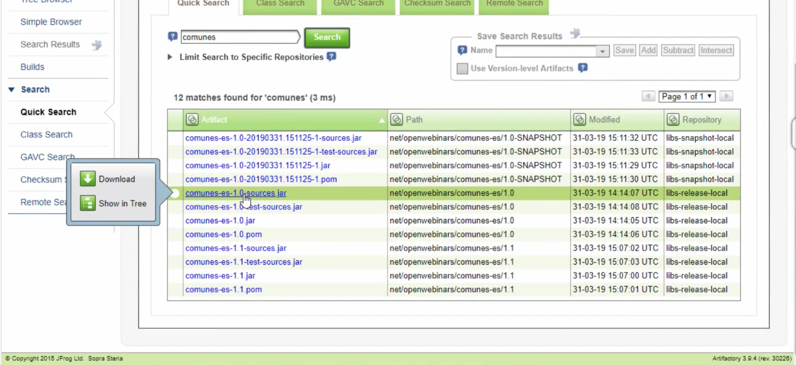

# 6. Apache Maven como herramienta de trabajo colaborativa 38m

* Apache Maven como herramienta de trabajo colaborativa 8:03 
* Despliegue de librerías y actualizaciones automáticas 9:39 
* Definición de ficheros settings.xml 5:54 
* Ejemplo práctico: Despliegue de librerías en Artifactory 15:04 
* Contenido adicional 3

## Apache Maven como herramienta de trabajo colaborativa 8:03 

[Apache Maven como herramienta de trabajo colaborativa](pdfs/6.1_Apache_Maven_como_herramienta_de_trabajo_colaborativa_.pdf)

Capacidades de Maven como herramienta de trabajo colaborativa. 

Maven ademas de ser una herramienta para compilar, para montar un pipeline en el ciclo de vida del proyecto, pero puede ir más alla por ejemplo equipos de proyectos distintos esten trabajando de forma colaborativa. 


Con Eclipse podemos tener nuestro repositorio remoto y a su vez tener la posibilidad de conectarnos a otros repositorios en Internet ya sea nuestros o publicos. 

Podriamos tener la siguiente visión, supongamos que en nuestra empresa hay líneas de desarrollo horizontales donde se establece un framework de desarrollo comun, donde hay equipos que le dan soporte a librerias comunes usadas por distintos proyectos, bajo este enfoque lo que se haria tradicionalmente es que para cada proyecto tendriamos que bajar el código fuente de las librerias comunes, compilarlo y trabajar a partir de este enfoque. 

Gracias a Maven y al uso de repositorios distribuidos pueden existir gente que se encargue de trabajar de forma activa de proyectos horizontales o comunes de forma que cuando consideras que tienes una libreria que suceptible de ser usada por todos los equipos para cierta versión usariamos el comando **deploy** para subirla al repositoorio corporativo y a partir de alli en función de como tengan configurado los usuarios la poliza y actualización de sus repositorios pueden ir recogiendo librerias ya sea de forma diaria o tener deshabilitada esta operación.

Habitualmente cuando una libreria se libera, se convierte en una Release, esa versión no es suceptible de ser actualizable, lo normal es que si se libera una versión es por que sea testeado y consideras que esa versión (2.5) esta cerrada. Si hubiera que hacerse una modificación esa subiria en forma de parche (2.5.1) o incluso en una versión posterior (2.6). Este sería el enfoque de librería de tipo Release.

Para aquellas que son de tipo Snapshot librerias que se actualizan hora a hora, si un desarrollador quiere estas versiones debe estar conciente de que las versiones no estan testeadas del todo, es util en ambientes de desarrollo donde se quiere tener la ultima versión con el último parche en cada momento.

Supongamos que el repositorio corporativo se llama **my_artifactory** un producto de **JFrog** que es el repositorio más usado en la industria otros pueden ser **Nexus**.


Los repositorios que se definen como repositorios remotos, se pueden definir como si son capaces de albergar versiones de tipo Release o de tipo Snapshot. En este caso para el repositorio llamado **central** se han declarado ambas opciones. Generalmente detras de un repositorio de Snapshot debe existir un motor de integración continua (Ej. Jenkis) que sea capaz de que constantemente este haciendo Deploy en el repositorio en base a la ultima copia que hay en el repositorio de código. Por ejemplo tenemos un motor de integración continua y lo tenemos configurado de tal manera que cada vez que se hace una subida de código hay una nueva revisión, se bajaría el código, lo compilaria, lo empaquetaría y haría un Deploy al repositorio `my_artifactory` de modo que siempre esta la última copia de la versión compilable de la librería en el repositorio para todos los usuarios que quieran tenerla, este es el caso de las Snapshots. Para aquellos usuarios que han configurado que siempre se bajen las últimas versiones del repositorio.

En el caso del repositorio **central** seguramente es un repositorio virtual que esta dentro de `artifactory` y que aglutine ciertos repositorios locales de ese servidor que se utilizan de forma centralizada donde entran todps los tipos de librerias. 

Otra opción es utilizar repositorios separados unos para Releases y otro para Snapshot. 

## Despliegue de librerías y actualizaciones automáticas 9:39 

[Despliegue de librerías y actualizaciones automáticas](pdfs/6.2_Despliegue_de_librerías.pdf)

Vamos a ver como hacer despliegues de librerias en un ambiente distribuido. Aquí ya entran varis factores por que no es igual generar una libreria en el repositorio local a ofrecer un servicio en una red corporativa o en Internet, donde cualquier persona puede hacer un Put para agregarlo en nuestro repositorio. Aquí ya existen factores relativos con seguridad etc. con lo que ltendra que autenticarse con contraseñas. 

### Deploy

El comando para hacer el despliegue es `deploy`


Es bueno hacer un clean previo al deploy para borrar siempre la carpeta target y despues compilar, para empaquetar y hacer el deploy.

La etiqueta `distributionManagement` que se define en el `pom.xml` nos sirve para definir los dos repositorios uno para Releases y otra para Snapshots.

La autenticación se establece en el `settings.xml` ya sea en el de usuario o en el global.

### Definición de los Repositorios

Esto lo hacemos en el archivo `pom.xml` usemos el proyecto `file-size-viewer`.

```html
<repositories>
   	<repository>
   		<id>my_artifactory_releases</id>
   		<url>http://slnxredesen01.alca.es.sopra:8080/artifactory/libs-release-local/</url>
   		<releases>
   			<enabled>true</enabled>
   			<updatePolicy>never</updatePolicy>
   		</releases>
   		<snapshots>
   			<enabled>false</enabled>
   		</snapshots>
   	</repository>
   	<repository>
   		<id>my_artifactory_snapshots</id>
   		<url>http://slnxredesen01.alca.es.sopra:8080/artifactory/libs-snapshot-local/</url>
   		<releases>
   			<enabled>false</enabled>
   		</releases>
   		<snapshots>
   			<enabled>true</enabled>
   			<updatePolicy>daily</updatePolicy>
   		</snapshots>
   	</repository>
</repositories>
```

**Para obtener actualizaciones**, tenemos dos repositorios definidos uno para Release y otro para Snapshots, con identificadores y politicas de actualizaciones distintas, cada que se tengan que descargaer las librerias iran a estos repositorios. 

Todo esto se complementa con la política de distribución que es la que nos permite saber como **hacer Deploy**.

```html
<distributionManagement>
  	<repository>
  		<id>my_artifactory</id>
  		<name>Release Repository</name>
  		<url>http://slnxredesen01.alca.es.sopra:8080/artifactory/central/</url>
  	</repository>
  	<snapshotRepository>
  		<id>my_artifactory</id>
  		<name>Snapshot Repository</name>
  		<url>http://slnxredesen01.alca.es.sopra:8080/artifactory/central/</url>
  	</snapshotRepository>
</distributionManagement>
```

Aquí hemos definido los repositorios en el `pom.xml` pero muchas veces es mejor definirlos en el `settings.xml` global del proyecto para tenerlo más centralizado y de esta manera tabién podremos definir un `mirror` que se convierte como una especie de proxy o pasarela por donde toda la instalación de Maven tiene que ir a obtener todas las librerias.

## Definición de ficheros settings.xml 5:54 

[Definición de ficheros settings.xml](pdfs/6.3_Definición_de_ficheros_settings.xml.pdf)


Maven de partida ofrece la configuración de un unico fichero `settings.xml` que suele llamarse **Global Settings** que es el que se encuentra en la propia carpeta de instalación de Maven. En este fichero se pueden definir los Mirrows, los Servidores, el Proxy HTTP, Perfiles de Configuración, etc., este afectara a todos los proyectos que usen Maven por eso el nombre de Global. Hay otro tipo de organización de proyectos que suele ser más efectiva y es la de utilizar archivos `settings.xml` por proyecto de forma a la configuración Global definida, ¿qué se consigue con esto? Cuando tenemos una setting por proyecto y trabajamos con un repositorio distribuido que requiere autenticación, la autenticación del repositorio distribuido puede ser diferente, puede ser que en algunos casos tenga información sensible como las cuentas de usuario del directorio activo en este caso donde la seguridad debería estar más blindada no conviene tener un setting por proyecto por que mostrariamos las configuraciones de los usuarios a todos, lo que no es una buena practica. Usariamos el Setting Global donde cada usuario tendría sub-settings pero ofreceria una posibilidad de error por tener cada usuario una configuración diferente pero sería preferible que todos los miembros del proyecto trabajen con las mismas cuentas.

**Ecipse al final hara una sumatoria entre el Global Setting y el User Setting para contar con la configuracón final.**

La *User Setting*sería la instalación del propio usuario en la carpeta de instalación local de Maven. Aquí es donde hay que subir las credenciales, el proxy http por que puede ser que una configuración global no funcione para todos los usuarios ya que podrían trabajar en diferentes instalaciones o desde casa.

Eclipse permite definir Global Settings como User Settings, al final se sumaran las dos para tener la configuración total. 

Hay que entrar en las *Preferences > Maven > User Settings*.


Trabajar de esta manera lo que evita son esfuerzos adicionales o errores no contemplados por los usuarios. Hay que evitar el truco de trabajar todos con la misma configuración  por que cada uno trabaja de forma diferente y ahunar esfuerzos en las configuraciones comunes las cuales si deben estar historificadas bajo un fichero común de proyecto. 

## Ejemplo práctico: Despliegue de librerías en Artifactory 15:04 

Vamos a ver un ejemplo práctico de como podemos desplegar librerías en un repositorio Artifactory. 

Artifactory es un producto de la empresa JFrog. Tenemos una imagen en el Docker Hub: 

https://hub.docker.com/r/mattgruter/artifactory/

Esta imagen la podemos bajar y ejecutar el comando siguiente para instalar:

```sh
docker pull mattgruter/artifactory
```
Y el siguiente para levantar el contenedor en el puerto 8080

```sh
docker run -p 8080:8080 mattgruter/artifactory
```

Este es el repositorio recien instalado con Docker, iniciando sesión como administrador,  


Te ofrece la zona de Admin donde se puede personalizar poniendo por ejemplo un logo de la empresa, la URL Base etc.


Lo normal es que en nuestra empresa tengamos un repositorio distribuido equivalente a este. 

**Artifactory** es un repositorio de artefactos que permite subir dependencias y hacer de proxy contra internet a traves de repositorios remotos. Podemos dar de alta repositorios remotos o locales. Si un usuario solicita una librería no actualizada a Artifactory, este va al repositorio final la descarga, la guarda en su repositorio final y si distintos usuarios a lo largo del día van solicitando la misma librería Artifactory no va nuevamente al repositorio final sino que le da la que tiene en su repositorio local, con lo que reduce peticiones de la red corporativa haciendo que todo vaya un poco más rápido.


Siempre existe la opción de hacer el despliegue manual o inclusive un despliegue masivo a partir de un archivo zip. Esto lo hacemos por ejemplo de un proyecto guardando todas las librerías con el comando `dependency:copy-dependency` empaquetarlas en un zip y cargarlas desde Artifactory indicandole a que repositorio queremos subirlas. 


Otras cosas que se pueden hacer con Artifactory son:

* Temas de cache
* Integración SSO para autenticación 
* Integración SAML 
* LDAP
* etc.

En el proyecto `commons-io` podriamos insertar en el `pom.xml` la sección de `<distributionManagement>` que vismos en la lección pasada para poder hacer el despliegue de una libreía.

Las credenciales de autenticación se establecerian en el settings global con:

```html
<servers>

   . . .
   
<server>
   <id>my_artifactory</id>
   <username>openwebinars</username>
   <password>123456</password>
</server>   
</servers>

```

Con esta configuración se puede ejecutar un comando `clean deploy` y con ello se subira la librería al repositorio de Artifactory. Aqui vemos ejemplos de versiones Release y Snapshops (le pone fecha y hora)



También podemos ver como separa las versiones Release y las Snapshop.


Podemos ver los diferentes artefactos contenidos en una versión subida.


Podemos descargarnos desde aquí la librería.

## Contenido adicional 3

[Apache Maven como herramienta de trabajo colaborativa](pdfs/6.1_Apache_Maven_como_herramienta_de_trabajo_colaborativa_.pdf)

[Despliegue de librerías y actualizaciones automáticas](pdfs/6.2_Despliegue_de_librerías.pdf)

[Definición de ficheros settings.xml](pdfs/6.3_Definición_de_ficheros_settings.xml.pdf)
