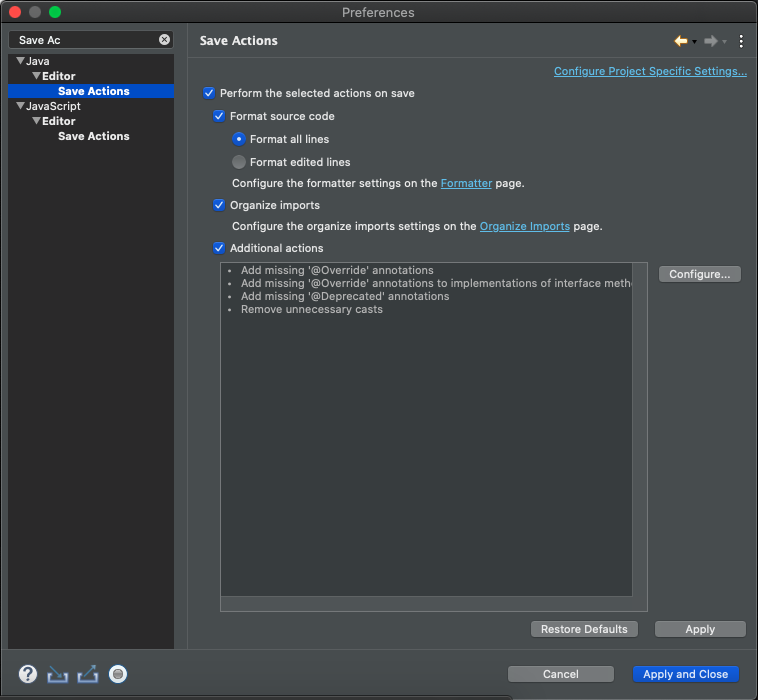
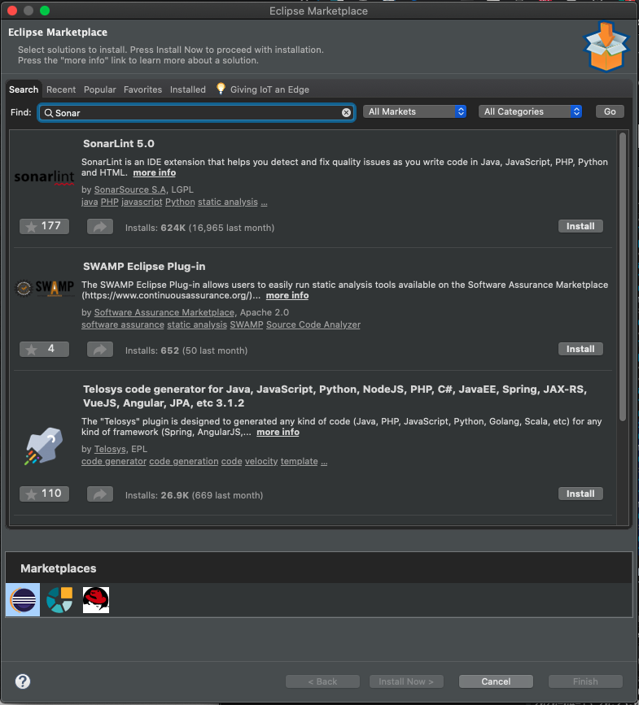

# 7. Mejorando la calidad del código con Apache Maven 9m

* Mejorando la calidad del código con Apache Maven 9:21 
* Contenido adicional 1

## Mejorando la calidad del código con Apache Maven 9:21 

[Mejorando la calidad del código con Apache Maven](pdfs/6.4_Mejorando_la_calidad_del_código_con_Apache_Maven.pdf)

Esta sección va más efocada a los departamentos de calidad, pero es muy importante para los desarrolladores.

### PLUGINS DE PROCESOS Q&A

Estos plugins se usan para procesos de mejora de calidad y rendimiento en Java son:

* **maven-pmd-plugin**

   Sirve para medir cierto comportamiento en el código que sean suseptibles de ser mejorables a nivel de a nivel de complejidad, si existen varios bucles anidados, operaciones lentas en cuanto a rendimiento, uso masivo de concatenación de caracteres, uso de StringBuffers o StringBulders,  
   
* **cobertura-maven-plugin**

   Analiza el código dando una metrica de hasta que punto tu código esta cubierto con test, que porcentaje de tu código esta testeado. 
* **maven-checkstyle-plugin**

   Ayudarte a formatear el código de tal manera que los diferentes desarrolladores tienen el mismo checkstyle, que se pueden meter dentro del entorno de Eclipse, de tal manera que cuando e guarde un archivo `.java` o `.xml` se ejecute la orden de `format code`
   
   
   
   Lo que le decimos que cuando se guarde el código se formate, organice los imports y ademas podemos añadir acciones adicionales con checkstyle. 

* **sonar-maven-plugin**

   Este pluging hace un analisis más minucioso basado en cubos de reglas, mide la deuda tecnica del código, posibles errores bloqueantes que se puedan tener.
   
   Existe un plugin que se puede instalar en Eclipse llamado *SonarLint* para analizar el estado de calidad del código antes de que llegue al servidor. 
   
   
   
   Que si lo empezamos a utilizar estaremos desarrollando código con las medidas de calidad oportunas.
   
   
Todos estos tienen su plugin asociado Maven, por lo que tantio en entornos locales como en servidores de integración continua se puedan ejecutar de forma que, el desarrollador pueda ejecutar en su equipo localmente para ver como esta desarrollando o que el servidor de integración vaya verificando que la calidad del código sea la correcta.

### TESTS UNITARIOS Y TESTS DE INTEGRACIÓN

* **maven-surefire-plugin**

   Este pluging se usa dentro del comando `mvn test`, permite ejecutar las pruebas y guardar los informes.

* **dbunit-maven-plugin**

   Este pluging permite ejecutar pruebas que guardan datos de prueba en las BD y una vez ejecutado los test borrarlos.

* **wiremock-maven-plugin** 

   Parecido a dbunit pero más moderno.
   
### DESPLIEGUES AUTOMATIZADOS CON APACHE MAVEN

* **cargo-maven-plugin**

   Con respecto la automatización de despliegues que es una tarea más tipica de los motores de integración continua también podemos hacerlo en nuestro entorno local, pero no es un uso muy común. Su caso de uso es en servidores de integración continua y permite hacer despligues a servidores como Tomcat, JBoss, Weblogic, etc. 
   
### INFORMES AUTOMATIZADOS CON MAVEN

* **maven-project-info-reports-plugin**:

   * Continous Integration
   * Dependencies
   * Issue Tracking
   * License
   * Mailing Lists
   * Project Team
   * Source Repository
   
   Maven permite la posibilidad de generación de informes del proyecto para tener todo este tipo de información.
   
### APACHE MAVEN COMO BASE DE SISTEMAS DE INTEGRACIÓN CONTINUA

* Jenkins
* Bamboo (Atlassian)
* GitLab
* TeamCity (JetBrains)
* Codeship (CloudBees)
* Travis 

Maven es la base de los IDEs como Eclipse, Netbeans, etc. y la base de los sistemas de integración continua más habituales. Todos ellos lo que ofrecen es un envoltorio de uso sobre Maven de una forma más enriquesida pero al final Maven el motor que permite que estos sistemas poder trabajar.

## Contenido adicional 1

[Mejorando la calidad del código con Apache Maven](pdfs/6.4_Mejorando_la_calidad_del_código_con_Apache_Maven.pdf)
